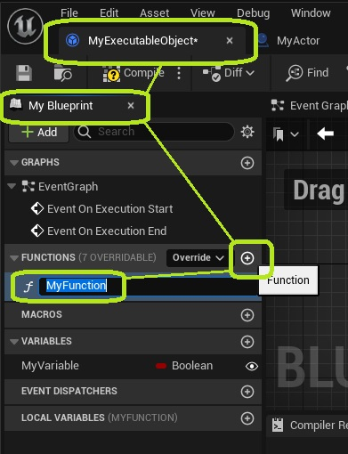
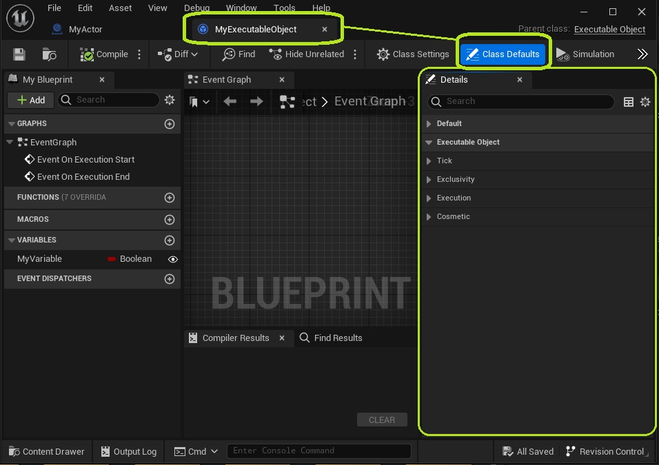
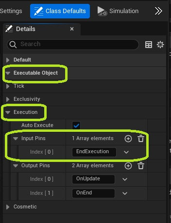
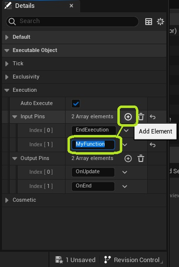
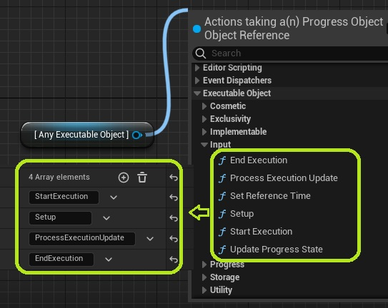
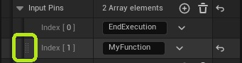
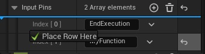
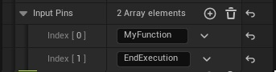
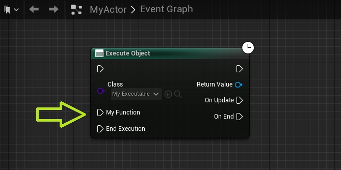

Executable Objects can define custom input pins on their node, that call functions on the Executable Obejct. Here is how to set them up.

In the *My Blueprint* tab of your Executable Object, navigate to the *Functions* section. Create a new function, and give it a name.

Still in your Executable Object, open the *Class Defaults*. The details panel on the right will now show all variables.

Expand the* Executable Object* and *Execution* categories, and you will find a variable named Input Pins. This list defines the input execution pins that are visible on the left side of the node.

Use the *"+"* icon on the top right of the list to add a new element to the array. Give this element the same name as your function. The name in the array must match exactly with the name of the function you want to call. If not, the pin will not work!

You can also add names of other functions or events that already exist in parent classes of the Executable Object. For example, input functions like StartExecution, ProcessExecutionUpdate, or EndExecution. Note that while these function names are displayed with spaces in Bluerpint nodes, the name specified in the Executable Object iteself must match the internal c++ name, which does not contain these spaces. 

You can change the order of the input pins by dragging the array elements using the handles on the left.

Refresh any existing nodes if the changes have not taken effect.

The newly created pin is now available on your node.

*Congratulations! You have successfully added an input execution pin to your node.*