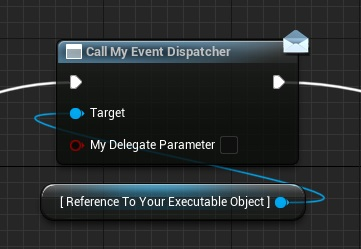

**Executable Objects can send information back to the managing object via their node. This tutorial will show you how to set up event dispatchers and link them to output pins.**

For more information on how to use Event Dispatchers in general, , please consult the <a href="https://docs.unrealengine.com/5.2/en-US/event-dispatchers-in-unreal-engine/" target="_blank">Unreal Engine documentation on the topic</a>.

Navigate to the *My Blueprint* tab of your Executable Object. In the *Event Dispatchers* section, create a new Event Dispatcher and give it a name.

Optionally, you can define parameters to pass on with the Event Dispatcher when it is called. To do this, select your Event Dispatcher, navigate to the *Details* panel, and add the parameters in the *Inputs* section.

You can call this Event Dispatcher from anywhere inside or outside your Executable Object. 

Open the *Class Defaults* of your Executable Object. In the *Details* panel, you will find all variables on the object.

In the *Execution* category, there is a variable named Output Pins.

Add the name of your Event Dispatcher to the list.

The name specified here must match the name of the delegate exactly. If not, the pin will not work correctly!.

It is also possible to add any of the Delegates that already exist in the Executable Object base classes by their name.

You can change the order of the output pins by changing the order of the names in the Output Pins array. You can do this by dragging the handles on the left of the array index numbers up and down.

Only the output pin on the bottom of the list will show its parameters on the node.

 Refresh any nodes you want to update with these changes.

The node for your Executable Object now contains output pins for the delegate and its output parameters.

**Congratulations! You have successfully added a delegate pin to your Executable Object and its node.**

