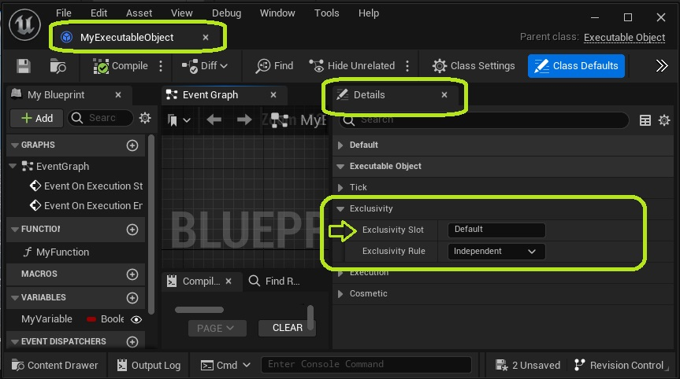
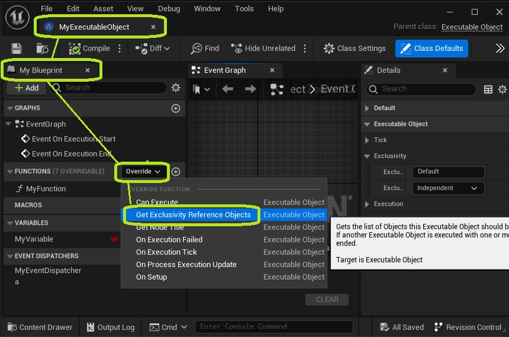
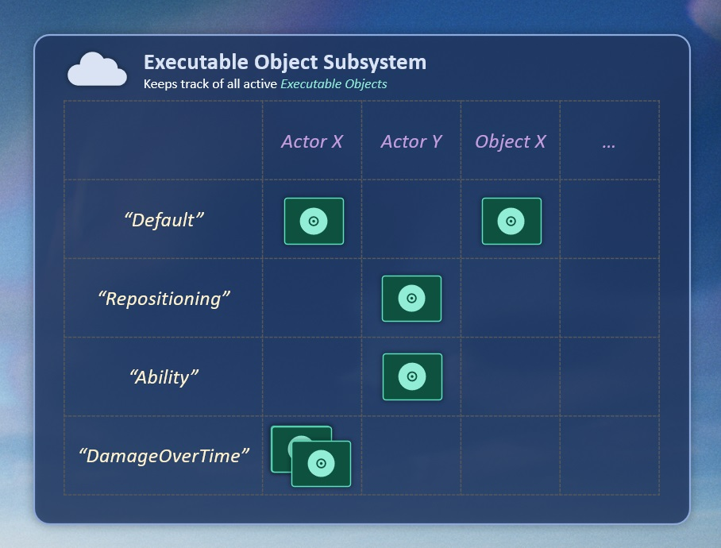

There are situations where you may not want multiple Executable Objects running at once. Here are some examples:

* If your Executable Object is an ability, players should not be able to activate it if the same or another ability is already active.
* Having multiple Reposition Objects active that are trying to change an Actor's transformation, can cause problems.

This is why Executable Objects can make use of **Exclusivity Rules**. These rules determine which objects are allowed to run at the same time, and which one gets cancelled in case of a conflict.

## Exclusivity Slot and Reference Objects

**First off, you need to define which Executable Objects are aware of one another. This is done in two steps:**

* Set the Exclusivity Slot in the *Class Defaults* of your Executable Object.

* Override the Get Exclusivity Reference Objects function.

This function should return the Objects in the game world that the Executable Object has direct effects on. Setting this manually is optional, because the Reference Object will be set to the Outer Object by default (i.e. the Blueprint that created the Executable Object). But in some cases, you may need to set different Reference Objects. For example, a status effect should refer to its target and not the character that created it. Another example is an interaction between two Characters, which should be exclusive for both characters at the same time.

The Exclusivity Reference Objects should not be confused with the [Managing Object](/executable-objects/02-reference-materials/06-exclusivity), which is the Outer Object of an Executable Object.

Think of the **Slot** and the **Reference Objects** as different 'channels' your Executable Object exists on. Executable Objects are only relevant to one another if they are on the same Slot, and have one or more Reference Objects that are the same.

## Exclusivity rule

**Next, we decide what to do if there is a conflict between two Executable Objects.**

This will happen if we try to run two Objects that are on the same Slot, and have one or more Reference Objects in common.

| Exclusivity rule | Description | Use cases|
| ----------- | ----------- | ----------- |
| Independent | Both objects are allowed to run at the same time.	 | Status effects, Damage over time |
| Replace old | The execution will be ended on the Object that was previously active. The new Object wil Execute in its place.	 | Repositioning, Gradually updating a variable, Equipment  |
| Block new | The previous Object will keep executing. The execution will fail on the new object.	 | Abilities, Interactions between characters |

## Follow-up

**Using these steps, you can control which Executable Objects are allowed to run at the same time.** 

* If you want to specify other conditions that can block the execution of your object, consult the article on [Blocking execution](/executable-objects/01-tutorials/07-blocking-execution).

* If you need to access Executable Objects that are currently running, consult the artcile on the [Executable Object Subsystem](/executable-objects/02-reference-material/06-executable-object-subsystem).
