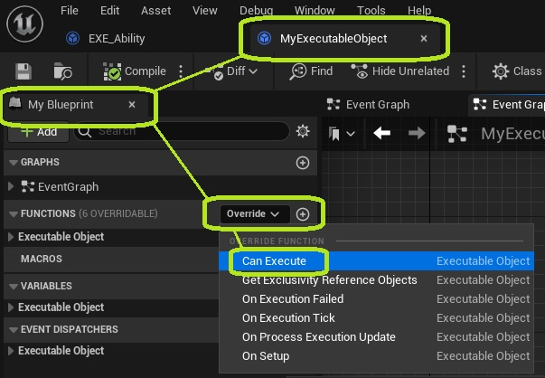
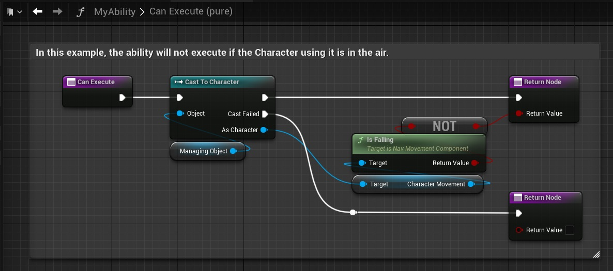
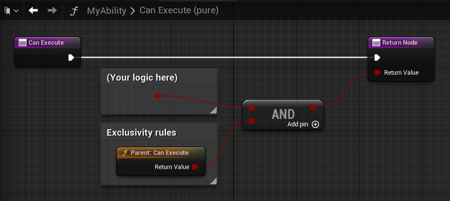
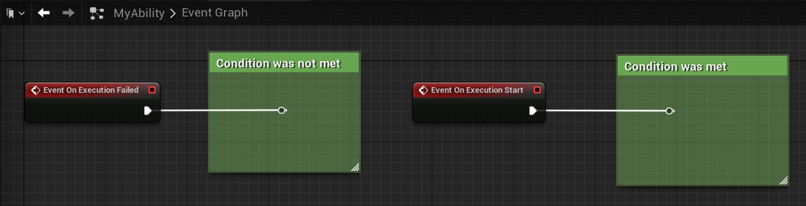
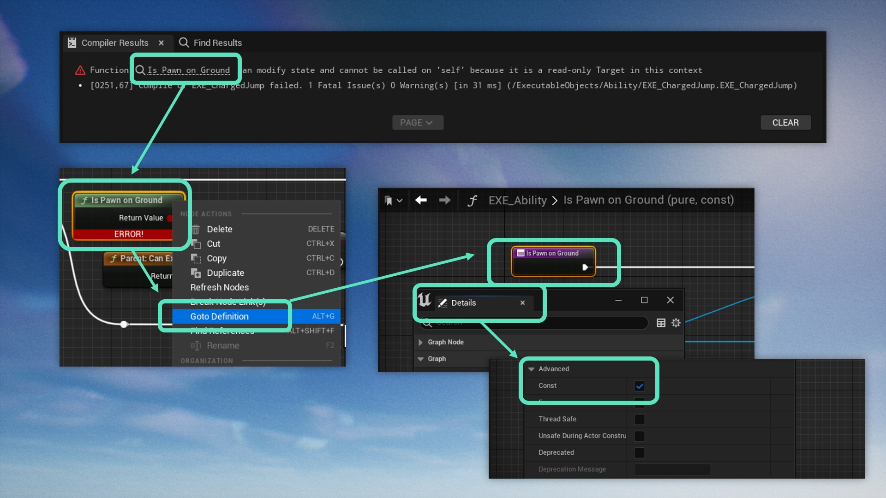

**In some cases, you may want to control whether an Executable Object is allowed to Execute or not.**

* If this condition is only based on other Executable Objects that are running, you may be able to do so quickly using exclusivity. Please consult the tutorial on [exclusivity rules](/executable-objects/01-tutorials/06-exclusivity)  for more information.

* The condition can also be based on other factors. For example, this would be the case for an Ability that the player can only activate if they are on the ground.

In the latter case, you can override the Can Execute function on your Executable Object.

If your object makes use of the default [exclusivity rules](/executable-objects/01-tutorials/06-exclusivity) as well, this function override should include a call to the parent function. The object will then only execute if your custom condition is met, and if the Exclusivity Rules are also respected.

 

These tests will run whenever the execution is started using Start Execution, or via the exec pin on the Execute Object node. Depending on whether the test was successful, the Executable Object will call On Execution Failed or start the execution, resulting in On Execution Start being called. It is possible to override these events and add your own functionality. 

 

Keep in mind that Can Execute is a constant function. This means that it cannot modify the state of the game world. Therefore, it is not possible to add non-constant functions in its graph. If you get an error stating your function "*cannot be called on 'self' because it is a read-only Target in this context*", follow the steps below to make the function constant as well.

 

