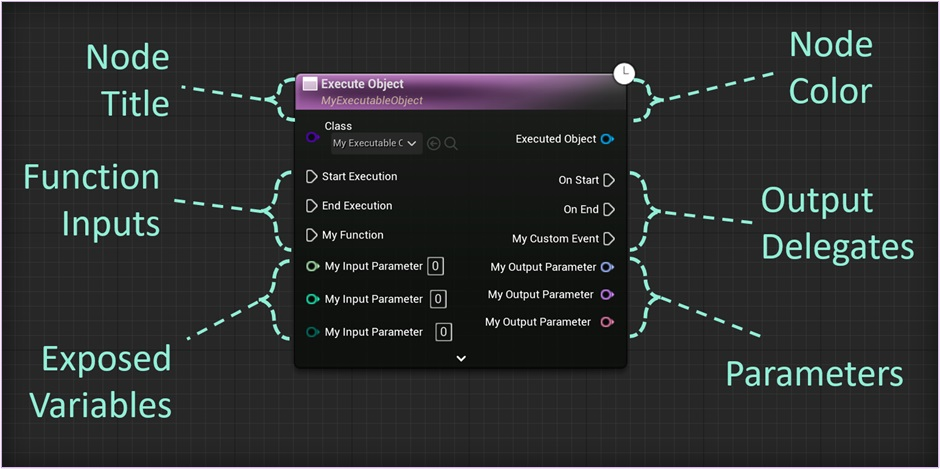
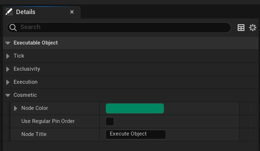
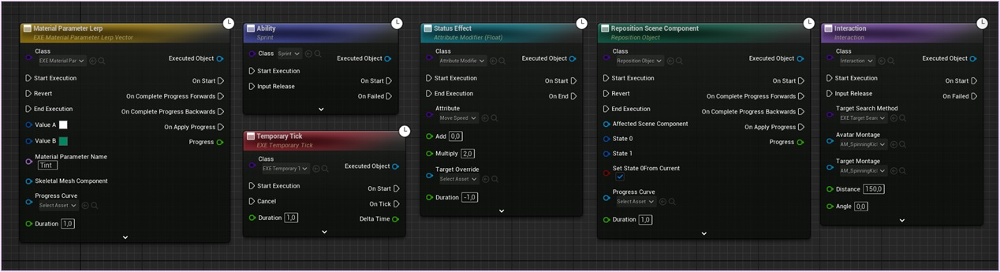
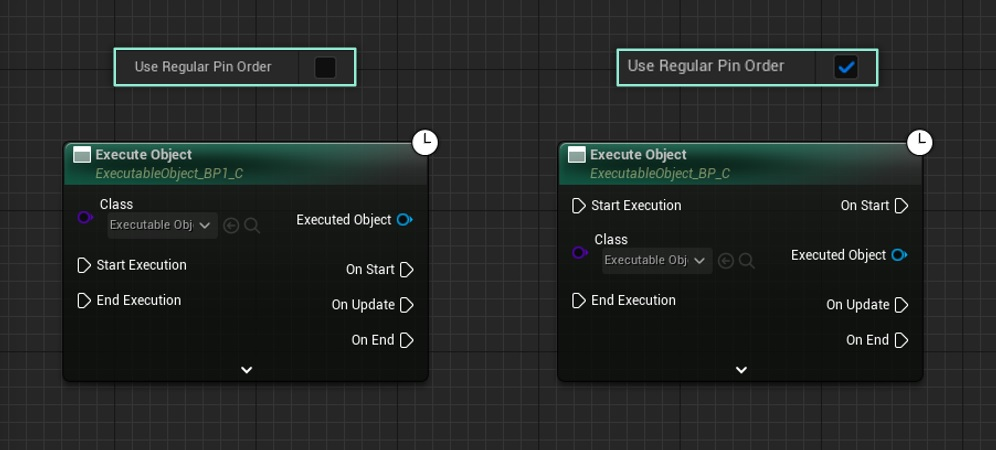
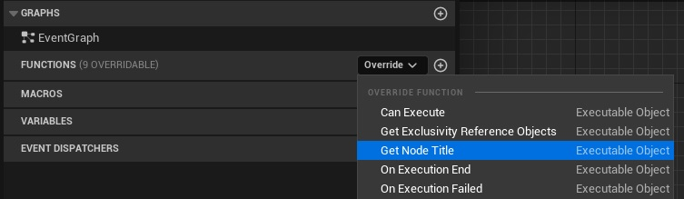
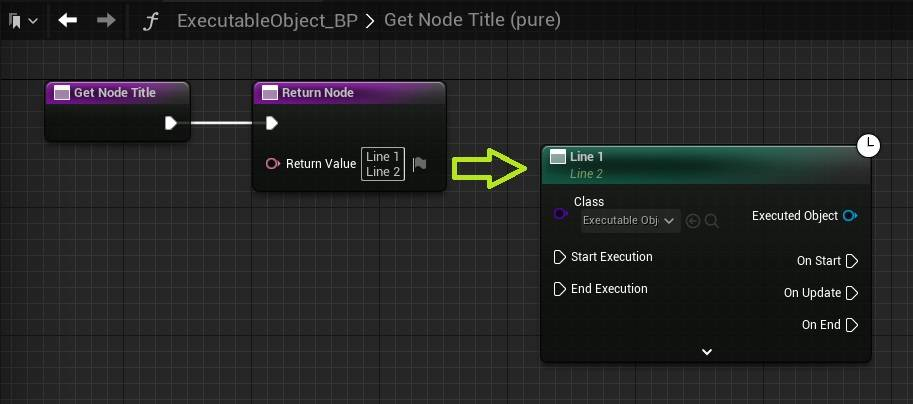

**You can change the appearance of the Execute Object node in several ways. This article provides an overview of the different ways to do so.**

You can find the settings related to the appearance of the node in the *class defaults* of your Executable Objects, in the *Cosmetic* category.

## Node color

You can change the color of the node using the Color variable, located in the *cosmetic* category of your Executable Object.

## Pin order

Enabling the Use Regular Pin Order setting will make the node look more like a typical Construct Object From Class node, by keeping the execution pins on the top of the node.

## Node title

You can change the text on the header of the node in two ways:

* A first way, is by changing the Node Title variable. This will change only the first line of the title, and keep the class of the object mentioned on a second line.

* You can also override the Get Node Title function. This gives you full control over the title. You can use *[Shift+Enter]* to add a new line to the text. Any lines below the first one, will show up with special formatting.

