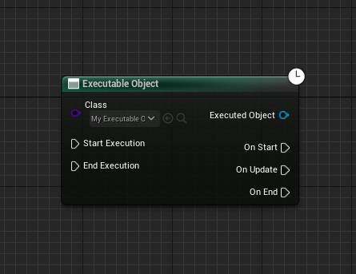
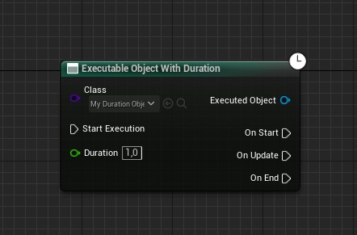
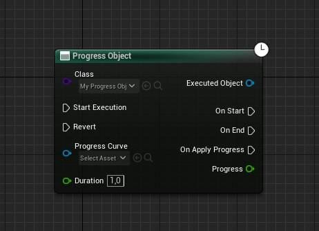
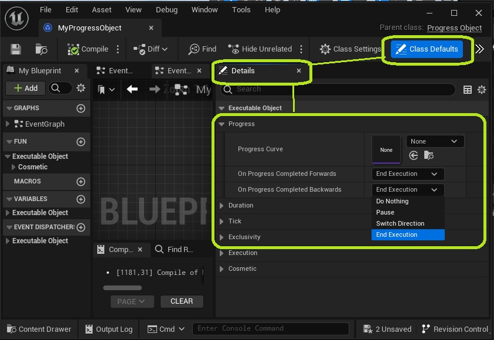
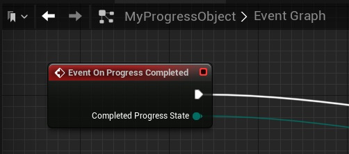

Executable Objects come in different classes, depending on the functionality you need. On a technical level, all of these classes are Blueprintable Async Actions with additional functionalities and a custom node.

The ExecutableObject  base class is parent to the ExecutableObjectWithDuration   class, which is in turn the parent of ProgressObject. Each of these classes gradually adds more functionality that users can include or leave out where needed. This article contains an explanation on each of these classes, and general advice on when to use each one.

<embed src="/pdf/slide-classes.pdf" width="100%" height="500px" toolbar=0 frameborder="0" scrolling="no" />

## Executable Object

The ExecutableObject base class is a Cancellable Async Action that can be customized in Blueprint. It must be manually started and ended using the Blueprint Node or any of its Input Functions.

## Executable Object With Duration

The ExecutableObjectWithDuration is similar to the base class, but ends automatically after a specified duration.

To stop the Object from ending automatically, set the Duration to a negative value.

## Progress Object

Progess Objects also have a duration, but offer additional functionality:

* **They have a Progress value that automatically updates each tick.** You can access the progress and bind functionality to it using the Get Progess function, the On Progress Applied event, or via the On Apply Progress pin of the node. You can further tweak how progress scales with the elapsed time, by setting a Progress Curve. 

* **Progress Objects can go forwards and backwards in time. They can also be paused.** This state is called the Progress State. You can access it using the Get Progress State function. To change the progress, call Update Progress State on the object. You can build functionality using the On Progress State Change event.

* **You can define the Object should do when its progress is completed.** This happens when the progress reaches its start or end. You can control what happens on completion using the On Progress Completed variables, or using the On Progress Completed event. This means that, unlike Executable Objects With Duration, Progess Objects do not need to end when their Duration is over.

## Which class to use?

Which class of Executable Object to use, depends on the result you are trying to achieve. Here are some general recommendations.

|**Class**|**When to use**|**Examples**|
|------------------|------------------------------|-----|
|Executable Object  |Any action you want to end manually, or where you build the action in a way where it ends itself.  |Actions that wait for something to change on an actor|
|Executable Object With Duration    |Actions you want to end automatically. This will require only the function call to start the execution.	|Status effects, Abilities|
|Progess Objects	|Cases where you want to interpolate between different states or values.	|Repositioning a Scene Component, Gradually updating a variable, Anything that involves interpolation|

## Reparenting an Executable Object

If you have already created an Executable Object and want to change the parent class later, you can do so in the *Class Settings*.

