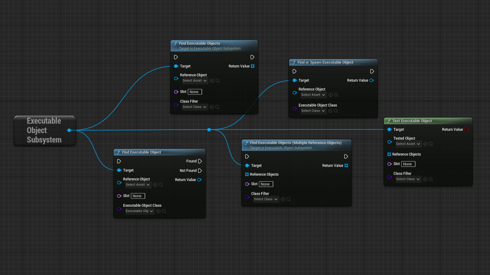

**The Executable Object Subsystem is an object that runs together with the Game Instance, and keeps track of all Executable Objects that are active.**

For more information on Game Instance Subsystems, please consult the <a href="https://docs.unrealengine.com/5.2/en-US/programming-subsystems-in-unreal-engine/" target="_blank">Unreal Engine documentation on the topic</a>.

<embed src="/pdf/slide-subsystem.pdf" width="100%" height="500px" toolbar=0 frameborder="0" scrolling="no" />

You can access the Subsystem by adding a Get Executable Object Subsystem node. From here, you can use the Subsystem to look for any Executable Objects that are currently active.

You may not need to interface with the Subsystem directly. Instead, you can make use of [Exclusivity Rules](/executable-objects/2-tutorials/06-exclusivity) to make sure no incompatible Executable Objects are running at the same time.

