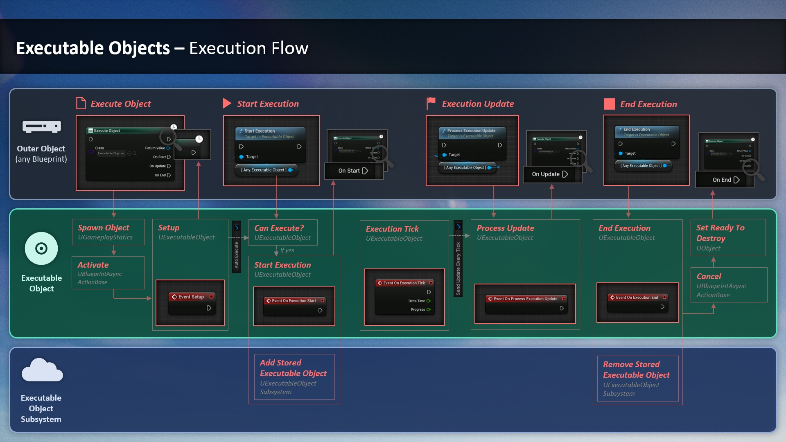
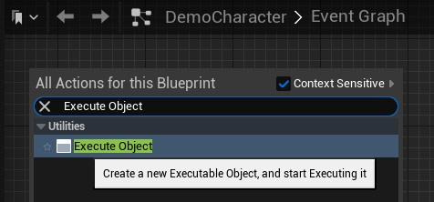
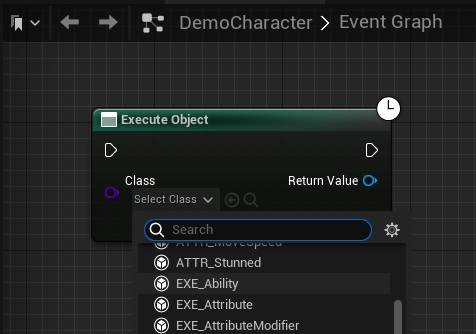
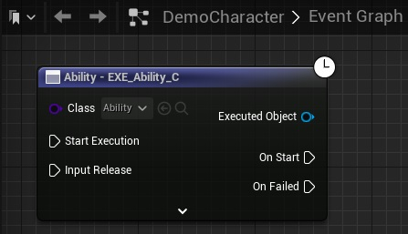
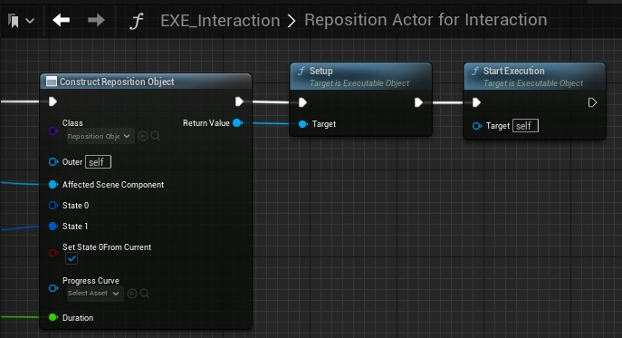
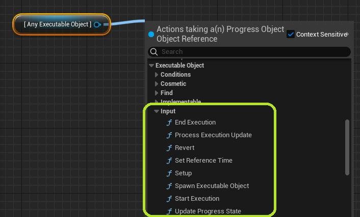

Executable Objects have an execution flow that is easy to understand and control. This article will look at the various ways in which you can interface with an Executable Object.

# *Execute Object* node

The easiest way to use an Executable Object, is through the Execute Object node. You can do so by adding the selected node to a Graph, and selecting the desired class.

The node can be customized through the Executable Object itself:

* [Executing custom Executable Object Classes](/executable-objects/2-tutorials/01-creating-an-executable-object)
* [Add exposed variables](/executable-objects/2-tutorials/02-adding-input-parameters)
* [Add custom function inputs](/executable-objects/2-tutorials/03-adding-input-execution-pins)
* [Add output delegates](/executable-objects/2-tutorials/05-adding-delegate-pins)

# Constructing an Executable Object manually

It is also possible to construct and execute the object manually using the Engine's default functionality. To do so, use a Construct Object From Class node, select the desired class, and call Setup and Start Execution on the constructed object. While this setup takes a bit more time, it can be useful when working in Graphs that do not allow latent nodes (e.g. function graphs).

# Input Functions

You can control the Executable Object using the functions listed in the "Input" category. 

These input functions can also be called using the execution pin with the same name on an Execute Object node.

