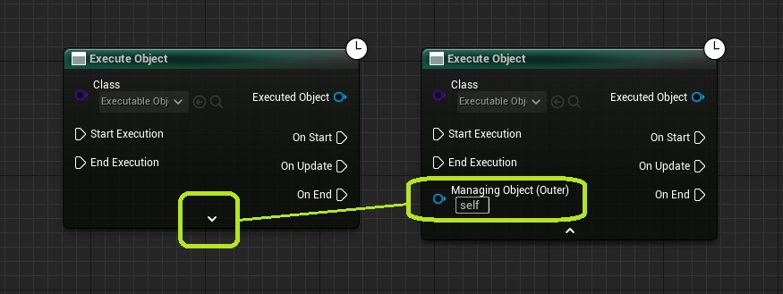
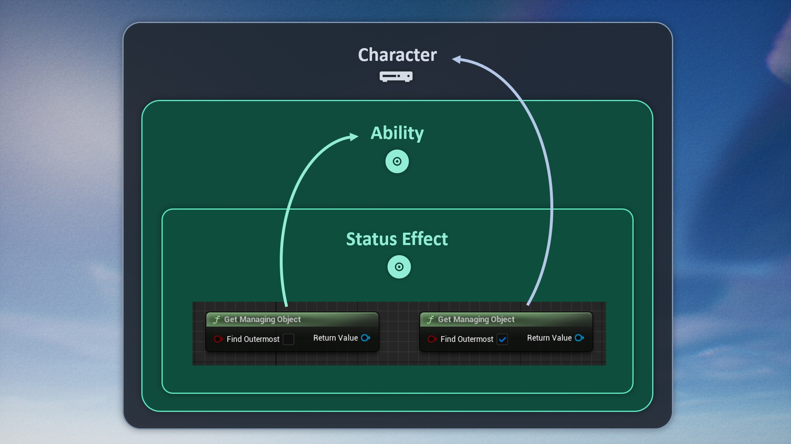
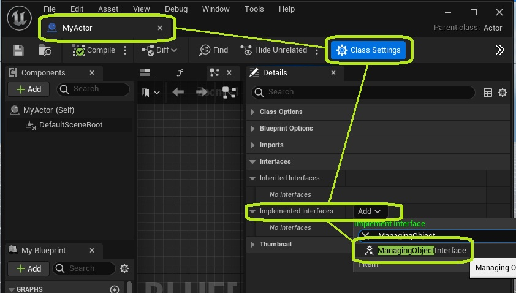
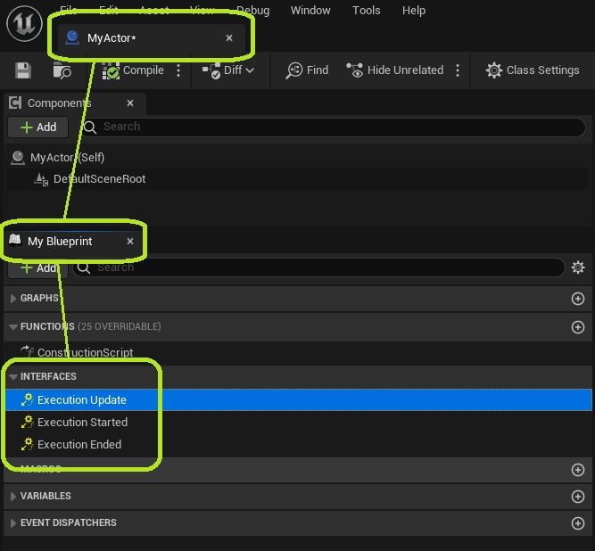
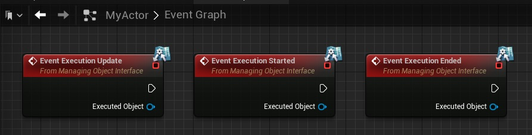

In Unreal Engine, all <a href="https://dev.epicgames.com/documentation/en-us/unreal-engine/objects-in-unreal-engine" target="_blank">objects</a> have an Outer Object. The Outer Object is considered the owner of its inner object. Executable Objects are no different. They refer to their Outer Object as Managing Object.

The Managing Object should not be confused with the [exclusivity reference objects](/executable-objects/2-tutorials/06-exclusivity). The latter are not updated on the execution, but are merely used to check for other relevant Executable Objects that are running.

By default, the Managing Object will be the Blueprint that used the Execute Object node. To define another Managing Object, you can expand the node to show the advanced pins.

To find out the Managing Object of an Executable Object, use function Get Managing Object. This function has a parameter named Find Outermost, which is set to *true* by default. This setting will keep looking for Outer Objects recursively, until it finds a non-executable Object.

> For example, consider a Character that casts an ability .The ability in turn applies a status effect. This makes the Character the Outer Object of the Ability. The ability is the Outer Object of the Status Effect. If you try to get the Managing Object of the Status Effect and enable Find Outermost, the function will go 'all the way up' to the character. If not, it will stop at the ability. Both versions of the function have their use cases.

Outer Objects can optionally implement the Managing Object Interface. If they do, they will be notified of events on the Executable Object.

