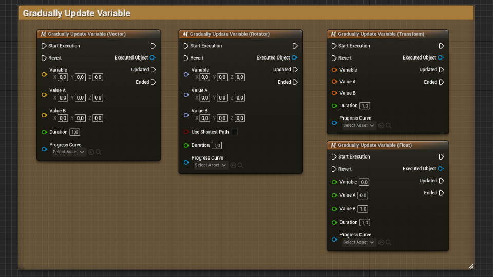

**The Demo Project illustrates some of the functionality of Execuable Objects. It does so using a simple ability system, with activatable abilities, status effects, attributes and interactions. These mechanics are all represented by an Executable Object, and can run without the need for additional components or setup.**

**In this article, we will go over the contents of the demo project.**

# The Demo Character

In the Content/Demo folder, there is a Blueprint named DemoCharacter. Its Graph has some example nodes laid out.

# Gradually Updating Variables

A simple use case of Executable Objects, is gradually changing the value of a variable. To do this, you can use any of the Gradually Update Variable nodes.

# Gradually Updating Material Parameters

As another example, the Demo Character has a 'Material Parameter Lerp' node that will change the color of the Character.

# Repositioning

You can use Executable Objects to reposition scene components gradually. This functionality can move characters from one place to another. 

# Update Velocity

Similarly, you can create a 'Dash' or 'Push' effect by updating the velocity of a Character.

# Abilities

You can also use Executable Objects to create simple abilities. For example, the Demo Project has a *Sprint* ability and a *Charged Jump* ability.

**To create your own Ability:**

* Create a new Blueprint Class with EXE_Ability as the parent Class
* Override the following functions: On Execution Start and Input Release

# Status Effects

Internally, these abilities apply a set of Status Effects while they are active. Status Effects  can, for example, increase the move speed of the character, and widen the field of view of the camera.

**To create your own Status Effect:**

* Create a new Blueprint Class with EXE_StatusEffect as the parent Class
* Override the On Execution Start event with the logic you need to run when the effect is applied.
* Override the On Execution End event with the logic you need to run when the effect is reverted.

The Demo Project has a Status Effect named SE_Death as an example.

In some cases, your game may need to handle multiple status effect that can overlap, and affect the same attribute. As an example on how to implement this, the Demo Project contains a simple attribute system.

**To create your own Attribute:**

* Create a new Blueprint Class with EXE_BooleanAttribute or EXE_FloatAttribute as the parent Class, depending on the desired type of attribute.
* Override the Get Source Value and Set Source Value functions. They should read and update the game state respectively.

The Demo Project has attributes named ATTR_MoveSpeed and ATTR_Stunned as examples.

**To modify the attribute you created:**

* Add a new Execute Object node
* Change the Object Class to EXE_FloatAttributeModifier or EXE_BooleanAttributeModifier, depending on the type of the attribute you want to change. Make sure to select one of these exact classes, and not your attribute itself.
* New pins will appear on the node. In here, you can set the desired Attribute you wish to affect. This can be the attribute you just created.
* In the case of a Float Attribute, set an additive value and/or a multiplier. When calculating the attribute value, multiply operations will be applied before add operations.

The abilities AB_Sprint and AB_ChargedJump in the Demo Project show examples of how to activate and revert attribute modifiers. Normally, all Status Effects need to be reverted manually. However, abilities are set up to end all effects that were created from them automatically when the ability ends.

# Interactions

You can also use Executable Objects to create interactions between different actors. For example, the Demo Character has a regular takedown move, and a stealth takedown. Depending on whether the other Character is facing us we will activate the stealth takedown or the regular takedown.  

These are just some of the features you could build using Executable Objects. Their main strength, is that they are Blueprintable and fully customizable. Want to know how to make your own Executable Objects? Have a look at the [Tutorials](/executable-objects/2-tutorials/01-creating-an-executable-object)!