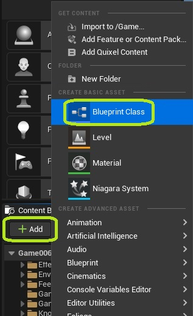

One of the main strengths of Executable Objects,  is that their functionality is exposed to Blueprint. This means that designers can easily create their own asynchronous actions entirely from the editor. This article will guide you through the steps required to create your own Executable Object.

Add a new Blueprint Class to your project.

Select ExecutableObject as the parent class.

Give your Executable Object a name

Override the On Execution Start function. 

Connect any logic you want to run when the execution starts.

Do the same for On Execution End. This logic will run when your execution has finished.

In an Event Graph of your choosing, add an Execute Object node.

Select your newly created Executable Object as the Class.

Some additional pins may be added automatically, based on your chosen class. To modify these pins, please follow the [tutorial on adding input execution pins](/executable-objects/2-tutorials/03-adding-input-execution-pins).

You use the Start Execution and End Execution pins to access the On Execution Start and On Execution End events you have created above. Aftwerwards, the execution will continue on the output pins of the node. 

Similarly, you can access the On Execution Update event by calling the Process Execution Update function from any Blueprint (from inside or outside the Executable Object).

To get a more general idea of the execution flow when working with Executable Objects, please consult the [article on Controlling the Execution](/executable-objects/1-reference-material/03-controlling-the-execution).

**Congratulations! You have successfully created your own Executable Object.**

What do to next?

* [Add input parameter pins](/executable-objects/2-tutorials/02-adding-input-parameters)
* [Add input execution pins](/executable-objects/2-tutorials/03-adding-input-execution-pins)
* [Add output delegate pins](/executable-objects/2-tutorials/05-adding-delegate-pins)
* [Add exclusivity rules](/executable-objects/2-tutorials/06-exclusivity)