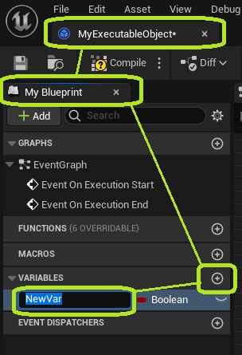
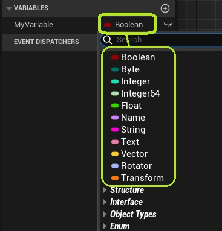
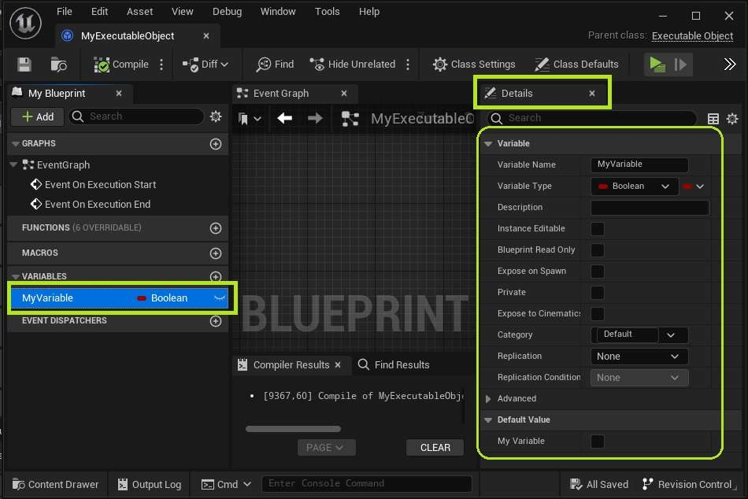
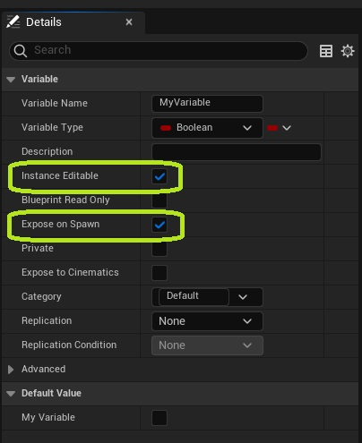
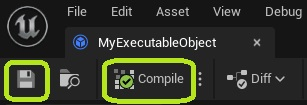
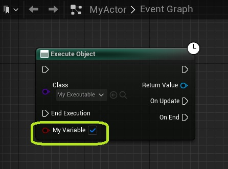

**Executable Objects can have exposed variables that affect what they do. This tutorial explains how to set up these parameters, and add them to a node.**

In your Executable Object Blueprint, navigate to the My Blueprint panel, and add a new variable.

Select the desired type of your variable.

Select your variable, and navigate to the *Details* panel. Here, you can change the variable name, type, description, default value, and any other properties of the variable.

In the details panel, Enable the *Instance Editable* and *Expose on Spawn* specifiers.

Compile and save your Bluerpint.

You may need to refresh existing nodes that were already placed for this object.

Your updated node will now have your newly created variable exposed as an input parameter.

*Congratulations! You have successfully added an input parameter to your Executable Object.*
