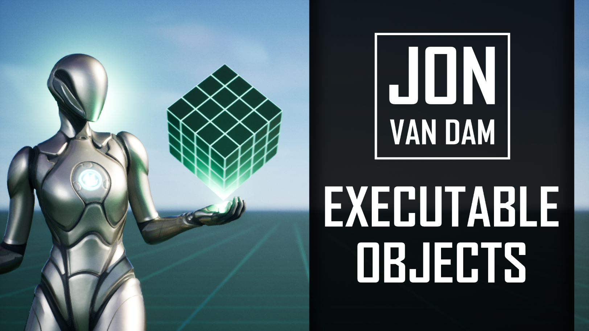
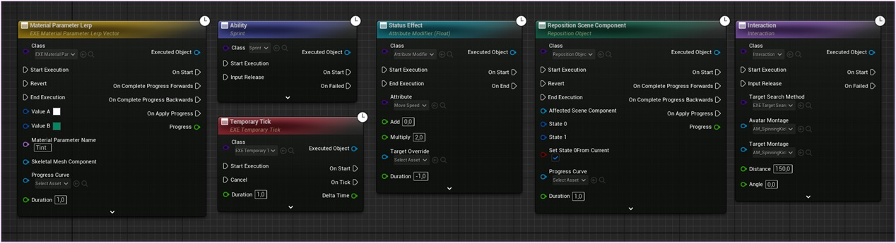
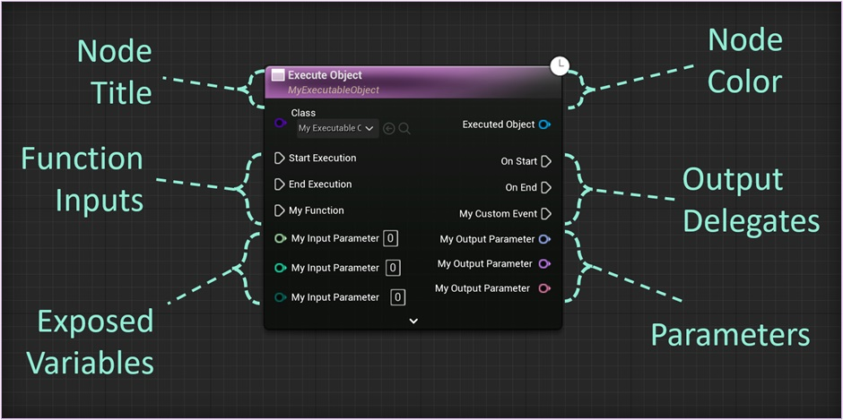

Executable Objects represent an action that will happen in the game world. They can be customized with their own inputs and outputs, both in the form of parameters and executions. All of this functionality is condensed into a single Blueprint node.

## What can they do?

You can use Executable Objects to build your own custom actions that happen over time. Some examples are:

* Gradually Updating Variables
* Moving an object from one place to another
* Abilities
* Status Effects
* Updating velocity (e.g. 'push' or 'dash' mechanics)
* Interactions (e.g. healing animations, throws, executions, ...)

**Essentially, any action or process that happens over time.** All of the examples mentioned above, can be found in the [example content](/executable-objects/02-reference-material/07-example-content).

## How to use them?

Executable Objects are easy to use. They can be controlled using a single Blueprint node, and have a clear execution flow. 

<embed src="/public/pdf/slide-overview.pdf" width="100%" height="500px" toolbar=0 frameborder="0" scrolling="no" />

## Create your own !

Executable Objects are exposed to Blueprint. This means that designers can easily create their own asynchronous actions entirely from the editor. Want to know how? The Tutorials section of this documentation will teach you how to:

* [Add exposed variables](/executable-objects/01-tutorials/02-adding-input-parameters)
* [Add custom function inputs](/executable-objects/01-tutorials/03-adding-input-execution-pins)
* [Add output delegates](/executable-objects/01-tutorials/05-adding-delegate-pins)
* And more!

## Getting started with the plugin

The Executable Objects plugin contains all the base classes you need to get started. It also has a example Blueprint classes of Executable Object Blueprints you can use as a base in your own project. A demo project is available as well. This project shows off some examples of what you can make using Executable Objects.
