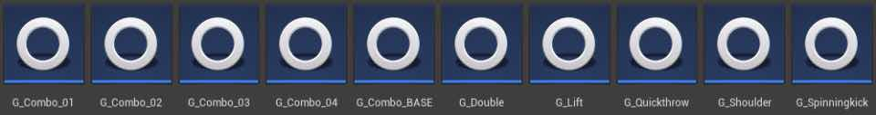
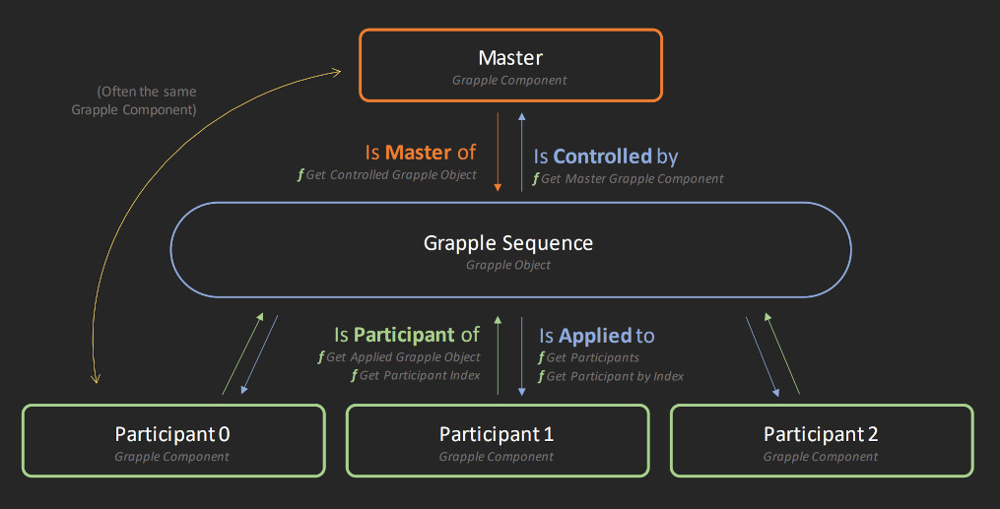
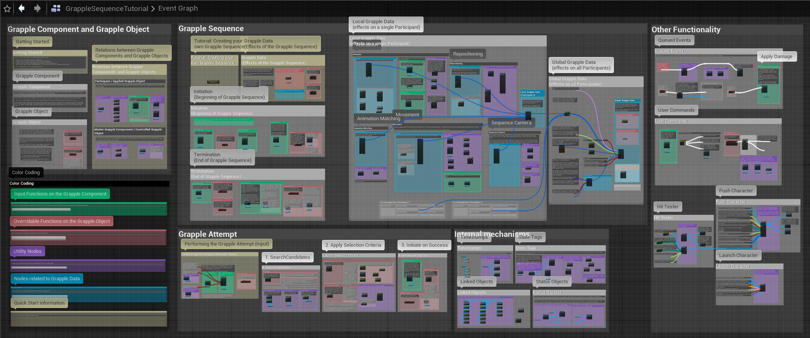

## Grapple Component

The Grapple Component is an Actor Component which can be added to any Pawn. It allows its owning actor to be a Participant in a Grapple Sequence.

## Grapple Sequence

A Grapple Sequence is an event where different characters interact with one another in the game world, for example by playing a synchronized sequence of animations together.

On a technical level, the Grapple Sequence is a state one or more Grapple Components can enter, where they each become Participant and assume a specific role.

The Grapple Sequence can apply different effects to each of its Participants. For example:

* Synchronized animations
* Repositioning
* Gameplay effects (e.g. blocking movement, damage)

## Grapple Object

A Grapple Object is a Blueprint that defines and represents a Grapple Sequence. 

## Participant / Applied Grapple Object

Grapple Objects have a list of Grapple Components that they are applying effects to. These are the **Participants** of the Grapple Sequence. During the Grapple Sequence, the Grapple Object is applied to the Participant.

* To access all Participants on a Grapple Object, use function Get Participants.
* To access a specific Participant based on its Participant Index, use function Get Participant by Index.
* To access the applied Grapple Object from a Grapple Component, use function Get applied Grapple Object.
* To get the current position of a participant in the array of its applied Grapple Object, use function 
Get Participant Index.

## Master Grapple Component / Controlled Grapple Object

Every Grapple object has a Master Grapple Component. This is the Grapple Component that has initiated the Grapple Sequence, and is in control of it.

* To access the Master Grapple Component on a Grapple Object, use function Get Master Grapple Component.

* To access the controlled Grapple Object on a Grapple Component, is function Get Controlled Grapple Object. While it is possible to access the Controlled Grapple Object in this way, it is suggested to use Input Functions instead.

A lot of the functionality of the Grapple Component is explained in the Graph of the 'Grapple Sequence Tutorial' Object.

## Getting Started

**Most users will be able to get started with the Grapple Component doing the following:**

- Following the tutorial on Installation.
- Following the tutorial on Implementation.
- Following the tutorial on Grapple Sequence.
- Consulting the Event Graph of the Grapple Sequence for more information and for links to commonly used Blueprint nodes.
- In addition to following the tutorials in this Documentation, you can opt to watch the introductory video tutorial.

In addition to following the tutorials in this Documentation, you can opt to watch the <a href="https://youtu.be/iCmOiVsCJYg" target="_blank">introductory video tutorial</a>
