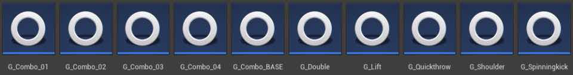
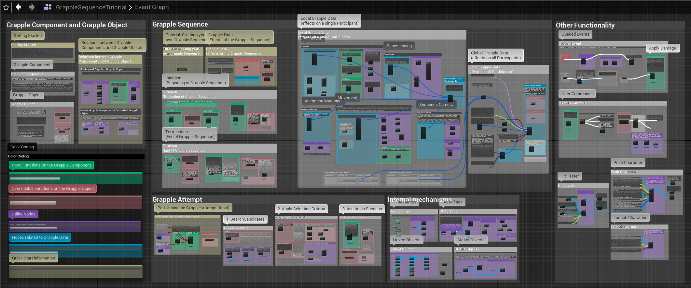

## Grapple Component

The Grapple Component is an Actor Component which can be added to any Pawn. The Grapple Component's main functionality relates to Grapple Sequences. It allows other Blueprints to control the Grapple Sequence, and acts as a proxy that represents its owning Actor in the Grapple Sequence.

## Grapple Sequence

A Grapple Sequence is an event where different characters interact with one another in the game world, for example by playing a synchronized sequence of animations together.

On a technical level, the Grapple Sequence is a state one or more Grapple Components can enter, where they each become Participant and assume a specific role.

The Grapple Sequence can apply different effects to each of its Participants. Most notably, Participants will play animations that are synchronized with one another. More generally, effects can be purely related to player feedback (e.g. synchronized animation updates; changes to the camera and viewpoint), but they can also affect gameplay (e.g. repositioning; ability to move; damage). Each Grapple Sequence is defined by a Grapple Object. The content included with the Grapple Component exists as a toolset for creating these Grapple Sequences.

## Grapple Object

### Concept

Grapple Objects are Blueprint Objects that inherit from class GrappleObject. They contain most of the functionality that is required to define and manage a Grapple Sequence. They are used to define a Grapple Sequence and manage its Participants. On a technical level, Grapple Objects are added to the Grapple Component as Status Objects.

### Functionality

Grapple Objects can be applied and reverted on Grapple Components, causing said Grapple Components to Enter or Exit the Grapple Sequence respectively. Each Grapple Component that has entered a Grapple Sequence, becomes a Participant and is assigned a unique Participant Index.

- The Grapple Object applies the effects of a Grapple Sequence to other Objects in the game world. This is done through the Grapple Component.
- Effects are applied and reverted whenever Participants enter or exit the Grapple Sequence. This typically occurs at the very beginning and the very end of the Grapple Sequence. To this end, the Grapple Object contains Grapple Data in the form of a variable structure. This Grapple Data describes the state Grapple Component and its owning Actor are in during the Grapple Sequence.
- The Grapple Object can be configured to apply effects based on external input, which is received through User Commands.
- The Grapple Component can also execute Queued Events at specifically planned times during the Grapple Sequence.

A lot of the functionality of the Grapple Component is explained in the Graph of the 'Grapple Sequence Tutorial' Object.

## Getting Started

**Most users will be able to get started with the Grapple Component doing the following:**

- Consulting this first chapter of Documentation (Grapple Component).
- Following the tutorial on Installation, which can be found at the end of this document.
- Following the tutorial on Implementation, which can be found at the end of this document.
- Following the tutorial on Grapple Sequence, which can be found at the end of this document.
- Consulting the Event Graph of the Grapple Sequence for more information and for links to commonly used Blueprint nodes.
- In addition to following the tutorials in this Documentation, you can opt to watch the introductory video tutorial.

In addition to following the tutorials in this Documentation, you can opt to watch the <a href="https://youtu.be/iCmOiVsCJYg" target="_blank">introductory video tutorial</a>
