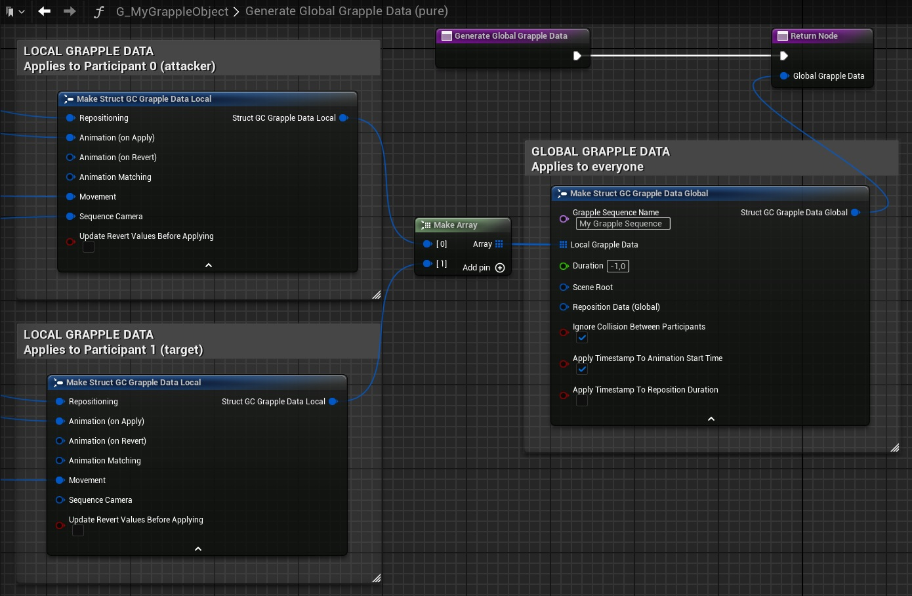

In the case if Grapple Objects inheriting from GrappleObject_StructBased, the effects of the Grapple Sequence are determined by its Grapple Data. This Grapple Data is split up into Global Grapple Data and Local Grapple Data.

For an overview of Global Grapple Data with example nodes, please consult the Graph of the [Grapple Sequence Tutorial Object](/grapple-component/6-tutorials/030-gctutorial).

## Global Grapple Data

The Global Grapple Data contains the settings that will be applied during a Grapple Sequence and are common to all Participants. In other words, they apply to the Grapple Sequence as a whole.

Global Grapple Data are defined using a variable structure of type Struct_GC_GrappleData_Global, which consists of the following member variables.

| Member variable | Description |
| ----------- | ----------- |
| Grapple Sequence Name | The name used to identify the Grapple Sequence. Defining this is optional. |
| Local Grapple Data | The Grapple Settings that are specific to each individual Participant. These settings are stored in an array of type struct_GC_GrappleData_Local, where each element corresponds to the Local Grapple Data of the Participant with that index. |
| Duration | Time after which the Grapple Sequence is Terminated. If a negative value is set, the Grapple Sequence will not be terminated automatically. In that case, it can be terminated manually using Input Function Terminate Grapple Sequence (Input) on the Grapple Component.   |
| Scene Root | The primitive component that acts as the Scene Root for the Grapple Sequence. Participants will be repositioned relative to this component, depending on their Local Reposition Data. By default, the Scene Root will be the root component of the Owning Actor of Participant 0. |
| Reposition Data (Global) | Defines the Global Reposition Data, i.e. how the Grapple Sequence as a whole should be placed in the game world. |
| Ignore Collision between Participants | Whether to ignore collision between Participants during the Grapple Sequence. It is also possible to disable collision entirely for an individual Participant using Movement Settings. |
| Apply Timestamp to Animation Start Time | Increase the animation start time to compensate latency between different connections. This is done by calling function Apply Timestamp to Animation Data, which makes use of the timestamp stored when Grapple Data were applied. |
| Apply Timestamp to Reposition Duration | Shorten the duration of the Reposition to compensate latency between different connections. This is done by calling function Apply Timestamp to Reposition Duration, which makes use of the timestamp stored when Grapple Data were applied. |

## Local Grapple Data

The Global Grapple Data contains an array of Struct_GC_GrappleData_Local structures. This is referred to as the Local Grapple Data, and applies to a single Participant.

| Member variable | Description |
| ----------- | ----------- |
| Repositioning | The way this Participant will be repositioned relative to the Scene Root of the Grapple Sequence. The Scene Root is defined in the Global Grapple Data using a struct_SceneComponentDefinition. |
| Animation (On Apply) | The animation that is played when the Grapple Data are Applied. |
| Animation (On Revert) | The animation that is played when the Grapple Data are Reverted. |
| Animation Matching | The way bones on this Participant should be retargeted in order to match the location of bones on other Participants. See also: Animation Matching (adapting animation depending on skeletal mesh). |
| Movement | Settings related to the movement of the Character, which are applied in layers by the Grapple Component. When the Grapple Settings are reverted, the Movement Settings are usually reset to their Revert Values. |
| Sequence Camera  | Defines the Sequence Camera settings for this Grapple Sequence. By default, the Sequence Camera is not used. |
| Update Revert Values before Applying | Whether to update Revert Values right before applying the Grapple Settings. Revert Values are stored based on their current values. Use this If you want a Character to exit the Grapple Sequence the same way it has entered. |

## Storage in the Grapple Object

Grapple Data is stored in a Grapple Object. When creating your own Grapple Object, you can define its Grapple Data in the following ways:

* Override function Generate Global Grapple Data.
* Set the variable Stored Global Grapple Data in the *class defaults*. 

Note that if both are overridden, the contents of the function will prevail over those of the variable. Internally, the Grapple Object will call the function once when it is constructed, and store the generated values in the varible for later use.

