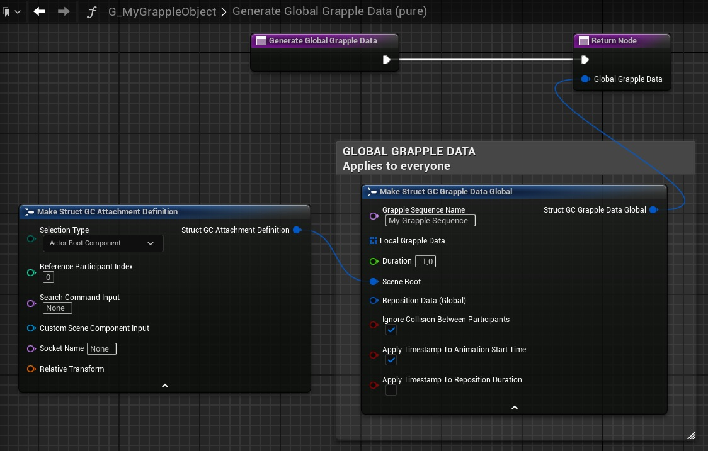
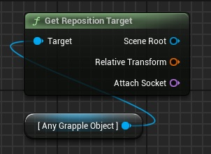
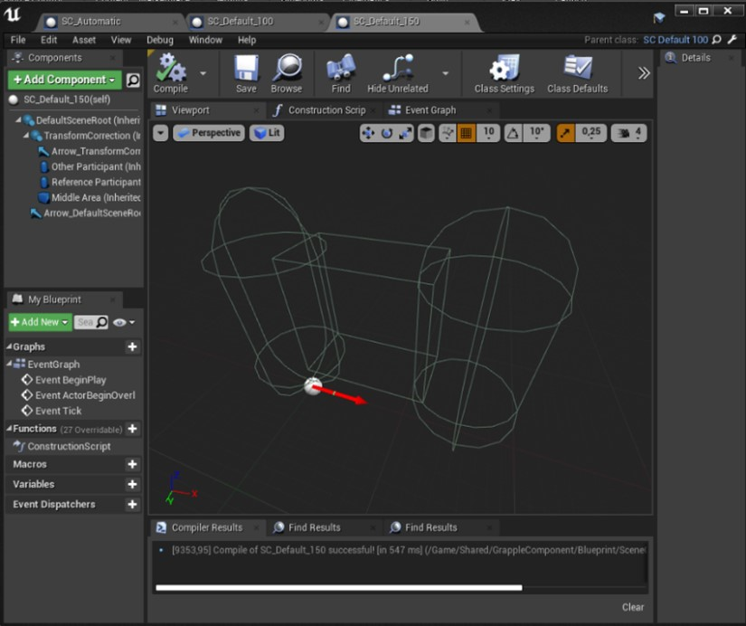
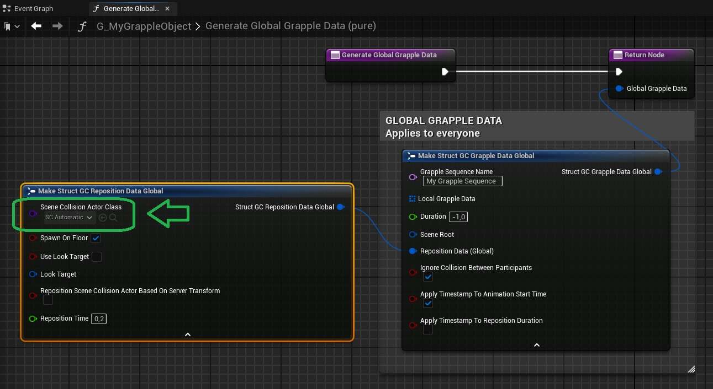
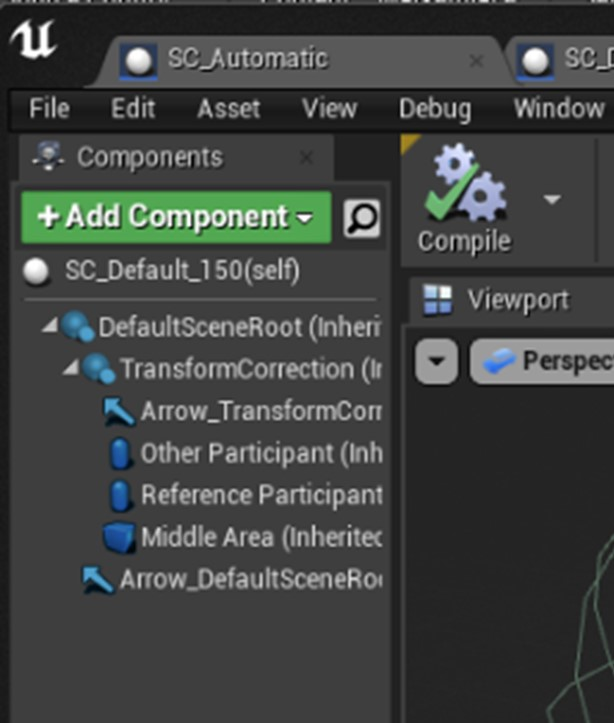
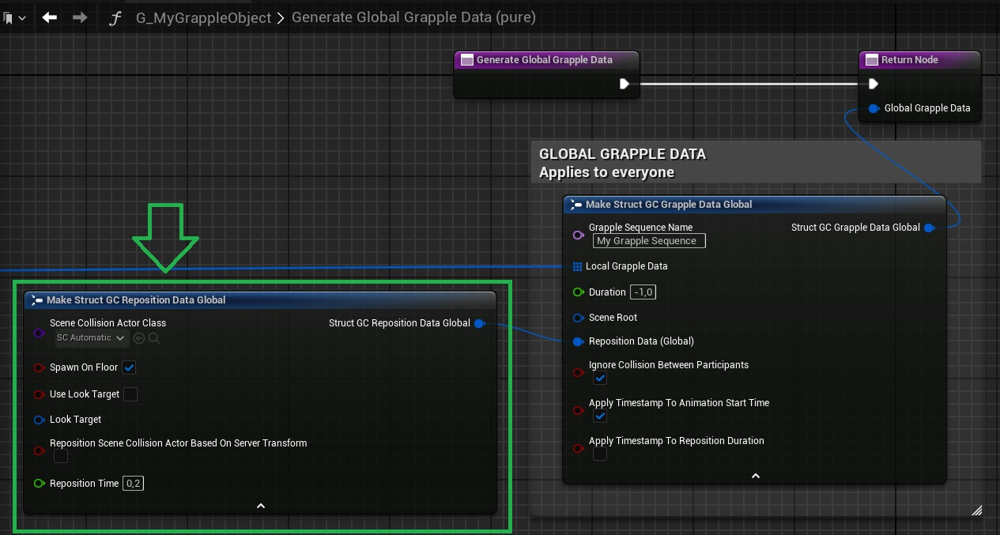
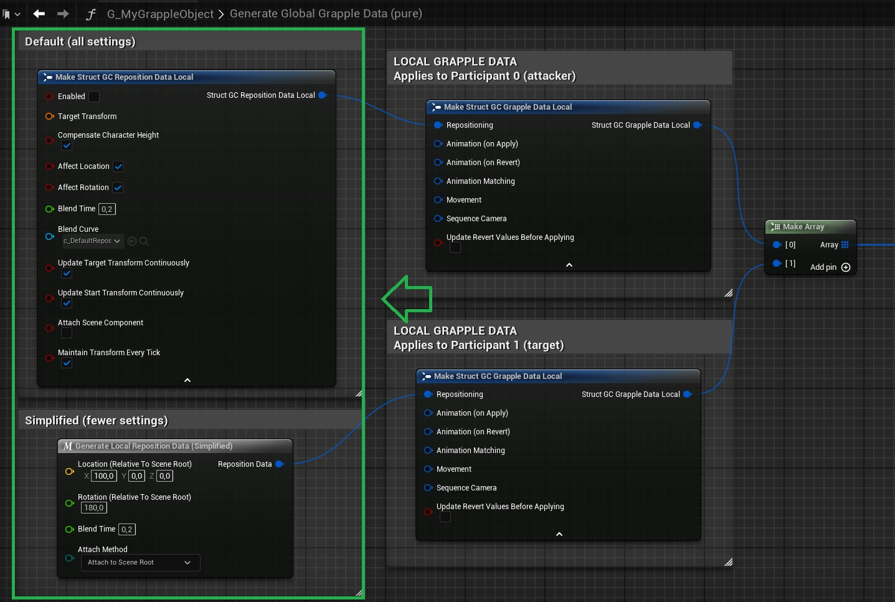

The [Grapple equence](/grapple-component/1-overview-of-the-grapple-component/010-basic-concepts) can influence the world transformation of Components on Pawns, as well as their parent/child relations to other Components. This is done through repositioning. Settings related to repositioning are split up between the [Global Grapple Data](/grapple-component/2-effects-of-the-grapple-component/010-grapple-data) and the [Local Grapple Data](/grapple-component/2-effects-of-the-grapple-component/010-grapple-data).

## Scene Root

The Scene Root is a transformation that acts as the root for the Grapple Sequence. Participants will be repositioned relative to the transformation of the Scene Root, unless the Grapple Sequence is using a Scene Collision Actor.

The Scene Root is defined in the Global Reposition Data of a Grapple Sequence using a variable structure of type  struct_GC_AttachmentDefinition. 

While this structure allows you to define an attach socket and a relative transform, these settings will only have effect if your Grapple Sequence is using a Scene Collision Actor.

By default, the Scene Root will be the root component of the [Master Grapple Component](/grapple-component/2-effects-of-the-grapple-component/010-grapple-data)'s owner.

## Reposition Target

Every Grapple Sequence has a Reposition Target. This is the Scene Component that acts as a reference point for repositioning. All repositioned Scene Components will be transformed relative to this target.

The Reposition Target is automatically set by the Grapple Component. The actual Scene Component assuming the role of the Reposition Target depends on whether the Grapple Sequence is using a Scene Collision Actor.

* If there is no Scene Collision Actor, the Scene Root will be the Reposition Target.
* If there is a Scene Collision Actor, the scene component 'Scene Root Correction' of the Scene Collision actor will be the Reposition Target.

## Scene Collision actor

### Purpose

Optionally, you can specify a SceneCollisionActor class in the [Global Grapple Data](/grapple-component/2-effects-of-the-grapple-component/010-grapple-data).

This will spawn a Scene Collision Actor at the beginning of the Grapple Sequence. This is an actor that takes up the space where the Grapple Sequence will happen. When the Scene Collision Actor is spawned, it will automatically find a suitable transform for the Grapple Sequence in the world. This prevents characters from colliding with the world.

The Scene Collision Actor is spawned at the location of the Scene Root, and takes its place as the Reposition Target. Depending on the Global Reposition Data, the spawn rotation of the Scene Collision Actor will be modified so that it is aligned towards (i.e. looks at) a target Scene Component.

Note that the Scene Collision will take the place of the Scene Root provided above, meaning that all Participants will be repositioned based on the root of the Scene Collision Actor instead.

### Scene Root Correction

The Attempt Transform Correction event executes the Scene Collision Actor's main functionality, which is looking for a world transform that acts as the root of a Grapple Sequence and that leaves enough space for all relevant animations to play out, without having characters collide with the world.

To this end, the Scene Collision Actor contains one or more Primitive Components. These Primitive Components represent the Participants in the current Grapple Sequence, as well as the space they need to be able to move within.

The Scene Collision actor will test if any of these Primitive Components are colliding with the world, and if so, will try applying some 'corrections' to the original transform, in order to make the Grapple Sequence fit into the game world physically.

### How to use

To make use of a Scene Collision Actor, select a Scene Collision Actor Class when defining the Global Reposition Data of your Grapple Sequence.

### Automatic Scene Collision Actor

For most situations, using SC_Automatic is recommended.

This Scene Collision Actor that automatically sets up collision based on the estimated proportions of the Grapple Sequence. It ensures that the Grapple Sequence is placed in such a way that none of the participating Characters collide with the game world.

### Creating your own Scene Collision Actor

To create your own Scene Collision Actor, follow these steps:

* Create a child Blueprint Class of SceneCollisionActor.
* Add the necessary Primitive Components to represent the physical dimensions of your Grapple Sequence. These primitive Components should be parented to the Scene Root Correction Scene Component.

### Disabling the Scene Collision Actor

To disable the Scene Collision Actor for a Grapple Sequence, set the Scene Collision Actor Class to (None) in your Global Reposition Data.

## Defining reposition settings using Grapple Data

### Global Reposition Data

### Local Reposition Data

