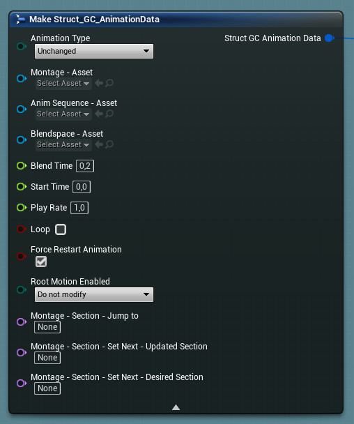
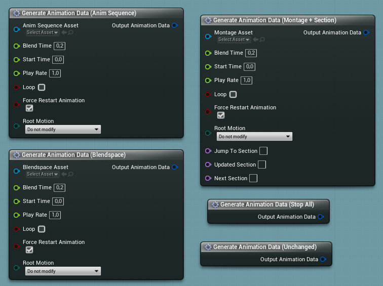

## Animation Data

The Grapple Component processes animation instructions when the Update Animation (Input) function is called. These animation updates are processed in the Linked Anim Instances of the Grapple Component. By default, this is the Linked Anim Graph that has been placed in the Character's Animation Blueprint.

These animation instructions are stored in a variable structure called struct_GC_AnimationData.

| Member variable | Description |
| ---------------------------------------------- | --------------------------------------------------------------------------------------------------------------------------------------------------------------------------------------------------------------------------------------------------------------------------------- |
| Animation Type                                 | Specifies the type of animation to be used (Anim Sequence, Blendspace or Animation Montage).                                                                                                           |
| Montage - Asset                                | In case Montage is selected under Animation Type, the Animation Montage asset that will be used is selected here.                                                                                                                                                                 |
| AnimSequence - Asset                           | In case Anim Sequence is selected under Animation Type, the Anim Sequence asset that will be used is selected here.                                                                                                                                                               |
| Blendspace - Asset                             | In case Blendspace is selected under Animation Type, the Blendspace asset that will be used is selected here.                                                                                                                                                                     |
| Blend time                                     | The desired blend time between animations.                                                                                                                                                                                                                                        |
| Start Time                                     | The initial position of the animation (in seconds)                                                                                                                                                                                                                                |
| Play Rate                                      | The play rate of the animation                                                                                                                                                                                                                                                    |
| Loop                                           | Whether the animation should loop (start over when it is finished)                                                                                                                                                                                                                |
| Force restart animation                        | Whether to force the animation to restart if the same asset is already playing                                                                                                                                                                                                    |
| Root Motion Enabled                            | Whether to enable root motion during the animation.                                                                                                                                                                                                                               |
| Montage - Section - Jump to                    | In case Montage is selected under Animation Type, the section to jump to. If this member variable is set to 'none' the section will remain unchanged.                                                                                                                             |
| Montage - Section - Set Next - Updated Section | In case Montage is selected under Animation Type, the function Montage Set Next Section will be called on the Animation Blueprint. This member variable will be passed on to the parameters of this function. It should contain the name of the section that needs to be changed. |
| Montage - Section - Set Next - Desired Section | In case Montage is selected under Animation Type, the function Montage Set Next Section will be called on the Animation Blueprint. This member variable will be passed on to the parameters of this function. It should contain the name of the next section.                     |

## Animation type

The enumeration Enum_GC_AnimationType is used to select the type of animation update we want to process when playing animation from the Grapple Component. These modes act as 'channels' that the Animation Blueprint switches between. 

| **Member variable** | **Description** |
| ----------- | ----------- |
| Stop All  | Stop all animation currently being played by the Grapple Component. |
| AnimSequence  | Use an Animation Sequence as the source for the animation. This can be user-friendly because external animation assets are typically imported into the Engine as Animation Sequences. |
| Montage  | Use an Animation Montage as the source for the animation. Montages are the most suitable way to create a Grapple sequence. They support the use of Montage Slots, Sections, and are more stable in multiplayer projects They also enable users to combine and selectively play animations that are contained in a single asset. |
| Blendspace  | Use a Blend Space as the source for the animation. Blend Spaces are assets that allow any number of animations to be blended between based on the values of multiple inputs. |
| Unchanged  | Do not change the animation. |

## Generating Animation Data

Animation Data can be generated using a Make struct_GC_AnimationData node. This node contains all of the pins that make up the Animation Data.

Alternatively, it is possible to use any of the following Macros:

*Macro - Make Animation Data (Simplified) 
*Macro - Make Animation Data (Montage) 
*Macro - Make Animation Data (Montage + Section) 
*Macro - Make Animation Data (Anim Sequence) 
*Macro - Make Animation Data (Blendspace) 
*Macro - Make Animation Data (Stop All) 
*Macro - Make Animation Data (Unchanged) 

## Animation Updates

Animation can be updated through the Grapple Component by using node Update Animation (Input). During a Grapple Sequence, it is also possible to update Animation Data on multiple Participants using node Update Animation for Multiple Participants (Input). 

These events take the input of a struct_GC_AnimationData variable structure, either in the form of a single variable or an array.

Animation is also updated at the beginning and at the end of a [Grapple Sequence](/grapple-component/1-overview-of-the-grapple-component/010-basic-concepts), if any animation data is provided in the [Local Grapple Data](/grapple-component/2-effects-of-the-grapple-sequence/010-grapple-data).