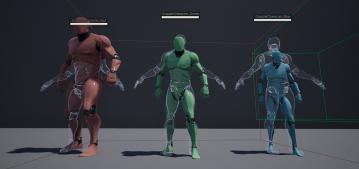
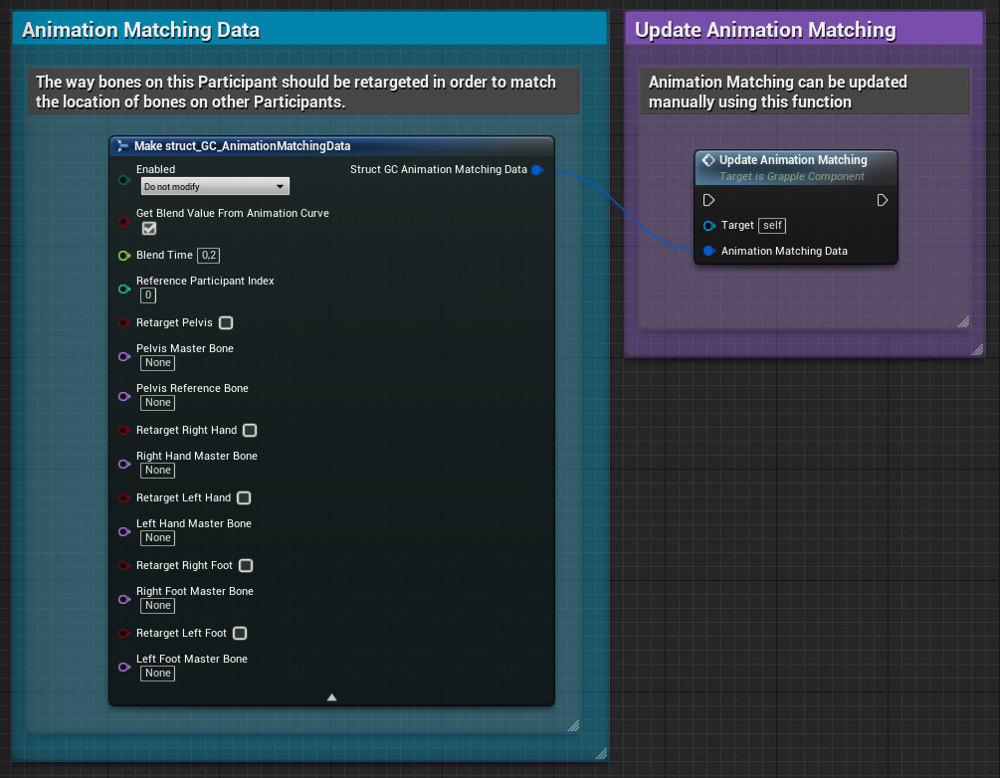
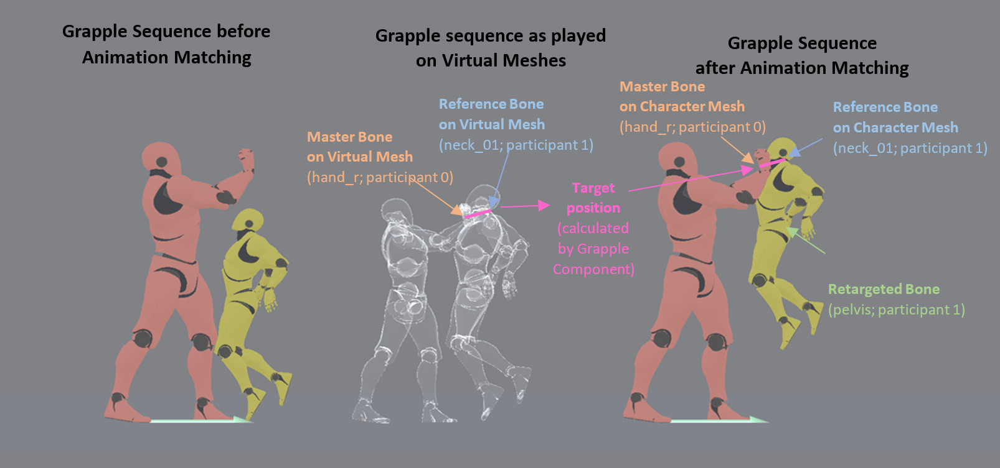

The Animation Blueprint used for animation matching are designed to be used with the UE5 Manny/Quinn skeleton and the UE4 Mannequin Skeleton. It may not work without modifications if used on skeletal meshes with a different skeleton.

## Typical Use Cases

Some animations will no longer match each other if they are played on skeletal meshes with proportions that are different from the one used for animating.

The Animation Matching feature attempts to remedy this mismatching by a certain extent. If Animation Matching is enabled, the Grapple Component will move the location of certain bones in the owner's skeletal mesh to match the position of certain other bones in the skeletal mesh associated with another Grapple Participant.

## Virtual Mesh Actor

Animations can appear mismatched when they are played on skeletal meshes that have different proportions than the skeletal meshes the animations were originally created in. The Grapple Component can attempt to resolve this mismatching by moving the relevant bones based the Skeletal Mesh on one Participant, based on the Skeletal Mesh of another Participant.

This is done by internally creating an 'ideal scenario', where all relevant animations are being played on their original skeletal meshes. The Grapple Component then takes the relative bone locations from this 'ideal scenario', and applies them to the non-ideal scenario that is taking place in the Grapple Sequence.

The original skeletal meshes mentioned above are added into the game world using a **Virtual Mesh Actor**. This is a Skeletal Mesh Actor, attached to the character mesh. Its skeletal mesh is the same as the one use used to author the animations. This virtual mesh is invisible to players, and only plays the animations that are relevant in a grapple  sequence.

## Animation Matching Settings

### Update Methods

Bones will be moved based on the Animation Matching Settings provided by the user. These settings can be set in the following ways:

* To set the Animation Matching Settings for the duration of a Grapple Sequence, set them in the [Global Grapple Data](/grapple-component/2-effects-of-the-grapple-component/010-grapple-data) of your [Grapple Object](/grapple-component/1-overview-of-the-grapple-component/basic-concepts).

* To change the settings manually, use function Update Animation Matching on the Grapple Component.

* To update the settings based on animation playback, use Animation Notify AnimNotify_Grapple_UpdateAnimationMatchingSettings in your animation asset.

### Animation Matching Data

All of these input methods require the input of Animation Matching Data. This data comes in the form of a variable structure of type struct_GC_AnimationMatching, which contains a set of instructions on how to adjust the animation on the Owner Skeletal Mesh Component in order to match the animation on other Participants. Essentially, the member variables specify the following:

* which bones are being affected;
* based on which bones on the other Participant they should be moved; and
* which other Participant to base these corrections on.

More specifically, it ahs the following member variables:

| **Member variable** | **Description** |
| ----------- | ----------- |
| Enabled | Whether Animation Matching should be processed by the Grapple Component. |
| Get blend value from animation curve	 | Whether the Blend Value for the Animation based should be based on the value of Animation Curve AnimationMatching on the animation asset that is currently playing. |
| Blend Time | Blend time between the pose with and without Animation Matching. |
| Reference Participant Index | The Participant to adjust the animation to. |
| Retarget [Bone name]; [Bone name] Master bone | Retarget [none name]: whether to adjust the bone. [Bone name] master bone: the name of the bone/socket that the retargeted bone should keep a 'correct position' to. This 'correct position' is calculated by taking the relative locations of these bones on the respective character's Virtual Meshes, and then applying it to the actual Character meshes in the game world. Pelvis reference bone: The pelvis can be repositioned in such a way that another bone maintains the 'correct position' relative to the other Character. |

## Terminology

| **Term** | **Description** |
| ----------- | ----------- |
| Retargeted Bone	 | The bone that is actually being moved by the Grapple Component. |
| Reference Bone	 | If no Reference Bone is set, the Retargeted Bone will act as the Reference Bone. |
| Master Bone		 | The name of the bone/socket that the reference bone should keep a 'correct position' to. This 'correct position' is calculated by taking the relative locations of these bones on the respective character's Virtual Meshes, and then applying it to the actual Character meshes in the game world. The master bone name can also refer to a socket. |
| Target Position	 | The position of the reference bone relative to the master bone. |

## Bones that can be subject to Animation Matching

| **Bones** | **Implementation** |
| ----------- | ----------- |
| Hand_r; Hand_l; Foot_r; Foot_l | Animation matching on the limbs is done by creating a two bone IK chain. The effector location will be the calculated so that the reference bone will  be in the target position relative to the master bone.A location for the joint target (ie. the target location of the knee/elbow) will also be calculated based on the pose of the Virtual Mesh. Animation matching on the hands and feet will thus affect multiple bones on the limb (more specifically the thigh, calf and foot bone for the legs and the upperarm, lowerarm and hand bones on the arms). |
| Pelvis	 | Animation matching on the pelvis is applied moving the pelvis (=retargeted bone) in such a way that the reference bone will be at the target position compared to the master bone. Animation matching on the pelvis will eventually affect all deform bones on the Skeletal Mesh, as they are all below the pelvis in the bone hierarchy. |

