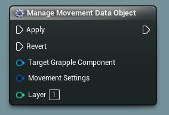
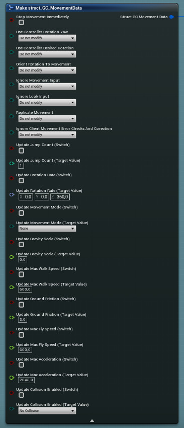

## Movement Settings and Movement Data Objects

The Grapple Component can affect the way Characters move in the game world. In a typical scenario, this would be used to keep characters in place during a Grapple Sequence.

This is done using **Movement Data Objects**. These Objects are stored in layers on the Grapple Component, which are applied from low to high. The Movement Data Object's purpose is to store movement settings, in the form of a variable structure of type struct_GC_MovementData. The member variables all perform one of the following functions:

* Stop movement immediately (unlike all other functionality on the Movement Data Object, which are properties/states being changed temporarily).
* Modify a Boolean variable. Users can specify which operation they want to execute by inputting a variable of type Enum_ModifyBoolean.
* Modify a variable that is of another type than Boolean. These member variables always come in pairs. A first member variable (of type Boolean) acts as a switch and determines if the variable in question should be changed, and another member variable contains the new value of the variable in question.

## Updating Movement Settings

### Relevant functions

Movement Settings can be updated in the following ways:

* [Initiating a Grapple Sequence](/grapple-component/3-controlling-the-grapple-sequence/010-initiating-the-grapple-sequence) and providing Movement Data as a part of the [local Grapple Data](/grapple-component/2-effects-of-the-grapple-component/010-grapple-data) for the associated Participant.

* Constructing an Object of Class MovementDataObject and providing it to the Grapple Component using the Update Movement Data Objects Event. This will add the Movement Data Object to a list on the Grapple Component, and will apply its Movement Settings in the right order. It is recommended to store the output Object as a Variable, so that you can access it later to remove the Object again, reverting its Movement Settings. Some examples of Movement Data Presets are included in the [content examples](/grapple-component/6-tutorials/040-accessing-content-examples).

* Using the Manage Movement Data Object Macro. This allows users to input Movement Data directly, and apply/revert it to when necessary. The Object is created within the Macro, and a Reference to the created Object is stored internally as well.

### Generating Movement Data

The functions mentioned above require an input of type Struct_GC_MovementData. This variable structure defines the effects of the Movement Data Object. It can be generated using the following nodes:

* Generate Movement Data (From Preset). This Macro can be used to update Movement Data based on an Object of Class MovementDataPreset. These presets are simple Object Classes that only contain a variable with the output movement data. To make your own preset, simply create a new Blueprint Class and select MovementDataPreset as the parent class. The associated Movement Data can be set in the Class Defaults tab.

* Make Struct_GC_MovementData. This node grants access to all parameters of the veriable structure. It can be used to apply settings that do not adhere to any preset.

## Revert Values

The Revert Values for a Grapple Component (i.e. the default state of all the variables affected by Movement Data Objects) are stored at layer 0, in an Object stored in variable Movement Data Object - Revert Values. These Revert Values can be updated in the following ways.

* Function Movement Data - Update Revert Values updates the Revert Values based on input Movement Data.

* Function Movement Data - Update Revert Values Based on Current State updates Revert Values based on the current state of the actor. 

This function is automatically called on begin play. To disable this behaviour, set variable Update Revert Values on Begin Play on the Grapple Component to false .

This function is called when Entering a Grapple Sequence if member variable Update Revert Values before Applying is set to true in the [local Grapple Data](/grapple-component/2-effects-of-the-grapple-component/010-grapple-data). 

## Snap to Control Rotation

The Grapple Component contains Events that can be used to instantly set the rotation of the [Linked Pawn](/grapple-component/5-internal-mechanisms/070-references-to-external-objects) to be its control rotation across all Connections.

* Event Snap to Control Rotation From Server (Input): Takes the Control Rotation for the [Controller](https://dev.epicgames.com/documentation/en-us/unreal-engine/controllers-in-unreal-engine?application_version=5.4) possessing the Pawn owning this Grapple Component (based on its value on the Server), and sets it to be the actual Rotation of the Pawn on all Connection. 

* Event Snap to Control Rotation From Client (Input): Takes the Control Rotation for the  [Controller](https://dev.epicgames.com/documentation/en-us/unreal-engine/controllers-in-unreal-engine?application_version=5.4) possessing the Pawn owning this Grapple Component (based on its value on the Client), and sets it to be the actual Rotation of the Pawn on all Connection.

