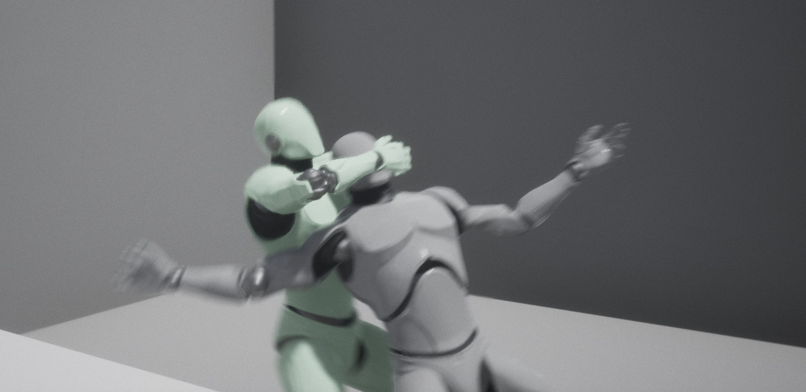
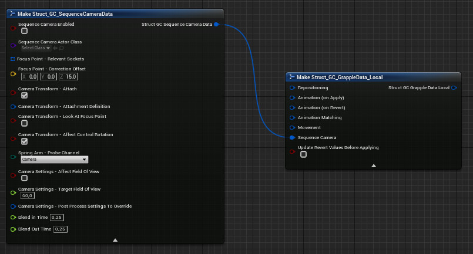
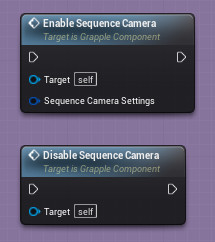
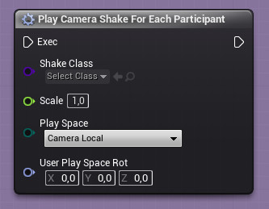

## Purpose of the Sequence Camera

If a Participant in a Grapple Sequence is controlled by a Player controlled Character, the Grapple Sequence can influence the viewpoint of this Player. This can make the Grapple Sequence appear more dramatic, impactful and cinematic to human players.

Using the Sequence Camera, you can do the following:

* Animate the player's viewpoint or attach it to 'camera bones' on a Skeletal Mesh
* Change [Post Process Settings](https://dev.epicgames.com/documentation/en-us/unreal-engine/post-process-effects-in-unreal-engine) (lens flare, motion blur, saturation, color correction, etc.)
* Change the [Field of View](https://www.youtube.com/watch?v=LuURSFbRPpA) of the camera
* Make the camera automaticallty track important elements of the [Grapple Sequence](/grapple-component/1-overview-of-the-grapple-component/basic-concepts)

## Updating the Sequence Camera

### Relevant nodes

* The Sequence Camera can be enabled for the duration of a [Grapple Sequence](/grapple-component/1-overview-of-the-grapple-component/basic-concepts) by setting the Sequence Camera settings in the [Local Grapple Data](/grapple-component/2-effects-of-the-grapple-component/010-grapple-data) using a  Make Struct_GC_SequenceCameraData node. 

* The Sequence Camera can also be updated manually using functions Enable Sequence Camera and Disable Sequence Camera.

### Sequence Camera Settings

The nodes above require the input of Sequence Camera Settings. These instructions are provided in the from of a variable structure of type struct_GC_SequenceCameraData. This variable structure consists of the following member variables. 

#### General settings

| **Member variable** | **Description** |
| ----------- | ----------- |
| Sequence Camera Enabled	 | Whether the Grapple Component should create and control a Sequence Camera Actor. |
| Sequence Camera Actor Class	 | The Class of Sequence Camera Actor that will be spawned for this Grapple Sequence. This variable can be changed in case the user wants to create their own version (Child Object) of the Sequence Camera Actor in order to implement specific behaviour. |

#### Focus Point

The Sequence Camera Actor contains a Scene Component that represents its Focus Point (i.e.. a physical location in the Game World where the center of the action in a Grapple Sequence should be).

The Focus Point of the Sequence Camera has two purposes:

* It is the location of the Spring Arm Component, which means that if the Camera Component needs to be moved in order to avoid collision with the world, it will be moved towards the location of the Focus Point.
* If enabled in the Sequence Camera Settings, the Camera Component will be rotated to look at the location Focus Point. On most Grapple Sequences, this creates the illusion of a handheld camera filming the action.

| **Member variable** | **Description** |
| ----------- | ----------- |
| Focus Point - Relevant Sockets	 | The location of this Scene Component is updated for every tick that  the Sequence Camera is active. The location is based on the average location of the Scene Components or Sockets provided in this Member Variable |
| Focus Point - Correction Offset | Correction to the Focus Point location, which is added after calculating the average position an applied in world space. |

#### Camera Transform

In most cases, the Sequence Camera's transformation will be set based on other Scene Components (e.g. a camera bone on the Skeletal Mesh Component of the Character).

| **Member variable** | **Description** |
| ----------- | ----------- |
| Camera Transform - Attach | Whether to set the transformation on the Camera Component of the Sequence Camera Actor based on other Scene Components. By default, the Sequence Camera will be attached to the Camera Component on the Character. This means that Players will perceive the Grapple Sequence as if their viewpoint has not changed, but the settings (tracking of the focus point, post process settings, field of view, etc.) have only been changed on the existing camera. In reality, the Sequence Camera simply copies the transformation of the original View Target, and applies its own effects from there. This means that the original View Target (typically the Character itself, driven by a Camera Component) remains unaffected by the Grapple Sequence.  |
| Camera Transform - Attachment Definition	 | Defines the Scene Component the Sequence Camera should be attached to, the relevant Socket and the relative transform. |
| Camera Transform - Look at Focus Point	 | Whether to rotate the Sequence Camera towards the focus point after calculating the previous transformations. |
| Camera Transform - Affect Control Rotation	 | Whether to set the Control Rotation (on the Controller that is possessing the Character) to the world rotation of the Sequence Camera. This can facilitate seamless blending between the default View Target and the Sequence Camera, because View Targets on Character Blueprints are often Camera Components that are directly affected by the Control Rotation. |
| Camera Transform - Anim Curve | Vercor curve asset that drives the animation of the Sequence Camera. Note that this will be overridden if Camera Transform - Attach is set to true. X = yaw rotation of the spring arm, this effectively controls the orbit of the camera around the focus point. Y = pitch of the spring arm, which influences the height of the camera relative to the focus point. Z = target arm length of the spring arm, this controls the distance of the camera from the focus point.|

#### Other

| **Member variable** | **Description** |
| ----------- | ----------- |
| Spring Arm - Probe Channel	 | The Probe Channel to be used by the Spring Arm Component on the Sequence Camera Actor. |
| Camera Settings - Affect Field of View | Whether to affect the field of view of the camera. |
| Camera Settings - Target Field of View	 | The field of view when the Sequence Camera is fully blended in. |
| Camera Settings - Post Process Settings to Override	 | Post Process Settings that will be overridden when the Sequence Camera is active. |
| Blend in time	 | The time over which to blend in to the Sequence Camera. |
| Blend out time	 | The time over which to blend back out of the Sequence Camera. |

## Sequence Camera Actor

On a technical level, effects from the Sequence Camera are achieved by accessing the [Player Camera Manager](https://docs.unrealengine.com/en-US/InteractiveExperiences/Framework/Camera/index.html). The [View Target](https://docs.unrealengine.com/en-US/BlueprintAPI/Game/Player/SetViewTargetwithBlend/index.html) on this Player Camera Manager is then changed to a Sequence Camera Actor. This is an actor of Class SequenceCameraActor
SequenceCameraActor, which is created for each Grapple Sequence that requires a Sequence Camera. The Sequence Camera Actor handles all logic required to animate/modify the Sequence Camera as needed, without affecting the default View Target of the [Player Controller](https://docs.unrealengine.com/en-US/InteractiveExperiences/Framework/Controller/PlayerController/index.html).

To get a reference to the currently active Sequence Camera Actor, use function Get Sequence Camera Actor on the Grapple Component.

## Camera Shakes

The Framework for playing [Camera Shakes](https://docs.unrealengine.com/en-US/BlueprintAPI/CameraShakes/index.html) is built in to the Engine and works independently from the Sequence Camera or the Grapple Component. However, Macro Play Camera Shake for Each Participant exists on the Grapple Object in order to facilitate adding Shakes that are seen by all [Participants](/grapple-component/1-overview-of-the-grapple-component/basic-concepts)involved in the Grapple Sequence.

