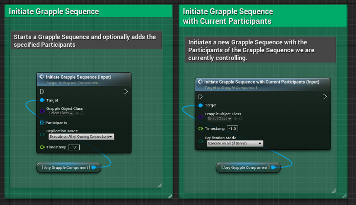
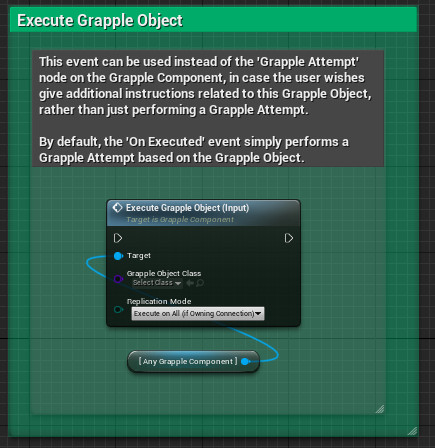

When a Grapple Sequence is initiated, it updates its Participants, applies effects to them, starts executing Queued Events, and starts receiving User Commands from its Master Grapple Component. This point in time can be seen as the 'beginning' of the Grapple Sequence.

A Grapple Sequence is always Initiated from a Grapple Component, which will then become the [Master](/grapple-component/1-overview-of-the-grapple-component/basic-concepts) of the Grapple Sequence. Initiating a Grapple Sequence will terminate the Grapple Sequence that is currently controlled by the Master Grapple Component.

Grapple Sequences can be initiated in the following ways.

## Grapple Attempt

A grapple attempt is a process where the Grapple Component searches for other Grapple Components that are eligible to join a Grapple Sequence, filters those Candidates based on certain criteria and then initiates a Grapple Sequence with itself and these Candidates as the Participants. It will typically serve as the link between a Grapple Sequence and gameplay.

Grapple Attempts are initiated on the basis of a [Grapple Object](/grapple-component/1-overview-of-the-grapple-component/basic-concepts) Class. This can be done using any of the following input functions: 

* Grapple Attempt (Input) 
* Grapple Attempt Advanced (Input) 

Please consult the dedicated section on [Grapple Attempts](/grapple-component/3-controlling-the-grapple-sequence/030-grapple-attempt) for more information.

## Initiating the Grapple Sequence directly

Function Initiate Grapple Sequence (Input) on the Grapple Component can be used to make a specific set of Grapple Components enter a Grapple Sequence together.

Initiating a Grapple Sequence directly is useful in cases where you have determined that a Grapple Sequence will initiate, regardless of circumstances in the game world. It gives you direct control over the Grapple Sequence. When using this node, only the Global Grapple Data on the Grapple Object will be taken into account. The Search Method and the Selection Criteria of the Grapple Object are not relevant in this case.

Is a Grapple Sequence is already active and controlled by the Grapple Component, it is possible to use Function Initiate Grapple Sequence With Current Participants (Input). This function will change the Grapple Object and Grapple Data, but keep the current Participants, effectively transitioning between Grapple Sequences.

## Executing the Grapple Object

It is also possible to use the Input Function Execute Grapple Object (Input). This event creates a Grapple Object from the specified class and calls the Execute event on it. It is a more generic way to activate the "main functionality" of a Grapple Object, similar to the way one would activate an ability on a Character.

What this function does, depends entirely on the Grapple Object. Unless the On Executed event is overridden, it simply performs a Grapple Attempt on the relevant Grapple Component with the newly created Grapple Object as the input.

