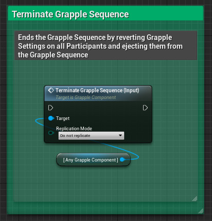
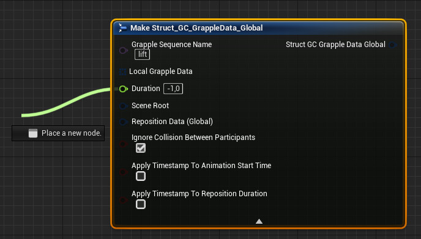
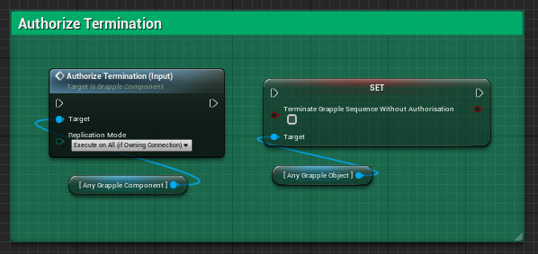

When a [Grapple Sequence](/grapple-component/1-overview-of-the-grapple-component/basic-concepts) is Terminated, all of its Effects are reverted, its Participants are removed, it stops executing Queued Events, and stops receiving User Commands from its Master Grapple Component.

A Grapple Sequence is always Terminated from its Master Grapple Component. After termination, this Grapple Component will no longer be Controlling the Grapple Object.

## Terminate Grapple Sequence (Input Function)

A Grapple Sequence can be terminated directly using Input Function Terminate Grapple Sequence (Input). When called on a Grapple Component, this function will instantly Terminate the Grapple Object.

## Duration of Grapple Objects 

### Automatic Termination

A Grapple Object will terminate automatically when its duration has elapsed. The duration of a Grapple Object can be set in its [Global Grapple Data](/grapple-component/2-effects-of-the-grapple-component/010-grapple-data). If the duration is set to a negative value, the Grapple Sequence will not be terminated automatically.

### Authorize Termination (Input Function)

By default, a Grapple Sequence will automatically terminate after its Duration has elapsed. However, it is possible that a Grapple Sequence needs to stay active until there is confirmation from the Grapple Component that it is allowed terminate. 

For example, this could be the case for a Grapple Sequence where the Grapple Object could still receive input from a player on a remote connection at the very end of the Grapple Sequence. In that case, we do not want the Grapple Sequence to terminate on other connections, unless the server has definitively decided that the Grapple Sequence is about to end.

Note that this behaviour is not enabled by default. A Grapple Object that is created from scratch does not wait until termination is explicitly authorized by the Grapple Component. To modify this behaviour, set variable Terminate Without Authorization to false. The Grapple Component will then wait until function Authorize Termination (Input) is called before actually Terminating the Grapple Sequence.

Also note that authorizing termination only has an effect if the Grapple Sequence is Terminated using a timer. This functionality can still be overridden by Terminating the Grapple Sequence instantly using Input Function TAuthorize Termination (Input). 

## 'On Terminate' Events

Events can be bound to the termination of a Grapple Sequence. Please consult the article on [Overridable Functions on the Grapple Object](/grapple-component/3-controlling-the-grapple-sequence/070-overridable-functions) for more information.
