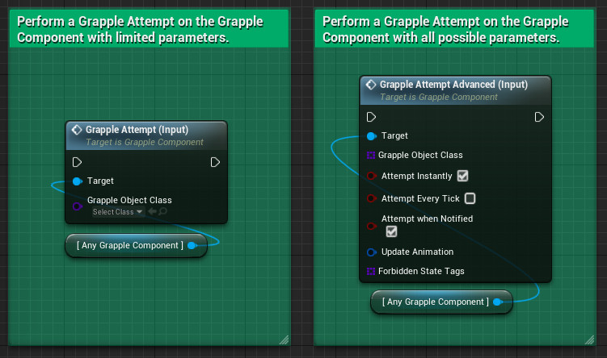
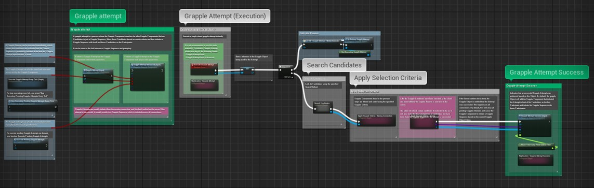
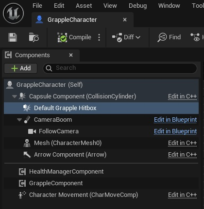
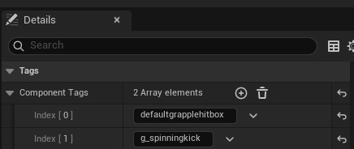
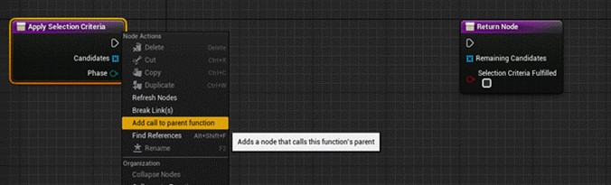
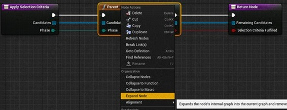
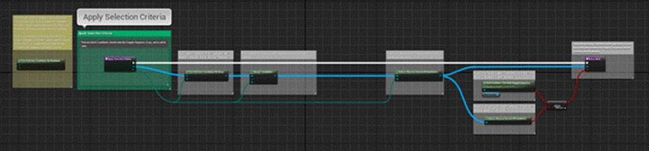

A grapple attempt is a process where the Grapple Component searches for other Grapple Components that are eligible to join a Grapple Sequence, filters those Candidates based on certain criteria and then initiates a Grapple Sequence with itself and these Candidates as the Participants.

It will typically serve as the link between a Grapple Sequence and gameplay.

## Input Functions

Typically, a Grapple Attempt is initiated based on input from a Pawn or a Controller, using Input Functions on the Grapple Component.

The most simple way to execute a Grapple Attempt is to use Input Function Grapple Attempt (Input). This node takes the input of a Grapple Object Class, and executes a Grapple Attempt based on it instantly.

It is also possible to execute a Grapple Attempt using Input Function Grapple Attempt Advanced (Input). This node has additional parameters.

Function Grapple Attempt Advanced (Input) is designed for cases where you want your character to perform a Grapple Attempt at specific times. 

It can also be used to perform multiple Attempts at the same time. However, only a single attempt can succeed. The input array of the advanced Grapple Attampt Node should be read as: "try index 0 first, and if it does not succeed, try index 1, then 2, ... " etc.  

For an example on how to enter different Grapple Sequences based on gameplay circumstances, have a look at the graph of GrappleCharacter_Green in the sample content. This Character can Initiate three different Grapple Sequences:

1. G_Double: a Grapple Sequence where the character attacks 2 targets.
2. G_StealthTakedown: Typical takedown move that can only be performed from behind a target.
3. G_Spinningkick: Fairly 'normal' and weaker attack with a knockback effect. Note that these Grapple Objects are arranged from 'exceptional' to 'normal'.

If conditions are fulfilled for one element of the array, the next elements will become irrelevant.

## Parameters

Input Function Grapple Attempt Advanced (Input) has the following Parameters.

All grapple attempts are performed based on one or more [Grapple Objects](/grapple-component/1-overview-of-the-grapple-component/basic-concepts). These will be initiated if the attempt is successful.

| **Parameter** | **Description** |
| ----------- | ----------- |
| Grapple Object Class | This parameter takes the input of an array which can contain multiple Grapple Objects. All of these attempts will be performed sequentially. |

The Grapple Component constructs Grapple Objects for each of the classes specified above, and adds them to the Pending Grapple Attempts. These Attempts are then executed at specific times based on the parameters below.

| **Parameter** | **Description** |
| ----------- | ----------- |
| Attempt Instantly | Execute pending Grapple Attempts immediately (at the time node is used). |
| Attempt Every Tick | Execute pending Grapple Attempts every tick, until Function Stop Executing Pending Grapple Attempts Every Tick is called. Modify variable Grapple Attempt Cooldown when performing Every Tick to set a cooldown for this functionality. |
| Attempt When Notified | Execute pending Grapple Attempts when function Execute Pending Grapple Attempts is called. |

Some other data is also included that does not directly affect the Grapple Attempt.

| **Parameter** | **Description** |
| ----------- | ----------- |
| Update Animation | This parameter can be used to immediately do an Animation Update. If the Grapple Attempt was successful, this animation will usually be interrupted by the animation of the Grapple Sequence. If the Grapple Attempt fails, the animation will keep playing. |
| Forbidden State Tags | The Grapple Component will ignore the input from this node if any of the State Tags provided here is active. |

## Different steps of the Grapple Attempt (Summary)

During a Grapple Attempt, the following actions are performed:

* Search Candidates: Find Candidates to join the Grapple Sequence.

* Apply Selection Criteria: Find out which of these Candidates can join the Grapple Sequence.

* On success, initiate Grapple Sequence: Start a new Grapple Sequence with the remaining Candidates.

The Blueprint logic used for Grapple Attempts can be consulted in the Input Functions Graph of the Grapple Component.

## Step 1: Search Candidates

### Candidates in a Grapple Attempt

In the context of a Grapple Attempt, Candidates are Grapple Components that are considered to become a [Participant](/grapple-component/1-overview-of-the-grapple-component/basic-concepts) of the Grapple Sequence that is initiated when the Grapple Attempt is successful. They can be seen as "potential Participants".

### Search Candidates Function on the Grapple Object

During the first phase, the Grapple Component will call function Search Candidates on the Grapple Object. 

This function can be overridden if you wish to build your own logic that finds Grapple Components that are Candidates to join the Grapple Sequence, which will be the case for most projects.

### Adding default collission components

By default, function Search Candidates will search for Candidates using any Primitive Component on the Linked Pawn that has one of the following tags:

* the name of the Grapple Sequence (as defined in the Global Grapple Data); or

* "defaultgrapplehitbox"

Using this Primitive Component, it will find all overlapping Pawns that have a Grapple Component. 

### Helper functions on the Grapple Component

When overriding function Search Candidates on the Grapple Object, it should be noted that the Grapple Component itself has a few functions built in that might assist users when searching for Candidates:

* Function Search Candidates - Scene Component Overlap;

* Function Search Candidates - Line Trace from Camera;

* Function Search Candidates - Use Pending Candidates; Rather than searching for Actors in the game world, this function accesses variable Pending Candidates on the Grapple Component. This variable is publicly accessible by other Blueprints, and can be used to set the Candidates that will be used before the attempt is executed.

## Step 2: Apply Selection Criteria

If any Candidates are found during the first phase (Search Candidates), the Grapple Component will examine if a Grapple Sequence should be initiated, which Candidates should become Participants (if any) and in which Participant Index each Candidate should occupy.

### Selection process

This selection process is handled as a whole by function Apply Selection Criteria on the Grapple Object.

This function can be overridden if you wish to build your own logic that finds Grapple Components that are Candidates to join the Grapple Sequence. Alternatively, it is possible to override any of the other functions on the Grapple Object that are called as a part of it.

Function Test Selection Conditions on Group tests Grapple Conditions on all Candidates (by executing function Test Selection Conditions on Candidate for each of them), and removes Candidates that do not fit the conditions. 

It is recommended not to override this function, but to override function Test Selection Conditions on Candidate instead.

Function Test Selection Conditions on Candidate checks if a single Candidate is eligible to become a Participant in the Grapple Sequence. It returns true if this is the case. By default, it only checks if the Candidate is in a state where it can enter a Grapple Sequence. 

This function should be overridden in case you want to specify the conditions that a Candidate must meet in order to become a Participant (e.g. attacker is standing behind the target; target is incapacitated; target is below 50 % health; etc.) It is recommended to keep a call to the parent function included when overriding this function, because the parent function checks if the Grapple Component is able to enter a Grapple Sequence in its current state.

Function Arrange Candidates is then executed on the remaining group of Candidates. This function will put the Candidates in the right order.

This function can be overridden in case you wish to build your own function that changes the order of Candidates. However, it provides three basic ways to arrange candidates (Match actors with target transformsations; Closest actor; Input Order), which can be selected using an input parameter of type Enum_GC_CandidateArrangement.

By default, function Arrange Candidates executes function Arrange Candidates Automatically. This function attempts to occupy all slots in the Grapple Sequence by Candidate that intuitively makes the most sense to human players. The function considers all Candidates and all target transformations that are available for each Participant (based on the Local Reposition Data, which is in turn defined in the Local Grapple Data). It then looks for the optimal way to allocate each available Participant Index to a Candidate, so that the Candidates have to travel as little distance as possible. 

Function Enforce Maximal amount of Candidates is then executed on the remaining Candidates. This function removes the Candidates at the end of the array that exceed the maximal amount of Participants.

This function can be overridden in case you wish to determine manually which Candidates are eliminated if there are too many.

The remaining Candidates are used in output parameter Remaining Candidates. 

The output parameter Selection Criteria fulfilled is set to true if the following conditions are fulfilled:

* enough Candidates were found (which is verified using function Enforce Minimal amount of Candidates on the Grapple Object); and 

* the Grapple Component that initiated the Grapple Sequence is in a state where it can enter a Grapple Sequence (which is verified using function Test Condition - Can Enter Grapple Sequence on the Grapple Component itself).

### Practical recommendations when overriding aspects of the selection process

The selection process of function Apply Selection Criteria consists of various steps. 

Depending on the needs of your project, it is possible that only a few of these steps need to be overridden, without changing the general structure of the selection process. In that case, it is recommended not to override function Apply Selection Criteria itself, but rather one of the other functions (e.g. est Selection Conditions on Candidate or Arrange Candidates).

If you do want to re-define the selection process as a whole, it is possible to override function Apply Selection Criteria. If you wish to override this function, but start out from a copy of the original Graph of the function (which includes all default functionality), it is recommended to proceed as follows:

* Navigate to the *My Blueprint* tab and override function Apply Selection Criteria.

* The Graph of your new function will now open. Right-click the input node and add a call to the parent function (in case this node is not present yet).

* Connect all pins on the parent function node to their counterparts in the current Graph. Right-click the parent function node and expand it. 

* A copy of the parent function will then be available in the current Graph (you might need to connect the execution pins manually).

### Initial versus Final Phase

Depending on the needs of your project, these tasks can be split up amongst the server and the owning connection. This is why some of these functions have an input parameter called Phase (of type enum_GC_SelectionCriteriaTestPhase, which can be aither initial or final) This parameter determines if we are applying selection criteria in an initial phase (which is done on the owning client before sending the result over to the server) or in a final phase (which takes place on the server).

Most operations are executed during both phases (testing selection conditions for each Candidate, checking if there are enough candidates). Other operations (arranging candidates and removing excessive candidates) are only executed during the final phase on the server.

## Step 3: Initiate Grapple Sequence on Success

Once the Grapple component has established the list of eligible Candidates, the Grapple Attempt will enter its third and final phase.

If the Grapple Attempt was successful, the Grapple Component will call event On Grapple Attempt Success on the Grapple Object. By default, this will simply cause the Grapple Object to Initiate a Grapple Sequence through the Grapple Component using input function Initiate Grapple Sequence (Input). It is possiblie to override this event. For more information, consult the article on [Overridable Functions on the Grapple Object](/grapple-component/3-controlling-the-grapple-sequence/070-overridable-functions).

