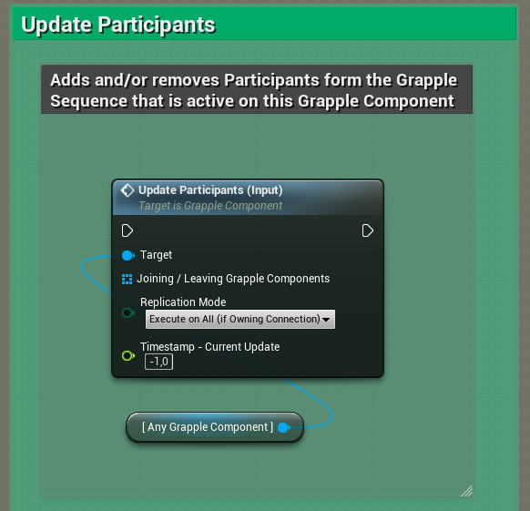

The Grapple Components that are involved in a Grapple Sequence are referred to as [Participants](/grapple-component/1-overview-of-the-grapple-component/basic-concepts).

## Grapple Attempt Success

Participants are usually selected automatically whenever a  [Grapple Attempt](/grapple-component/3-controlling-the-grapple-sequence/030-grapple-attempt) is successful.

## Initiating a Grapple Sequence

It is also possible to [initiate](/grapple-component/3-controlling-the-grapple-sequence/010-initiating-the-grapple-sequence) a Grapple Sequence manually and set the initial Participants immediately using function Initiate Grapple Sequence (Input).

## Update participants directly

Participants can be updated directly using Input Function Update Participants (Input) on the Grapple Component. This Event allows users to provide an array of Participants (Grapple Components). After the operation, each Grapple Component provided here will occupy a Participant Index corresponding to its respective position in the array.  

