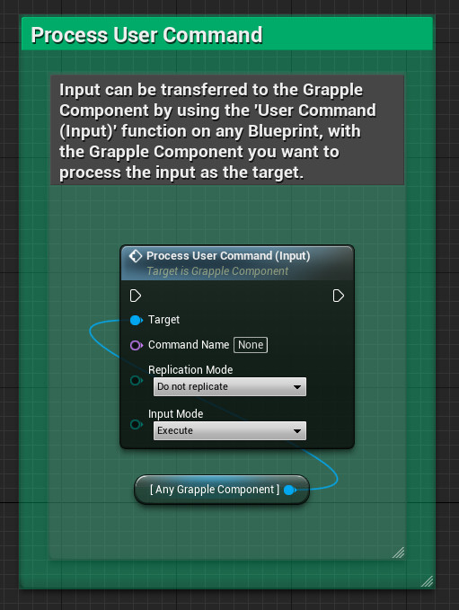
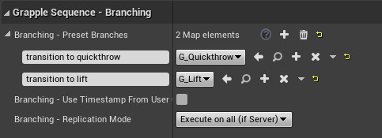

## Concepts

### User Command

User Commands are instructions that are handled by the Grapple Component. They are usually sent over by other Objects, like Character Blueprints or Controllers. The Grapple Component sends these User Commands over to its User Command Targets (by default, the Applied Grapple Object and the Controlled Grapple Object).

User commands can be used to:

* Send input from the player to a Grapple Object.
* Send gameplay updates to the Grapple Object.
* Branch or transition between different Grapple Sequences.

### User Command Targets

User Commands are sent over to all Blueprint Objects that are registered as User Command Targets. Each Grapple Component contains a list of User Command Targets that are currently active. This list can be accessed and modified on any [Grapple Component](/grapple-component/1-overview-of-the-grapple-component/basic-concepts)
 using the following functions: 

* Get User Command Targets
* Add User Command Target
* Remove User Command Target

The Objects added as User Command Targets can add functionality on their end by implementing Blueprint Interface BI_GrappleComponentInterface, more specifically its Event Process Incoming User Command.

Grapple Objects implement this Interface natively. They are automatically added as User Command Targets on all Grapple Components that are [Participants](/grapple-component/1-overview-of-the-grapple-component/basic-concepts), as well as their own [Master Grapple Component](/grapple-component/1-overview-of-the-grapple-component/basic-concepts). This behaviour can be disabled by modifying the following variables on the Grapple Object:

* Auto Receive User Commands from Participants during Grapple Sequence; and
* Auto Receive User Commands from Master during Grapple Sequence.

## How to use

### Processing User Commands on the Grapple Component

User Commands are sent to the Grapple Component using Input Function Process User Command (Input).

User Commands are processed according to a selected **input mode**:

| Input mode | Description |
| ----------- | ----------- |
| Execute | The User Command is Executed (i.e. sent over to all User Command Targets) immediately. |
| Queue | Add the User Command to a Queue, where each User Command is executed in whenever Input Function Consume Next Queued User Command (Input) is called. |
| Store Provisionally | Store the User Command on the Grapple Component. If a Grapple Sequence is initiated, all stored User Commands that were input after the input that lead to the successful Attempt will be queued (meaning that they will only be executed when Input Function Consume Next Queued User Command (Input) is called). This input mode is designed for specific situations in network environments. When performing a Grapple Attempt in a multiplayer project, there is usually a small delay between the input on the Client and the moment the Grapple Sequence is initiated. This is the case because all Grapple Attempts need to be verified on the server before the Grapple Sequence is initiated. However, it is possible that you still need the inputs during this small delay to be registered, in case they need to be used in the Grapple Sequence (for example, in a situation where a character does a variation of an attack when the input is pressed twice). |

## Implementation on the Grapple Object

User Commands can be accessed on Grapple Objects by implementing Event On User Command Received. Incoming User Commands can be filtered by using Macro - Filter User Command. This macro will automatically use the stored data of the last User Command that came in.

It is also possible to map the name of an incoming User Command to a new Grapple Sequence. This can be useful for branching Grapple Sequences. An example would be a situation where the player presses a button to switch to a follow-up attack. These mappings can be configured by modifying variable Branching - Preset Branches on the Grapple Object. For a more detailed process on creating these branches, please consult the tutorial on [creating a branching Grapple Sequence](/grapple-component/6-tutorials/080-creating-a-branching-grapple-sequence).

