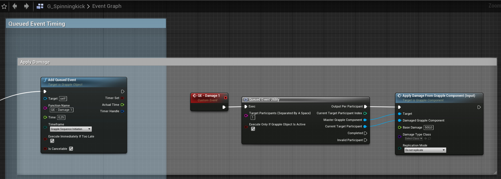

Damage can be dealt through the Grapple Component. This can be done using function Apply Damage from Grapple Component, which can be called from any Blueprint on the Grapple Component that is inflicting the damage.

It is suggested to use a [Queued Event](/grapple-component/4-other-functionality/040-queued-events) to apply damage, as illustrated below.

