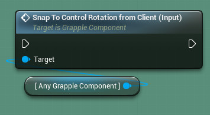
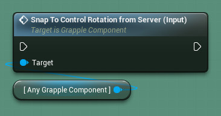

## Snap to Control Rotation from Client

Input Function Snap to Control Rotation From Client (Input) takes the Control Rotation for the Controller possessing the Pawn owning this Grapple Component (based on its value on the Client), and sets it to be the actual Rotation of the Pawn on all Connection.

## Snap to Control Rotation from Server

Input Function Snap to Control Rotation From Server (Input) takes the Control Rotation for the Controller possessing the Pawn owning this Grapple Component (based on its value on the Server), and sets it to be the actual Rotation of the Pawn on all Connection. This Event can be triggered by applying Movement Settings.

