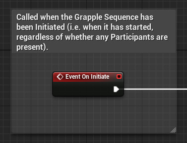
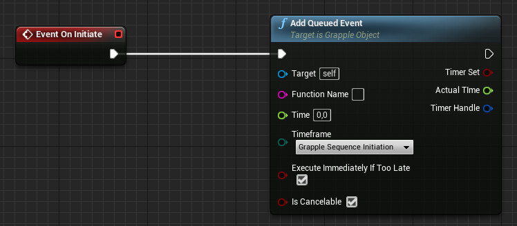
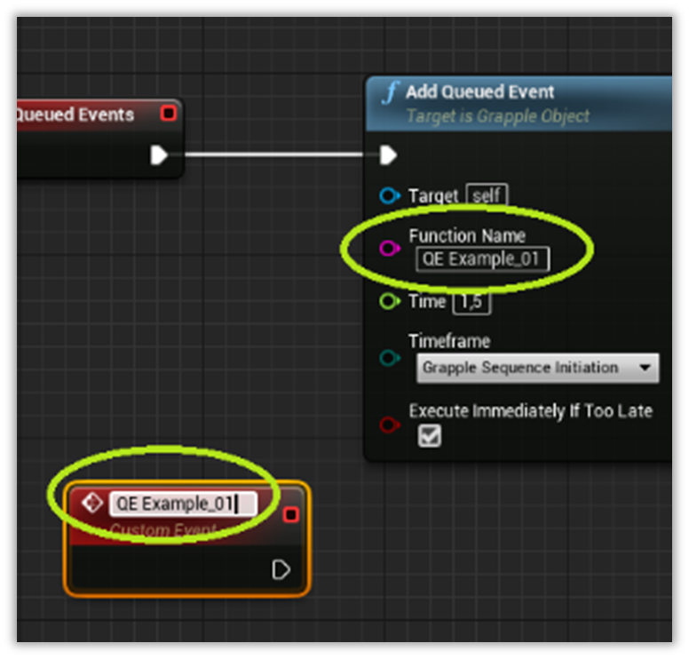
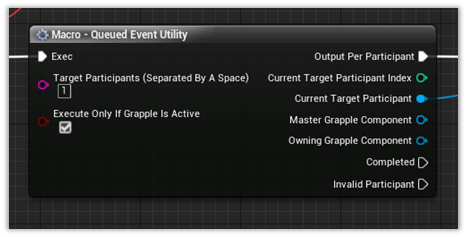
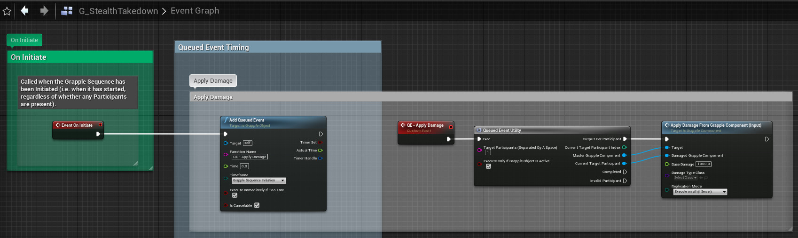
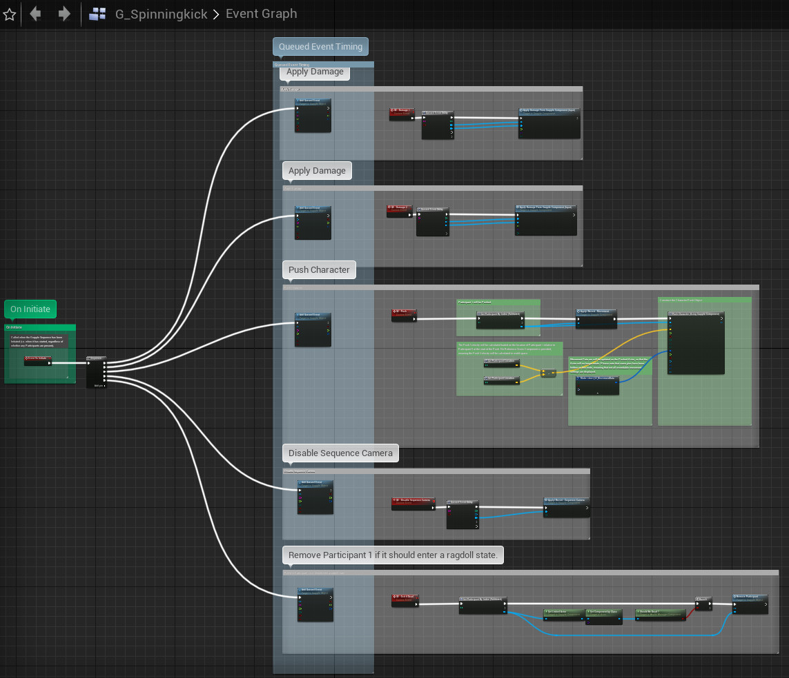
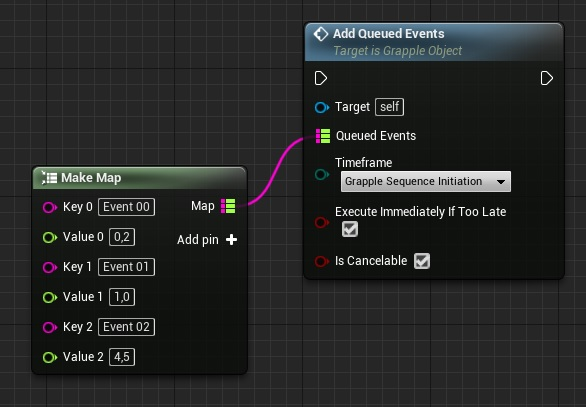
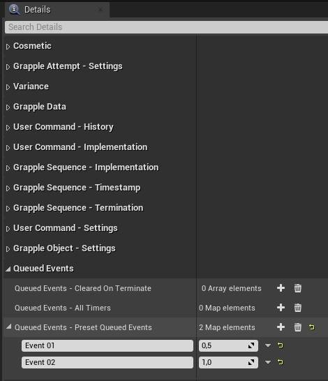

## Concept

Queued Events occur at a fixed time during the Grapple Sequence, and typically have an influence on gameplay (for example a character being pushed away or taking damage).

Queued Event nodes are typically connected to the event 'OnApplied' on a Grapple Object. This event is called whenever Grapple Data is being applied on a Grapple Component, based on this Grapple Object. Animation also starts to play at this time, making it a good referenc epoint for Queued Events.

The [Grapple Sequence Tutorial Object](/grapple-component/6-tutorials/030-gctutorial)contains a Graph with an example layout for Queued Events.

## Adding Queued Events to a Grapple sequence

Add a Qeueued Event to your Grapple Sequence using the following steps.

Override Event On Initiate in a Graph on a Grapple Object. 

It should be noted that Events can be Queued at any time. This means that the construction we are building here could also be connected to other Events, e.g. Event On User Command Received or Event on Apply.

To add a Queued Event, use function Add Queued Event.  On this node you can specify a delay (input parameter time), as well as the point in time from which this delay should be calculated (input parameter timeframe). You should also provide a name for the Queued Event (input parameter Function Name).

If input parameter Cancelable is set to true, the Queued Event will be cancelled when the Grapple Sequence is Terminated or when function Cancel Queued Events is called on the Grapple Object.

Proceed by adding an event or function to the Grapple Object that has the same name that has been provided to function Add Queued Event. This event should connect to the actual Blueprint logic you want to execute at that specific time.

Optionally, you can add a Macro - Queued Event Utility node. It contains pins with references to the Master Grapple Component (which by default is always the one linked to the Grapple Object), and also allows to re-route the event to different Participants. By default, this Node also makes sure that no input goes through when the Grapple is no longer active.

The Macro - Queued Event Utility node should then be connected to the actual logic you want to add into the Grapple Sequence. These Events can be called on the Grapple Component or on any Blueprint in your project.

Your final setup should look something like this.

It is also possible to add multiple events at once. The order in which they are added does not matter. All Queued Events will execute at their scheduled time.

It is also possible to add multiple Queued Events at once using function Add Queued Events.

It is also possible to add Queued Events in the properties of the Grapple Object. This can be done by modifying the Queued Events - Preset Queued Events property.

