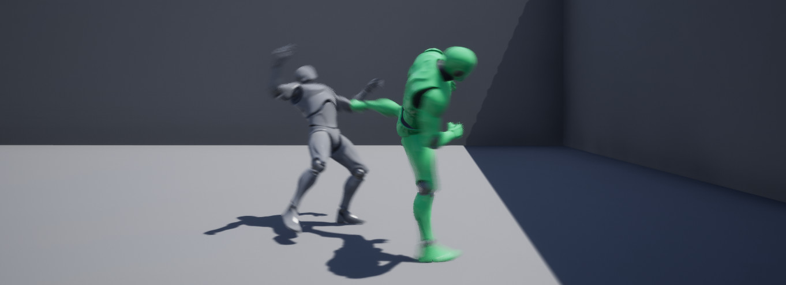
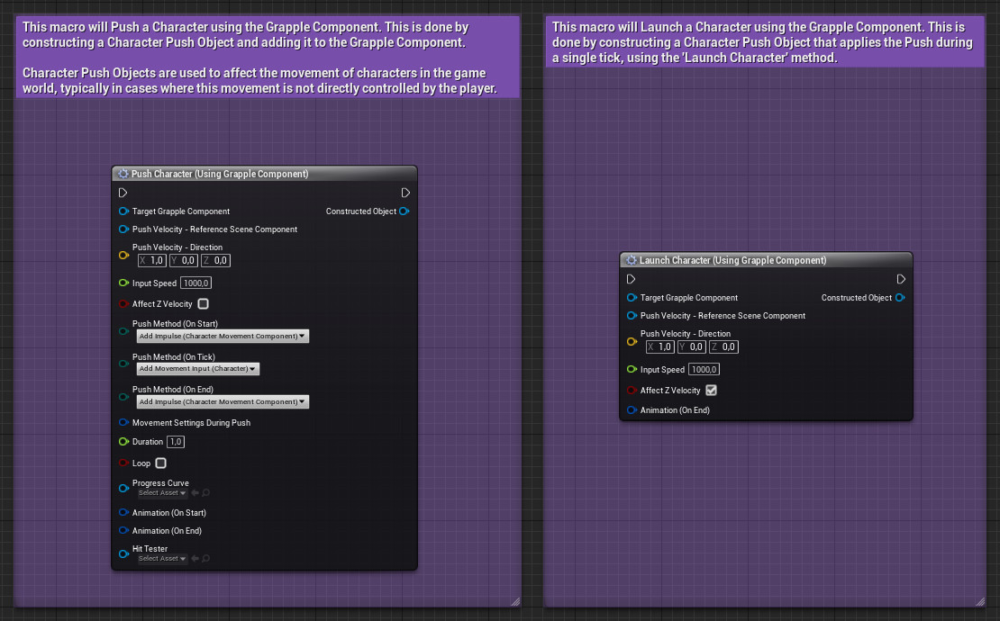
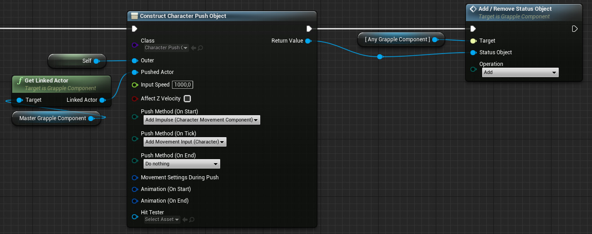

The Grapple Component can push characters around in the game world by launching them, applying an impulse or directly affecting their movement input. This can be done in the following ways.

## How to push a Character?

### Using Macro nodes

Alternatively, it is possible to initiate a Character Push using Macro node Push Character (Using Grapple Component).  To instantly launch a character, use Macro node  Launch Character (Using Grapple Component).

The input parameters on these nodes correspond to the names of variables on Object Classes CharacterPushObject and CharacterPushObject_DirectionBased. For more information, please consult the Blueprint Graphs of these Objects.

### Construct and add Character Push Object manually

A Character Push can be initiated by constructing an object of type CharacterPushObect_DirectionBased and adding it to the Grapple Component of the Pushed Character using function Add / Remove Status Object. 

For more information on Status Objects and how to manage them, please consult the section on [Status Objects](/grapple-component/5-internal-mechanisms/040-status-objects).

## Application method

The way a Character is Pushed can be set using an enumeration of type  enum_GC_CharacterPushApplicationMethod.

| Application method | Description |
| ----------- | ----------- |
| Add Movement Input (Character) | Add Movement Input to the Pushed Actor. This is optimal for multiplayer, but only works on Character Blueprints. |
| Add Impulse (Character Movement Component)	 | Use the Add Impulse function on the Character Movement Component of the Pushed Actor. |
| Launch Character		 | Use the Use the Launch Character function on the Pushed Actor. Only works on Character Blueprints. |
| Do nothing		 | Do not perform any action. |

