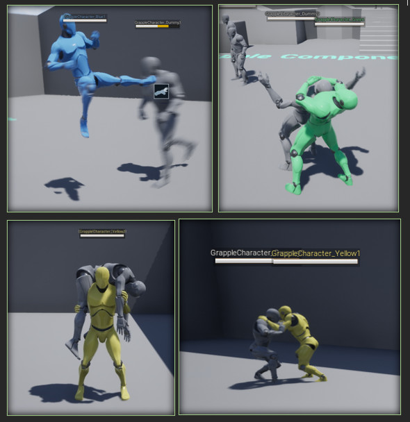

The Grapple Component supports [replication](https://dev.epicgames.com/documentation/en-us/unreal-engine/networking-overview-for-unreal-engine?application_version=5.4), making it suitable for online multiplayer projects.

## Replication Mode on Input Functions

[Input Functions](/grapple-component/3-controlling-the-grapple-sequence/060-input-functions) on the Grapple Component usually have a parameter named Replication Mode, which controls the way the instruction is sent across the network. 

| Replication mode | Description |
| ----------- | ----------- |
| Do not replicate	 | Execute the event on the current connection. It will not be sent over to the server or to clients. |
| Execute on all (if Server)	 | If we are on the server, send the event over to all clients. If we are on a client, ignore the event. |
| Execute on All (if Owning Connection)		 | If we are on the server, send the event over to all clients. If we are on a client, send the event to the server, which will in turn send it to all clients. |
| Execute on server (if Owning Client)		 | If we are on the client, execute the event on the server. |

## Replication of Grapple Attempts

[Grapple Attempts](/grapple-component/3-controlling-the-grapple-sequence/030-grapple-attempt) should be executed on the Owning Client. If the Grapple Criteria are met on the Client, they will be verified on the server. This is why some of the functions related to Selection Criteria have an input parameter that specifies whether they are executed in an Initial or a Final Phase.

If the criteria are also successful on the Server, it will have the Grapple Attempt Success (Input) Event executed on  all other connections.