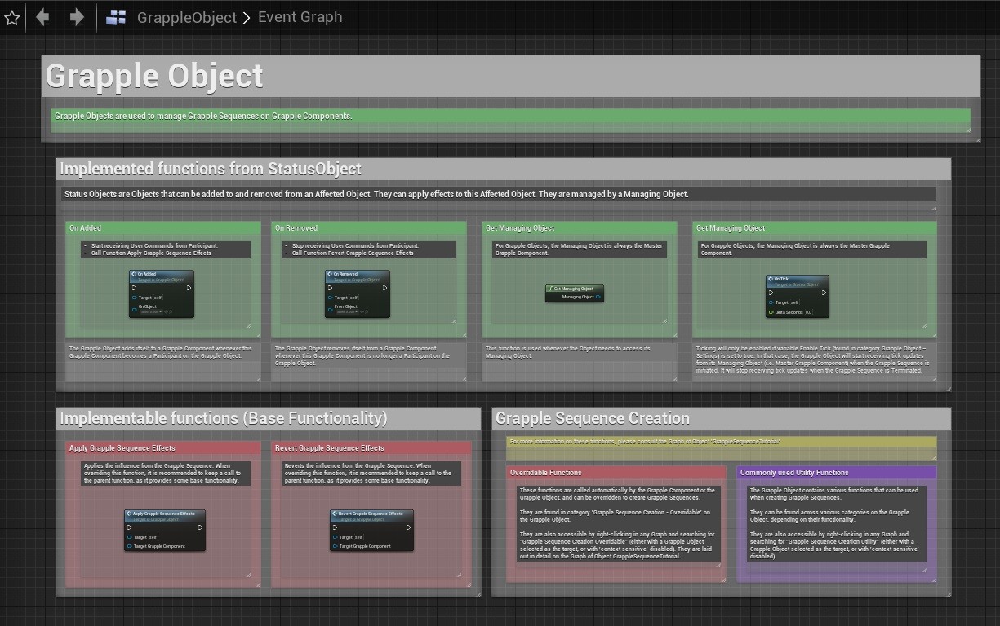

The information on this page relates to the internal functioning of the Grapple Component. It should only be relevant in case you are creating advanced Grapple Sequences, or if you are modifying or expanding on aspects of the Grapple Component itself. 

## Status Object Base Class

<embed src="/src/assets/grapple-component/slide-custom-objects.pdf" width="100%" height="550px" toolbar=0 frameborder="0" scrolling="no" />

### Concept

Objects of Class StatusObject can be added to and removed from an Affected Object. They can apply effects to this Affected Object. They are managed by a Managing Object.

### Affected Object(s)

An Affected Object is an Object the Status Object is added to or Removed from. Every Affected Object contains a list of Status Objects applied to is. Every Object can be an Affected Object, provided that it implements Interface BI_StatusObjectInterface. 

* To add or remove a Status Object, use Interface Call Add / Remove Status Object on the Affected Object.

* To access all Status Objects added to an Affected Object, use Interface Call Get added Status Objects.

### Managing Object

Every Status Object stores one reference to a Managing Object. This is Object does not necessarily need to be an Affected Object of the Status Object. By default, the Managing Object is the Outer Object of the Status Object. This can be Changed by overriding function Get Managing Object on the Status Object. Every Object can be a Managing Object, provided that it implements Interface BI_StatusObjectInterface. 

Status Objects can use Interface Call Enable / Disable Tick Updates for Status Object on the Managing Object. The Managing Object should then call Function On Tick on that Status Object every tick.

All of the functions from Interface BI_StatusObjectInterface should be implemented on the Managing Object. The [Grapple Component](/grapple-component/1-overview-of-the-grapple-component/basic-concepts) is meant to be the Managing Object for all Status Objects that come with the project, and implements all of these functions by default. 

### Implementable functions

The Status Object contains the following functions that can be overridden depending on the desired functionality.

| Function | Description |
| ----------- | ----------- |
|  On Added | Called when the Status Object is added to any Affected Object.  |
|  On Removed	 | Called when the Status Object is removed from any Affected Object. |
|  On Tick	 | Can be called by the Managing Object every Tick. To enable or disable, use function Enable / Disable Tick Updates on the Status Object. |
|  Get Managing Object	 | This function is used whenever the Object needs to access its Managing Object. By default, it returns the Outer Object of the Status Object. |

More information on how these functions are implemented in each child class, is available in the Graphs of these Blueprints.

