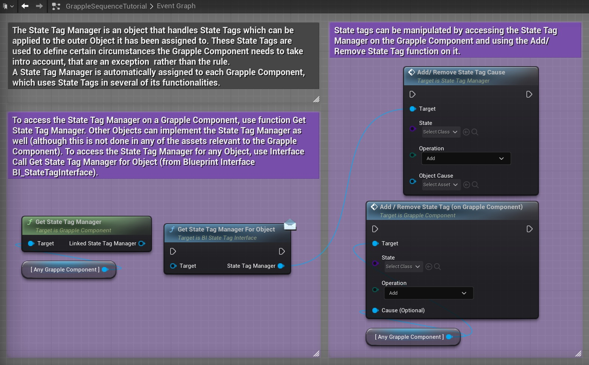
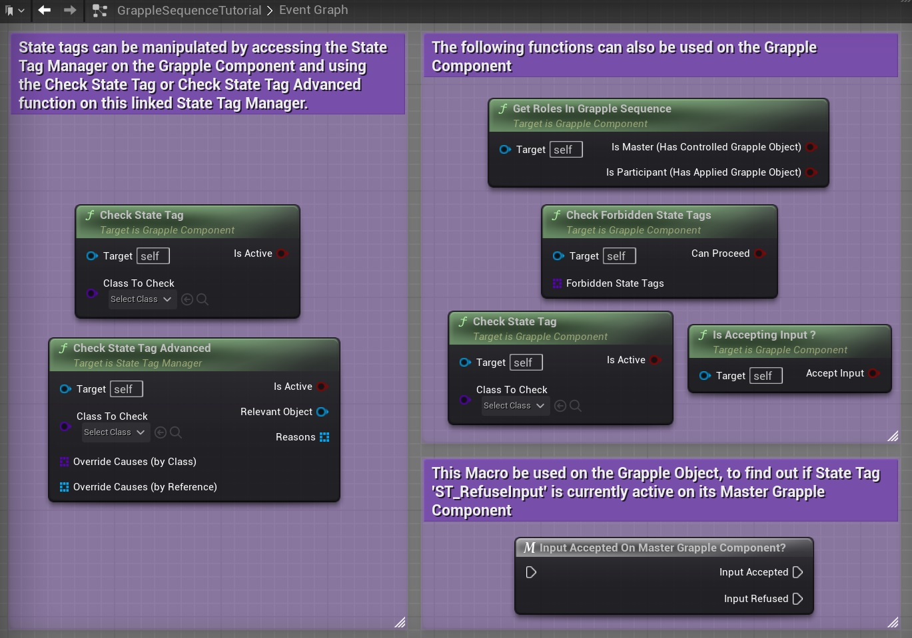

## Concept

State Tags are Objects that are added to and removed from a State Tag Manager. They each hold an array of 'Reasons' that keep them active. If they run out of Reasons, they are removed from the State Tag Manager. State Tags are used to define certain circumstances the Grapple Component needs to take into account, that are an exception  rather than the rule.  As such, you might only need the Grapple Component to do certain things if there are any (one or more) reasons to do so. Examples of such things are:

* **Refuse Input from the user** - Input should be accepted if there are no reasons to refuse it. However, it may be ignored in certain situation eg. the character being a Participant in a Grapple Sequence of performing another action.

* **Prevent the Grapple Component from entering a Grapple Sequence** - This could be done while the Grapple Component is already a Participant in another Grapple Sequence.

* **Have Ticking Enabled** - By default, ticking is disabled on the Grapple Component. However, certain functionalities (like Repositioning and Push Character) do require some logic to be executed every tick. This is why these graphs will add a state tag with consequence should tick enabled when they activate. When they are no longer active, the state tag is removed.

## State Tag Manager

The State Tag Manager is an object that handles State Tags which can be applied to the outer Object it has been assigned to. State Tags are Objects that are added to and removed from a State Tag Manager. They each hold an array of 'Reasons' that keep them active. If they run out of Reasons, they are removed from the State Tag Manager. They are used to define certain circumstances the Grapple Component needs to take intro account, that are an exception  rather than the rule. 

A State Tag Manager is automatically assigned to each Grapple Component, which uses State Tags in several of its functionalities.

To access the State Tag Manager on a Grapple Component, use function Get State Tag Manager.

Other Objects can implement the State Tag Manager as well (although this is not done in any of the assets relevant to the Grapple Component). To access the State Tag Manager for any Object, use Interface Call Get State Tag Manager for Object (from Blueprint Interface BI_StateTagInterface).

## Adding and removing state tags

State tags can be manipulated by accessing the State Tag Manager on the Grapple Component and using the  Add/Remove State Tag function on it.

* Performing the *add* operation adds a State Tag to the list of active State Tags. If a State Tag with the same name already exists, nothing will happen.

* Performing the *remove* operation removes the State Tag with the provided name. Its consequences will then no longer be applicable if there are no other active State Tags with the same consequence enabled.

## Reading state tags

To know the current state tags that are active, access the State Tag Manager on the Grapple Component and use the Check State Tag or Check State Tag Advanced function on this linked State Tag Manager.

This function will return *true* if a State Tag of the specified class is active, and will also return a list of State Tag classes that are currently causing this state tag being active.

It is also possible to use function Check State Tag Advanced on the State Tag Manager. This allows you to specify override causes. These are the state tag classes that should not be considered as a reason when checking if the specified State Tag is active.

## Consequences

State tags are linked to one another in the sense that each State Tag class has a set of other State Tag classes that are the consequences of that State Tag. What this means, is that activating some State Tags will lead to the activation of other State Tags. The relation between State Tags is based on consequence, rather than being a strict hierarchy.

## Built-in State Tags

The following State Tags are built in to the Grapple Component and are used for its different functionalities.

<embed src="/public/pdf/slide-state-tags.pdf" width="100%" height="520px" toolbar=0 frameborder="0" scrolling="no" />
