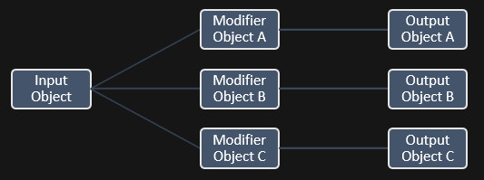

## Functioning of the Object Converter Blueprint

The Object Conversion Blueprint converts Input Objects to different Output Objects based on a specified modifier.

* The ObjectConversion base Class only contains a Convert Object function that converts Input Objects to Output Objects  based on Modifier Objects.

* The ObjectConversion_StoredData child Class contains a list of  combinations of Input Objects and Modifiers, with each combination mapped to a pre-defined Output Object. This is done as follows:

* Function Convert Object converts an Input Object to an Output Object based on a Modifier Object.

* Variable Object Conversion Mappings on the Object Converter Blueprint contains all possible input objects, all posisble Modifiers for that input object, and the output objects they should be converted to based on each Modifier. 

* An object can be converted if it is found as a key in variable Object Conversion Mappings. Each key in this map (i.e. each object that can be converted) is mapped to a value of type Struct_ObjectConversion. An object will be converted based on a certain Modifier, if that Modifier is found in the Struct_ObjectConversion mapped to the input object. The value the command is mapped to, will be the output object (i.e. the object the input object is converted to).

## Application: selecting animation assets based on Skeleton

The Object Converter Blueprint is used by the Grapple Component to convert one animation asset (Montage, Anim Sequence or Blendspace) to another, based on the relevant Skeleton.  

This is done by using the original assets from the [Animation Data](/grapple-component/2-effects-of-the-grapple-sequence/030-animation-data) as Input Objects, and the name of the Skeleton asset on the targeted Character as the Modifier. The Grapple Component then uses an Object Conversion Blueprint defined by the user, where all relevant animation assets are mapped to their counterparts on different Skeletons. In the Sample Content, this Object Converter Blueprint is **AnimationRemappingData**. 

* The sample content contains one Grapple Sequence that has been set up to be played on Skeletal Meshes using UE4_Mannequin_Skeleton as well as TutorialTPP_Skeleton. To this end, Animation Montages a_grapple_spinningkick_00_Montage and a_grapple_spinningkick_01_Montage were retargeted to another Skeleton. 

* Object Conversion Blueprint AnimationRemappingData was set up to convert the relevant Animation Montages to their counterparts on the other Skeleton. A visual explanation of this system is provided below. 

<embed src="/pdf/slide-object-converter.pdf" width="100%" height="520px" toolbar=0 frameborder="0" scrolling="no" />

