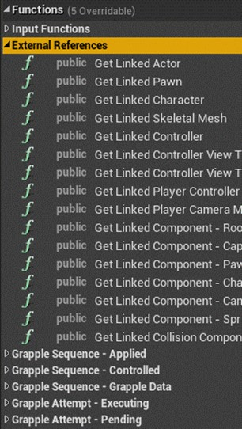
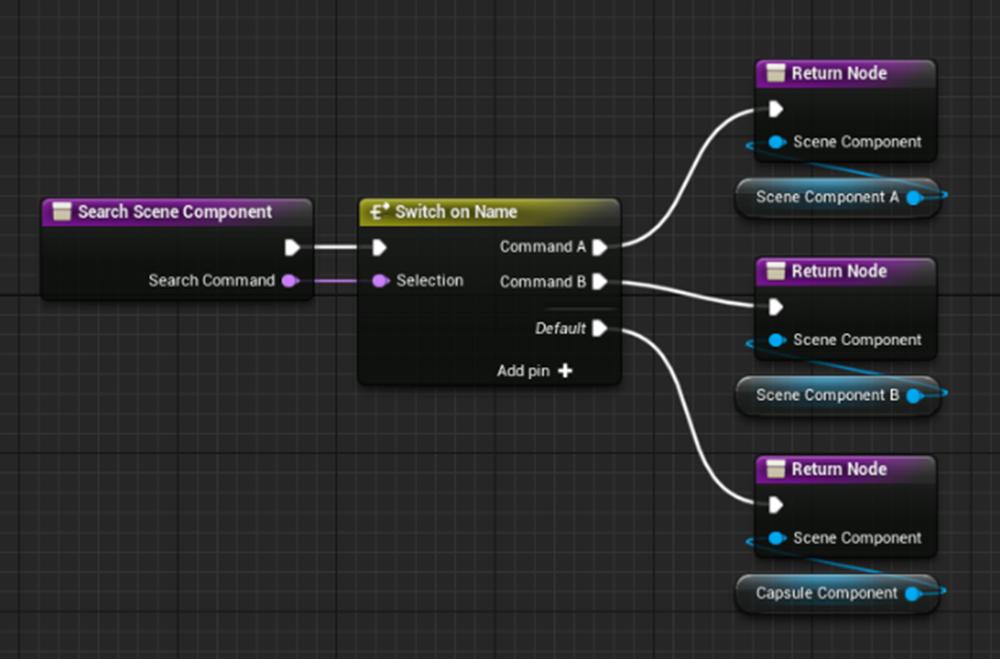
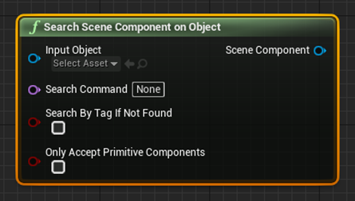
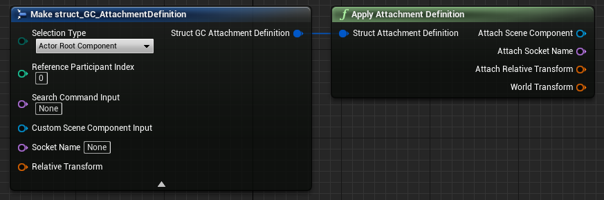

## Functions in Category 'External References'

The Grapple Component uses different functions that acquire references to other Objects that the Grapple Component needs for its different functionalities. These functions can be found in category '*External References*'. 

## Search Scene Component

### Search Commands

Function Search Scene Component on Blueprint Interface BI_GrappleComponentInterface finds a Scene Component that is in some way linked to an Object, based on an input Search Command. This Search Command functions as a sort of 'tag' which is used to uniquely identify a Scene Component when interfacing with a specific Object. 

For example, when performing this function on a Character Blueprint: 

* Search Command "**CharacterMesh**" could return the main Skeletal Mesh used by the Character; and

* Search Command "**DefaultGrappleHitbox**" could return the Primitive Component that is used to search for Participants when performing a Grapple Attempt.

An example of how this function could be implemented is shown below. 

### Function Search Scene Component on Object

A way of calling this Function with some extra functionality from the Grapple Component, is by using function Search Scene Component On Object. This function attempts to perform the Interface call on the target object. The parameters of this function add the following functionality.

* Only Accept Primitive Components: this parameter provides the option to filter the output so that only Primitive Components are accepted. 

* Search By Tag If Not Found: this parameter allows users to find a Scene Component based on its component tags, if the Input Object is an Actor. This means that you can also use the function by changing the component tags on the Input Object, without needing to implement the Interface.

## Attachment Definitions

The Grapple Component sometimes uses an attachment definition to refer to a Scene Component, or to a transformation relative to it.

This is done using a variable structure of type struct_GC_AttachmentDefinition. This variable structure contains instructions for finding a Transform in the context of a Grapple Sequence.

| Member veriable | Description |
| ----------- | ----------- |
| Selection Type	 | The type of Scene Component to look for. |
| Reference Participant Index | The Participant based on which we should look for the Scene Component mentioned above. For example, if 'Actor Root Component' is specified under Selection Type and the Reference Participant Index is 0, this Attachment Definition is referring to the Root Component of the Master Grapple Component ( = the Participant with index 0). |
| Search Command Input | In case Search Command is selected under selection type, the Grapple Component calls function "Search Scene Component" (from Blueprint Interface "BI_GrappleComponentInterface") on the owning actor. This Interface function can be implemented if you want to look up a specific Scene Component based on an input command. This member variable contains the Search Command that will be used. |
| Custom Scene Component Input	 | In case '*Custom*' is specified under Selection Type, a Scene Component Object reference can be input here. |
| Socket Name | The Socket on the Scene Component specified above that we should base out Transform on. |
| Relative Transform	 | The relative transformation (either to the Socket or the Scene Component itself) |

Attachment definitions can be applied using function Apply Attachment Definition.

