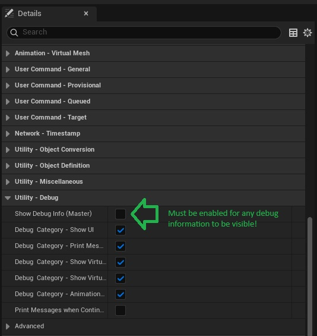
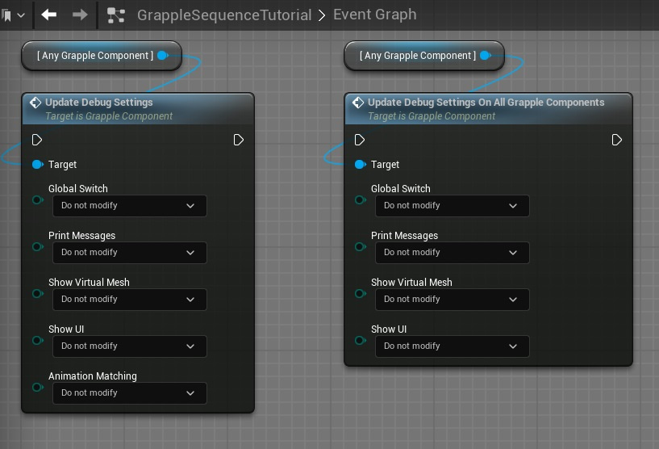
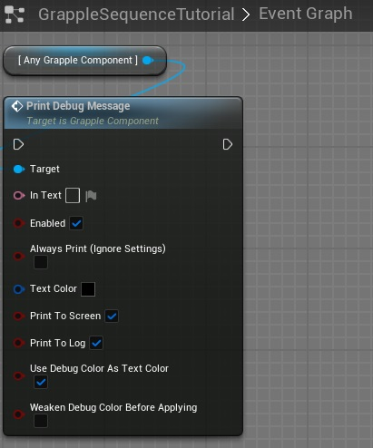
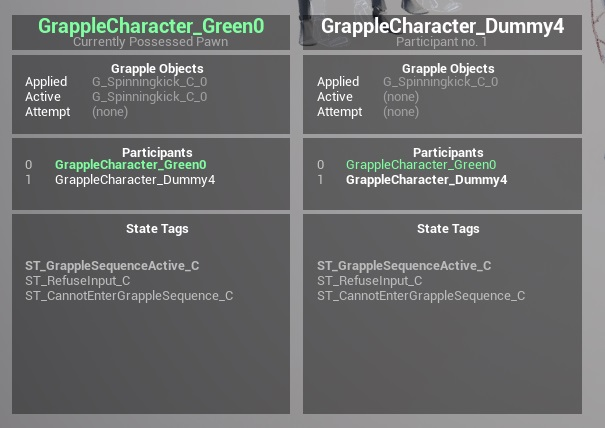

## Debug Settings

The Grapple Component contains the following settings related to debugging.

| Setting | Description |
| ----------- | ----------- |
| Debug - Global Switch	 | Whether to allow any of the debug information (normally controlled by the other settings) to be visible. |
| Debug - Show Virtual Mesh	 | Whether to show a visible material on the Virtual Mesh. |
| Debug - Show UI	 | See the section on Debug UI. |
| Debug - Print Messages	 | See the section on Debug Messages. |
| Debug Color	 | The color used to refer to this Grapple Component in the Debug UI. |

Settings related to debugging can be updated in the following ways:

* In the Grapple Component Blueprint itself, by setting the relevant variables in category 'Debug'

* At runtime, Using event ApplyDebugSettings
 will apply the settings on a single Grapple Component

* At runtime, Using event ApplyDebugSettings_AllGrappleComponents will apply the settings on all Grapple Components

## Debug Messages

The Grapple Component can print messages to the screen ant to the log (using the Print Text function built into the Engine). This can be done using function Debug Message. Messages will be printed if they are enabled in the Debug Settings, or if parameter Always Print (Ignore Settings) is set to true.

## Debug UI

If variable  Debug - Show UI is set to *true*, the Grapple Component will add a widget of Class UI_GC_DebugHUD to the player screen. This widget contains the following information:

* The name of the Actor this Grapple Component belongs to;
* The reason this widget is visible;
* Either the current Participants Following this Grapple Component or the Master Grapple Component this Grapple Component is following; and
* The active state tags for this Grapple Component.

Widgets will be shown automatically for the Grapple Component on the currently possessed Pawn, as well as for any other Participants if this Grapple Component is currently Participating  in a Grapple Sequence. 

