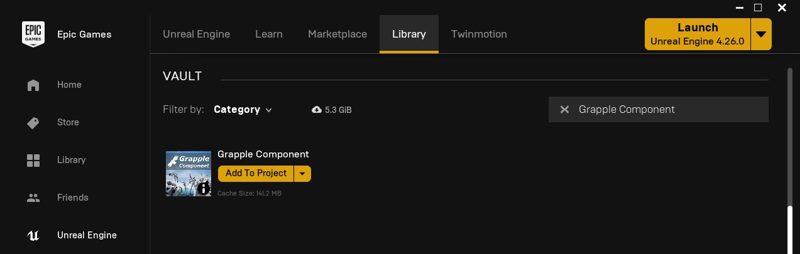
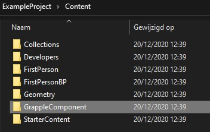
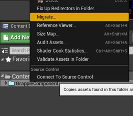
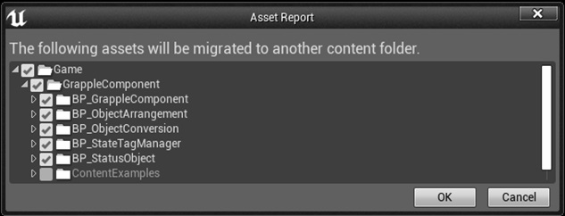

It is recommended not to change the location of any of the files in the Game\GrappleComponent folder. Doing so may cause issues when updating the files later.

## From Epic Games Launcher

If you have purchased the Grapple Component from FAB or the Unreal Engine Marketplace, it is available in the library of your Epic Games Launcher under the *Vault* section. From here, you can add the Grapple Component to a project of your choosing.

If you just purchased the product and do not see it appear in the Vault section, please restart your Launcher.

## From File Explorer 

To add the Grapple Component to your project, place all contents of the Content folder in the Content folder of your own project. The *ContentExamples* folder can be left out in case you do not need the sample content.

## From Other Project

You can also move the files over from another project by right-clicking on the *GrappleComponent* folder in the source project and selecting Migrate.

