Follow these steps to implement the Grapple Component into a Character Blueprint.

## 1. Gather Necessary Assets

Make sure the content in the Grapple Component Content is included in your project.

This can be done by following the instructions in the [Installation](/grapple-component/6-tutorials/010-installation) tutorial.

## 2. Add Grapple Component to your Character Blueprint

Open your Character Blueprint.

Navigate to the *Components* panel.

Add a component of class GrappleComponent.

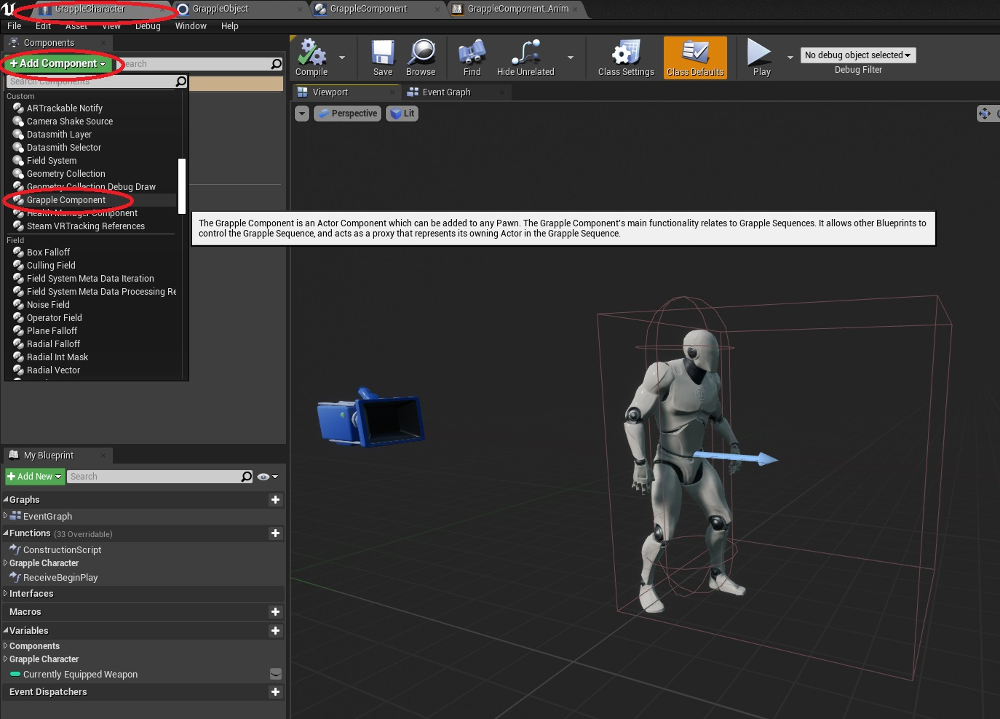

## 3. Create Default Grapple Hitbox (optional)

Optionally, you can add a Box Collision Component (any other [Primitive Component](https://docs.unrealengine.com/en-US/ProgrammingAndScripting/ProgrammingWithCPP/UnrealArchitecture/Actors/Components/index.html#primitivecomponents) will work as well). This component will be used to search for targets.

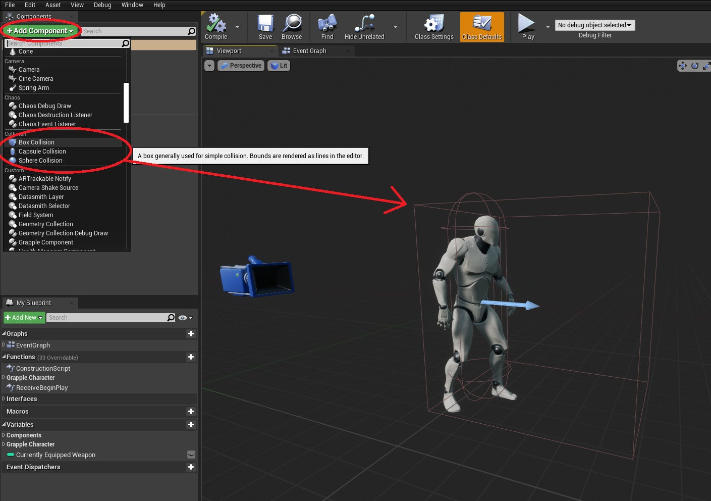

If you want the Grapple Component to use this Primitive Component by default, it should have a tag named "*defaultgrapplehitbox*".

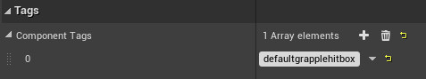

## 4. Set up Animation Blueprint 

### Method 1 - Linked Anim Graph (Recommended)

Navigate to the template for the Grapple Component Animation Blueprint (of class GrappleComponent_AnimBP, found in *GrappleComponent/AnimBP*). Create a Child Blueprint Class of this object. 

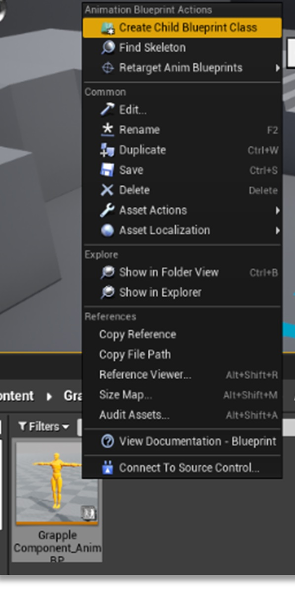

On this newly created Blueprint, navigate to the Class Settings and set the Target Skeleton to be the same one your Character's Skeletal Mesh is using (for example, UE4_Mannequin_Skeleton or SK_Mannequin).

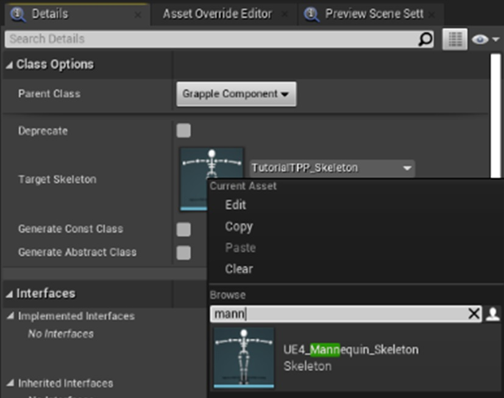

Note that the target skeleton flag is marked as advanced under the class settings. This means that you might need to expand the section to see the option.

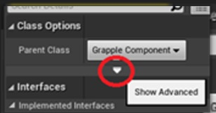

Open the Animation Blueprint used by your Character's main Skeletal Mesh.

In the Anim Graph of this Blueprint, add a Linked Anim Graph node before your output pose.

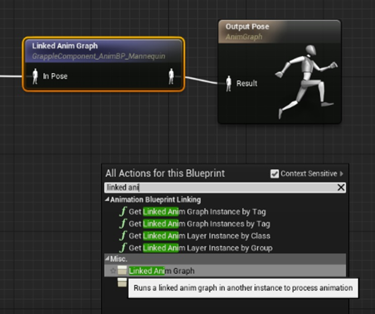

With the newly created node selected, navigate to the *details* panel and set the Instance Class to be the Animation Blueprint we have just created.

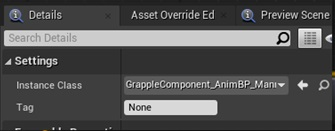

The Linked Anim Graph should be placed so that its output influences the output pose of the Animation Blueprint. 

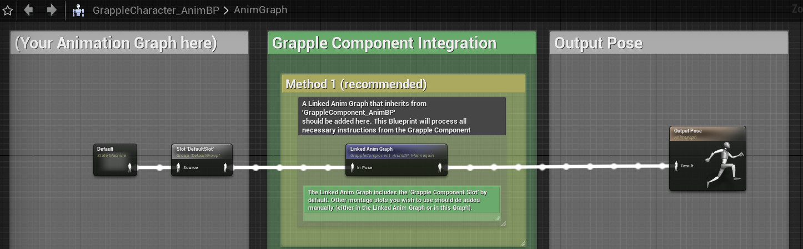

### Method 2 (Montages Only)

It is possible to work without a Linked Anim Graph by simply connecting the Montage Slots you are using to the output pose on your Character's main Animation Blueprint. If you already have montage slots set up, this method requires no implementation at all. 

It should be noted that this method is only viable if your Grapple Sequences use Animation Montages only. This method does not support Blendspaces, Anim Sequences or Animation Matching.

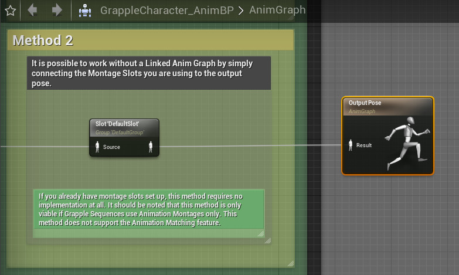

### Method 3 (Manual Implementation)

Animation for Grapple Sequences can also be implemented manually, by using the events from Blueprint Interface BI_GrappleComponentAnimationInterface.

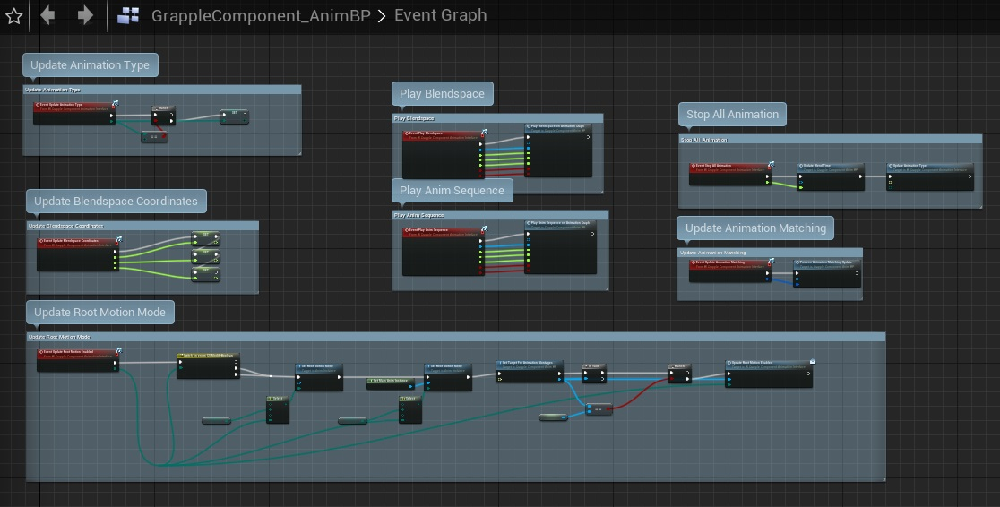

## Setup Complete!

Your Character is now Compatible with the Grapple Component!

For instructions on how to create your own Grapple Sequence, please proceed to the next tutorial.

If the Grapple Component does not find the Skeletal Mesh of your Character automatically, select the Skeletal Mesh component and give it a tag named "gc_skeletalmesh".

