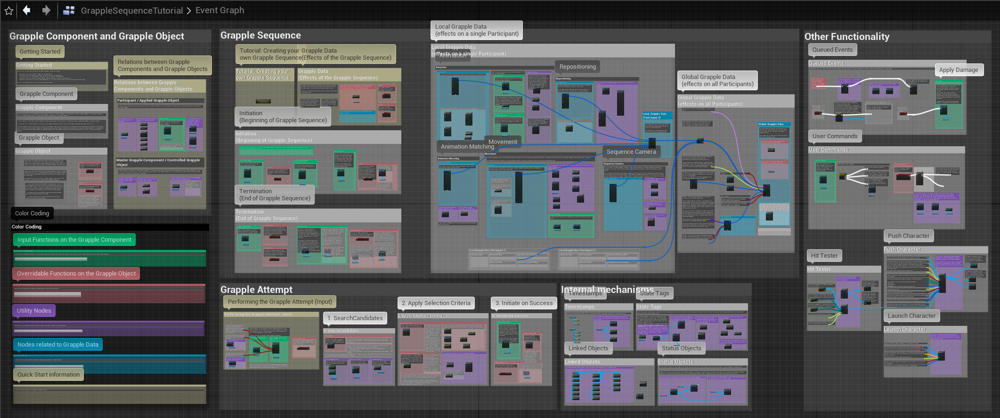
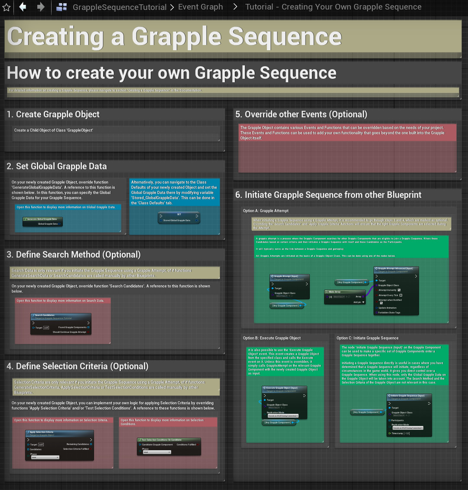
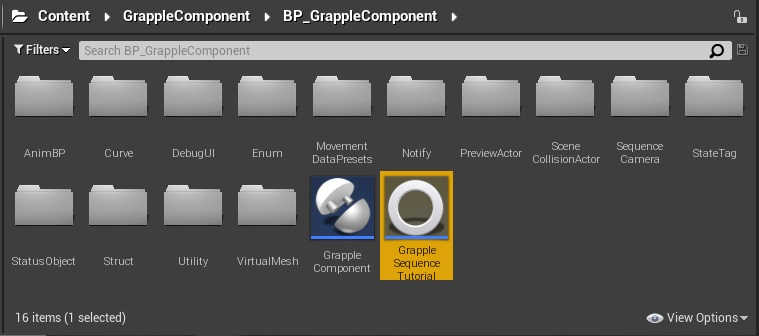
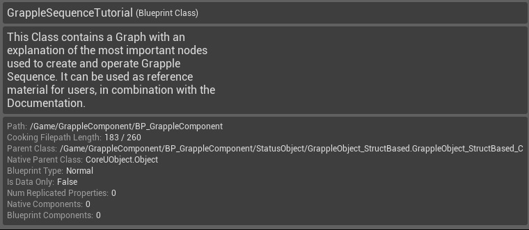

The content of the Grapple Component contains a Blueprint Class called GrappleSequenceTutorial. This Class does not provide any functionality to the project, but merely exists as reference material for users.

## Contents

The Event Graph of the Grapple Sequence Tutorial Object contains an overview of the most commonly used nodes on the Grapple Component and the Grapple Object. It also contains an exemple layout on how to make Grapple Data structures that define the effects of a Grapple Sequence.

It also contains a tutorial on creating your own Grapple Sequence, similar to [the one in this documentation](/grapple-component/6-tutorials/050-creating-a-grapple-sequence).

## How to access

The Grapple Sequence Tutorial Object Object can be found in the following location:

    Content/GrappleComponent/BP_GrappleComponent/GrappleSequenceTutorial.uasset

