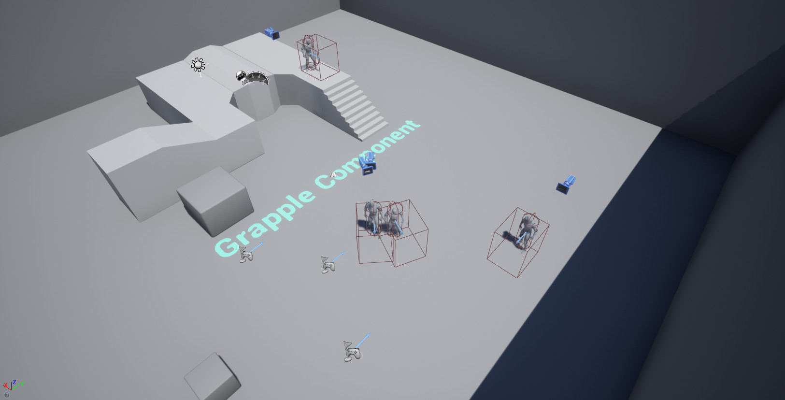

The content examples can be found in this folder:

    Content/GrappleComponent/ContentExamples

To access the Demonstration Game Mode, open the following level:

    Content/GrappleComponent/ContentExamples/GrappleComponent_ExampleMap.umap 

A playable version of the content examples can be downloaded [here](https://1drv.ms/u/s!Am6I3pHDdwOjlKkkWULcPUAqeuWIyA?e=glJnVC).

Please note that the content examples are only intented to illustrate the functionality of the Grapple Component. The project does not contain production-ready animation assets.

