Follow these steps to create a custom Grapple Sequence and initiate it from gameplay.

## 1. Create Grapple Object

Right-click an empty space in the Content Browser and create a new Blueprint Class that inherits from Class GrappleObject_StructBased.

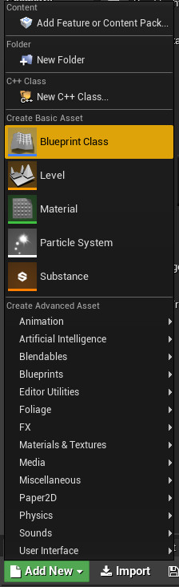

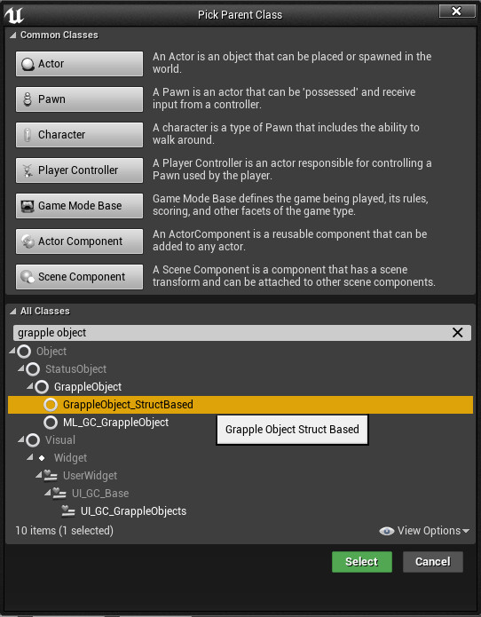

## 2. Make Grapple Data

For more information on defining the effects of the Grapple Sequence, please consult the article on [Grapple Data](/grapple-component/2-effects-of-the-grapple-component/010-grapple-data).

### Method A: Generate Grapple Data

On your newly created Grapple Object, override function Generate Global Grapple Data. In the Graph of this function, use a Make Struct_GC_GrappleData_Global node to generate the Global Grapple Data. 

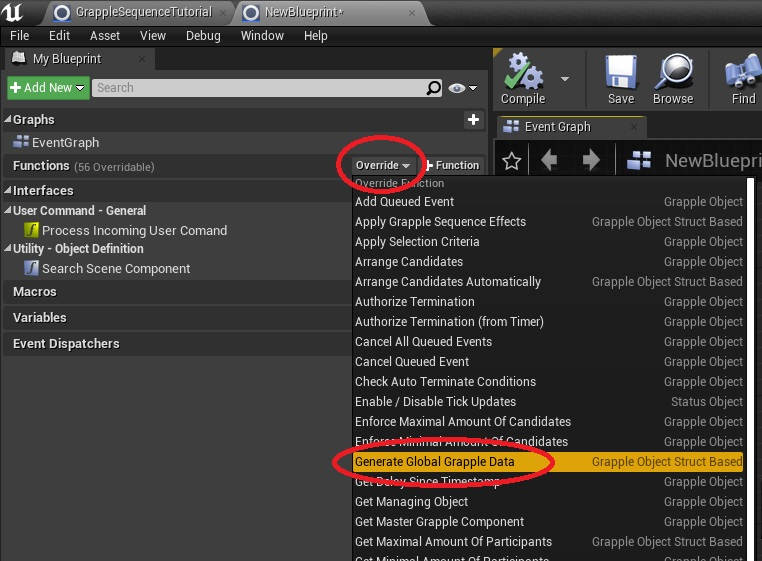

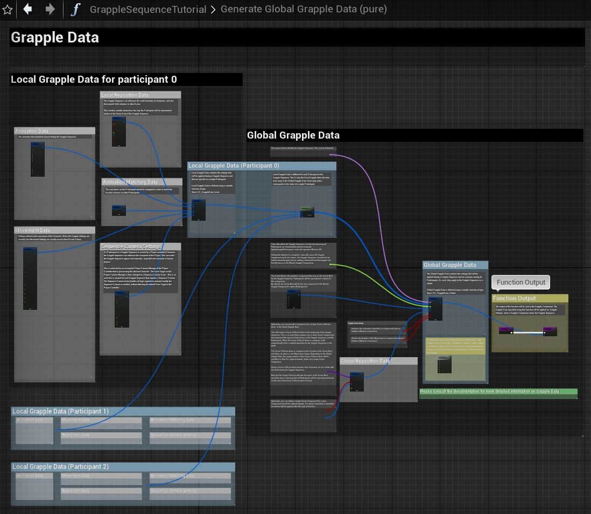

### Method B: Generate Grapple Data (Simplified)

An alternative to using this Blueprint layout to generate Global Grapple Data, is to use the macro called (Simplified) Generate Global Grapple Data, which will only expose the essential parameters to create a 'typical' third person Grapple Sequence with an attacker and a target.

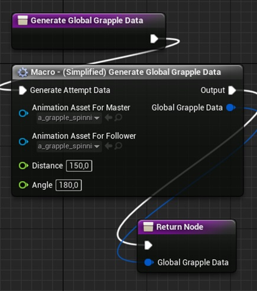

### Method C: Set Stored Grapple Data

Modify the default value of variable Stored Global Grapple Data on the Grapple Object. This can be done in the Class Defaults tab. Please note that the value stured in the defaults will be ignored if you also apply method A.

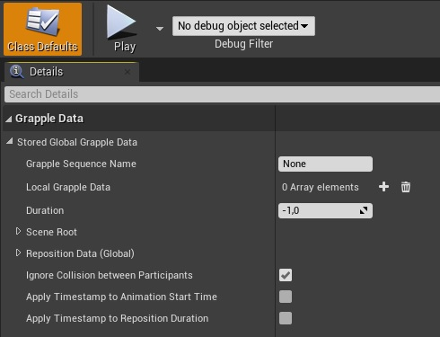

## 3. Define Search Method (Optional)

This step is only relevant in case you are initiating this Grapple Sequence from a [Grapple Attempt](/grapple-component/3-controlling-the-grapple-sequence/030-grapple-attempt). Please consult the section on Grapple Attempt for more information on Search Methods.

On your newly created Grapple Object, override function Search Candidates. This function finds Grapple Components in the game world that will become Candidates to enter a Grapple Sequence.

For more information on how this function works in detail, please consult the Graph of this function in the GrappleSequenceTutorial object.

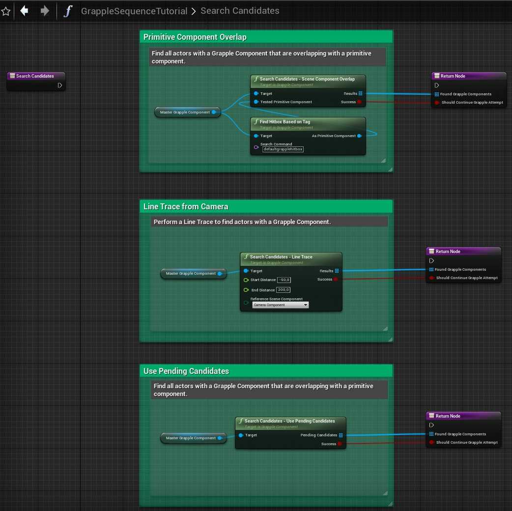

## 4. Define Selection Criteria (Optional)

This step is only relevant in case you are initiating this Grapple Sequence from a [Grapple Attempt](/grapple-component/3-controlling-the-grapple-sequence/030-grapple-attempt). Please consult the section on Grapple Attempt for more information on Selection Criteria.

On your newly created Grapple Object, you can implement your own logic for applying Selection Criteria by overriding any of the following functions: 

* Function Apply Selection Criteria can be overridden if you wish to build your own logic that checks if a group of Candidates is fit for the Grapple Sequence based on this Object, and determines the Participant Index for each Candidate.

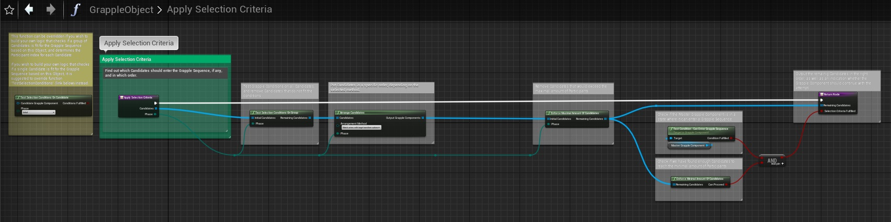

* Function Test Selection Conditions On Candidate can be overridden if you wish to build your own logic that checks if a single Candidate is fit for the Grapple Sequence based on this Object.

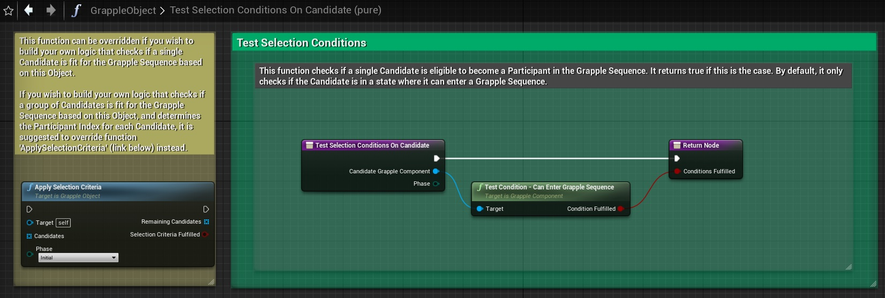
 
## 5. Override Events (Optional)

The Grapple Object has various [implementable Events and Functions](/grapple-component/3-controlling-the-grapple-sequence/070-overridable-functions) that can be overridden based on the needs of your project. These Events and Functions can be used to add your own functionality that goes beyond the one built into the Grapple Object itself.

## 6. Initiate Grapple Sequence from other Blueprint

The next step is to initiate the Grapple Sequence you created through an [input function](/grapple-component/3-controlling-the-grapple-sequence/060-input-functions) on the Grapple Component. 

### Option A: Grapple Attempt

A Grapple Attempt is a process where the Grapple Component searches for other Grapple Components that are eligible to join a Grapple Sequence, filters those Candidates based on certain criteria and then initiates a Grapple Sequence with itself and these Candidates as the Participants.

It will typically serve as the link between a Grapple Sequence and gameplay.

All Grapple Attempts are initiated on the basis of a Grapple Object Class. This can be done using node Grapple Attempt (Input) or node Grapple Attempt Advanced (Input).

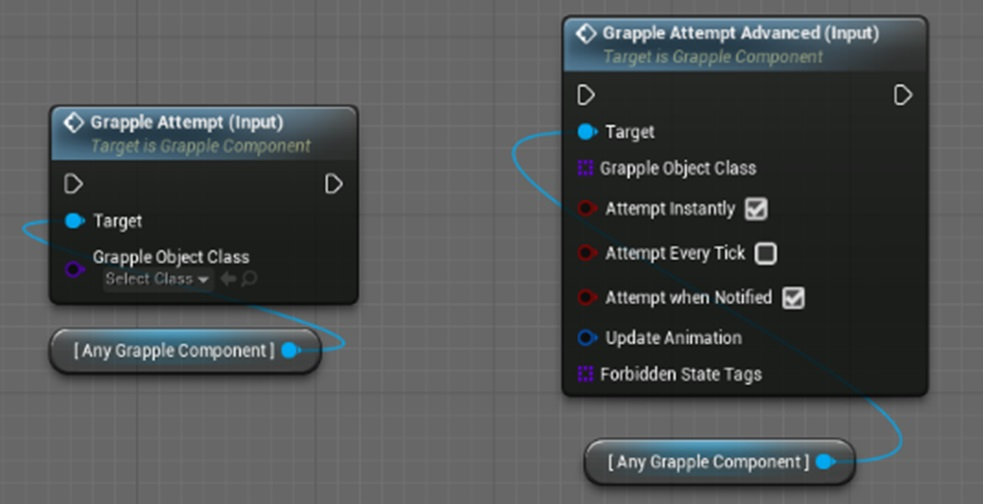

### Option B: Execute Grapple Object

It is also possible to use Input Function Execute Grapple Object (Input). This event creates a Grapple Object of the specified class and calls the Execute event on it. 

Unless this event is overridden on the Grapple Object, it simply performs a Grapple Attempt based on the relevant Grapple Component with the newly created Grapple Object as input.

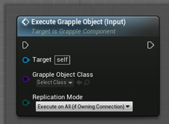

### Option C: Initiate Grapple Sequence Directly

Input Function Initiate Grapple Sequence (Input) can be used to make a specific set of Grapple Components enter a Grapple Sequence together.

The Initiate Grapple Sequence (Input) node is useful in cases where you have determined that a Grapple Sequence will initiate, regardless of circumstances in the game world. It gives you direct control over a Grapple Sequence. When using this node, only the Global Grapple Data on the Grapple Object will be taken into account. The Search Method and Selection Criteria are not relevant.

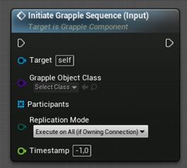

## Grapple Sequence Created!

Your Grapple Sequence can now be initiated from gameplay.

