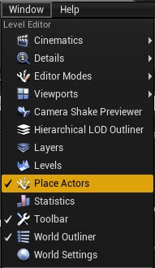
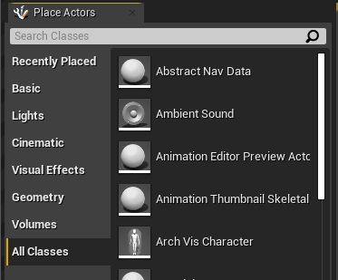
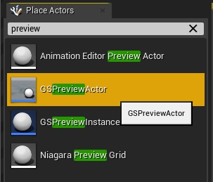
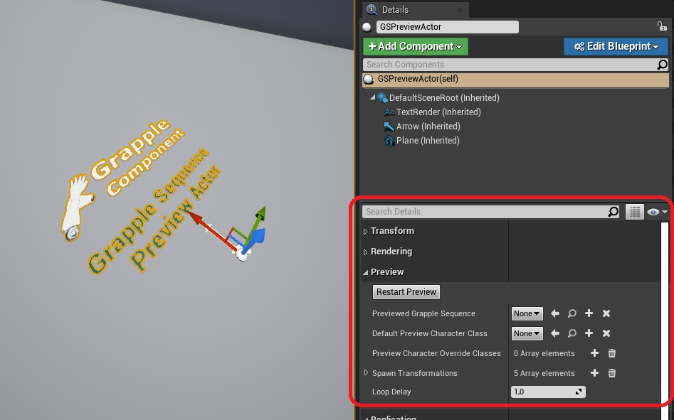
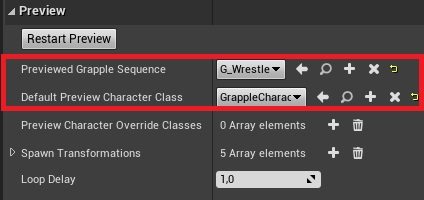
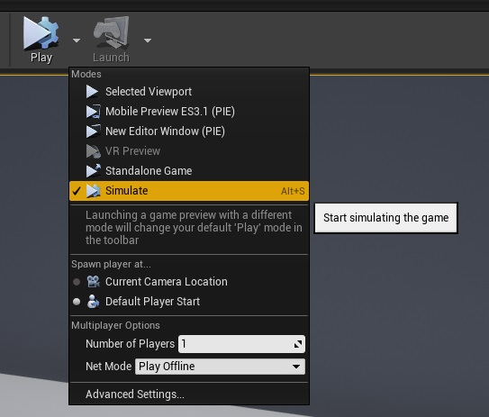
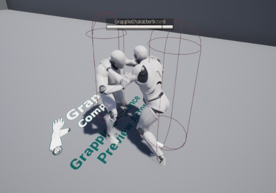
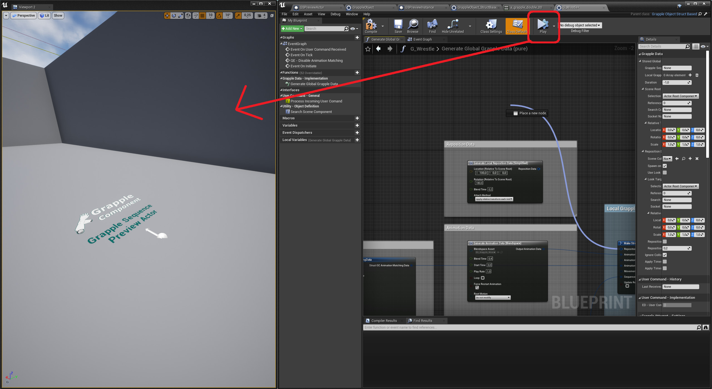
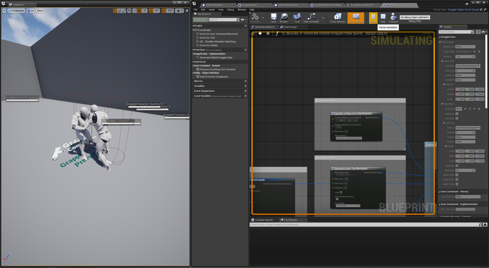

**This tutorial will guide you through the process of placing a Grapple Sequence Preview actor in your game world, and using said actor to tweak your Grapple Sequences without having to initiate them through gameplay.**

Navigate to the *Place Actors* window. If it is not shown by default, you can open it by clicking on Window > Place Actors.

In this window, select the *All Classes* option.

Select GSPreviewActor and drag it in to your level.

Make sure the Preview Actor is selected and navigate to its *details* panel.

Make the following changes to the exposed variables of the Preview Actor:

* Change the Previewed Grapple Sequence to the Grapple Object you are working on.

* Change the Default Character Preview Class to the Character you want to use during the preview.

Start simulating the game. This is done by clicking the small arrow next to the Play button and selecting the simulate option. Alternatively, you can use keyboard shortcut ctrl+s.

The Preview Actor will now spawn the required amount of Characters and Initiate a Grapple Sequecence based on the selected Grapple Object, with the preview Characters as Participants.

While making changes to your Grapple Data, you can now press 'Simulate' in the Blueprint Editor and view your changes directly in any viewport!

[Grapple Sequence](/grapple-component/1-overview-of-the-grapple-component/basic-concepts)

[Local Grapple Data](/grapple-component/2-effects-of-the-grapple-component/010-grapple-data)

Struct_GC_SequenceCameraData

[title](https://www.example.com)

| Syntax | Description |
| ----------- | ----------- |
| Header | Title |
| Paragraph | Text |