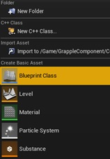
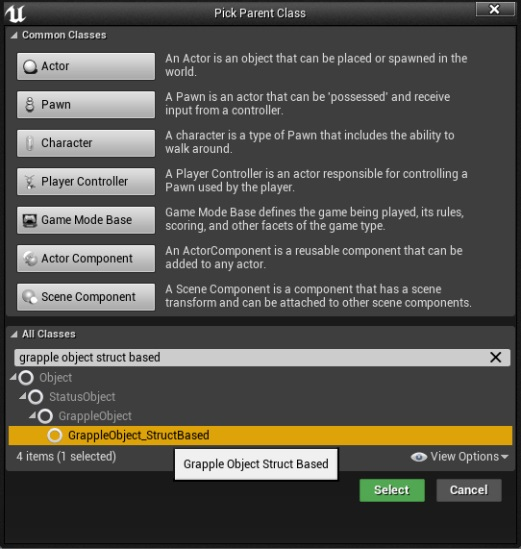
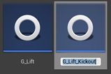
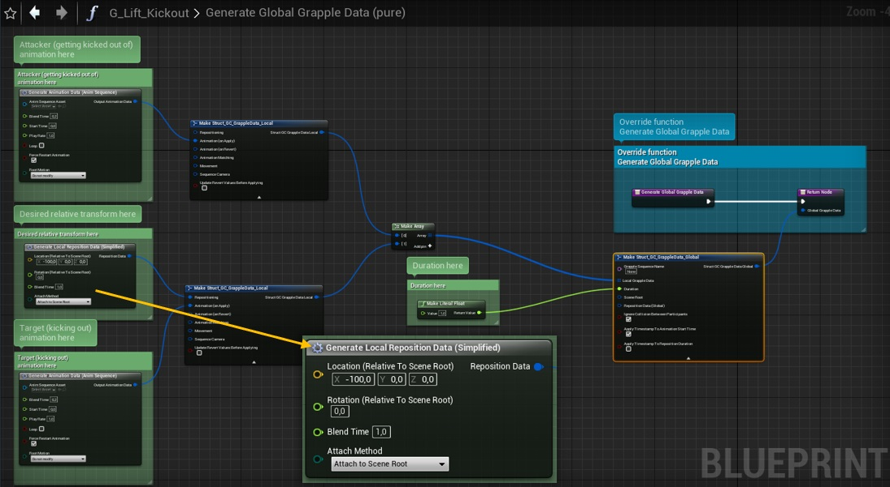
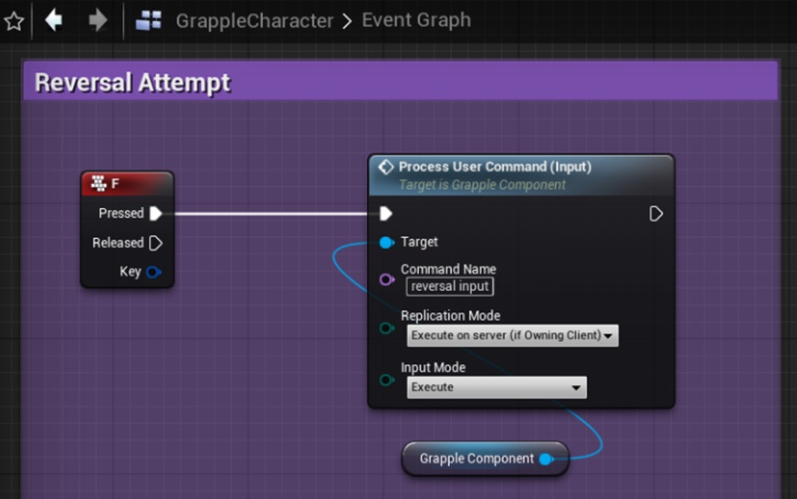
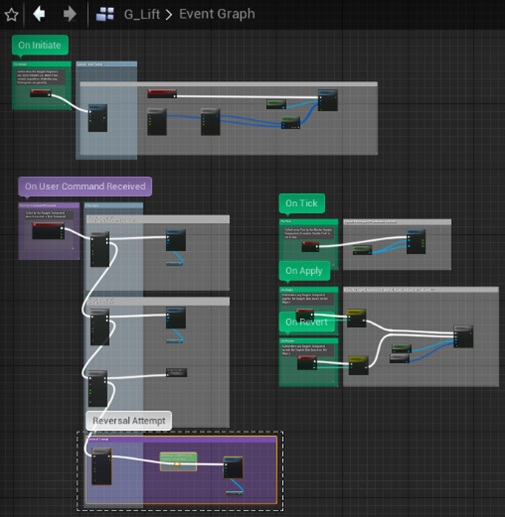
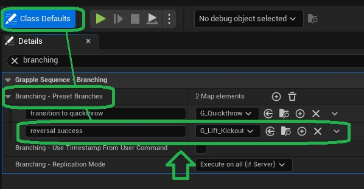
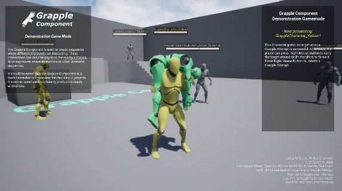
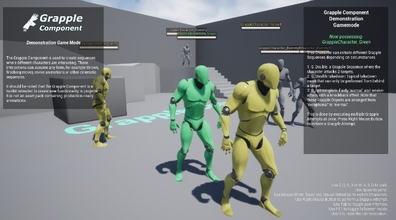

The Grapple Component provides specific tools to facilitate the creation of branching Grapple Sequences, i.e. ones that transition to another Grapple Sequence based on circumstances. Examples on how this can be translated to gameplay are:

* 'Chain throws' that enable the attacker to extend the animation by inputting additional commands. 

* 'Attack reversals' where another participant gains the upper hand in a Grapple Sequence

This tutorial will demonstrate how to make a character kick out of the fireman's carry in G_Lift.

## 1. Create a Grapple Object

Right-click an empty space in the Content Browser and create a new Blueprint Class that inherits from GrappleObject_StructBased. 

This Object will define the reversal move, where one character kicks out of the original Grapple Sequence.

In the example of this tutorial, we will name this Object "G_Lift".

## 2. Define Global Grapple Data

On the newly created Grapple Object, override function Generate Global Grapple Data. 

In this function, you can define the effects of the reversal move. For more information, please consult the section on[Grapple Data](/grapple-component/1-overview-of-the-grapple-component/basic-concepts) or the tutorial on [Creating a Grapple Sequence](/grapple-component/6-tutorials/050-creating-a-grapple-sequence). For the best results, make sure these aspects of the Grapple Data are defined:

* Duration of the Grapple Sequence (otherwise it will not end).

* Animation Data (Participants 0 and 1) - In here, you can set the animations that will be played for each Participant. 

* Reposition Data (Participant 1) - This can be set using a Generate Local Reposition Data (Simplified) node. Setting the relative location to (-100, 0, 0) will make Participant 1 end up behind Participant 0.

We will always be entering this Grapple Sequence from G_Lift, which disables collision between Particpants and overlaps their capsules with one another. While collision settings and parent/child relations are reverted automatically by the Grapple Component, this is not the case for relative transformation. This is why it is recommended to reposition the Characters again during the reversal move. This will make sure they are no longer overlapping when collision is re-enabled at the end. 

## 3. Add User Command

Navigate to the Graph you want to input the reversal move from (most likely your Character or Controller).

Navigate to the Graph you want to input the reversal move from (most likely your Character or Controller).

Add a Process User Command (Input) node. 

* The target should be the Grapple Component of the relevant Character. 
* The input mode should be *Execute*.
* The replication mode *Execute on server (if owning Client)*.

We will call this initial User Command Reversal Input.

Connect this node to an input or other event of your choice. For this example, we will use the input event linked to the F key. When this Event is called, the Grapple Component will send the User Command to the Grapple Sequence that is active at that time.

## 4. Add Functionality from User Command

Navigate to the Graph of the Grapple Object you want the reversal move to influence. In this case, that will be G_Lift. This Grapple Object already has various User Commands that have functionality. 

To add one, add a Filter User Command node below the other ones, and connect its execution pin to the Fail pin on the node above.

The Filter User Command node should be set up to accept User Commands with the name we specified earlier ("*Reversal Input*"). It should also filter by Participant Index. In this case, we only want Participant 1 to reverse the Grapple Sequence.

This functionality will be executed on the server, because of the replication mode selected in the previous step.

When the User Command has passed these requirements on the server, the Grapple Object needs to send another User Command to the Grapple Component, this time to confirm that the input was valid and that we should actually transition.

To this end, connect a new Process User Command (Input) node to the Pass pin. This is the User Command that will actually trigger the reversal. 

* The target of the user command should be the Master Grapple Component. 
* In this case, we will fill out "*Reversal Success*" as the User Command Name.
* The input mode should be *Execute*.
* The replication mode should be *Do not replicate*, because the input has already been replicated at this point.

## 5. Add a branching point

Next, we want to take the "*Reversal Success*" User Command, and use it to switch to our newly created Grapple Sequence.

 This can be done by navigating to the *Class Defaults* of G_Lift, and modifying the variable Branching - Preset Branches. 
 
 In here, add an entry with "*Reversal Success*" as the name, and G_Lift_Kickout as the Grapple Object.

## End result

Participant 1 will now be able to escape the Grapple Sequence by pressing the F key.

