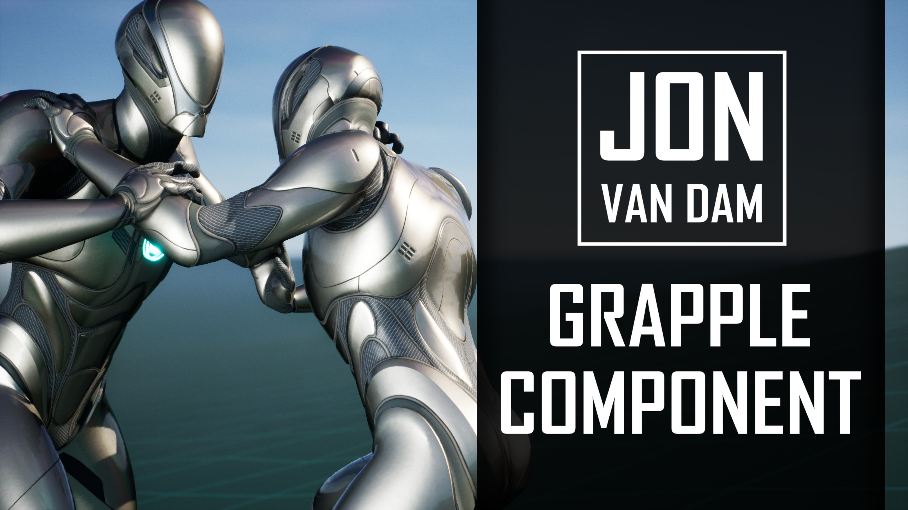

## Blueprint-powered character interaction

The Grapple Component is used to create sequences where different characters are interacting. These interactions can assume any form, for example throws, finishing moves, revive animations or other cinematic sequences. During these interactions, characters play synchronized animations and provide other player feedback. Grapple Sequences can also influence gameplay, for example by repositioning characters, changing movement capabilities or applying damage.

The Grapple Component supports multiplayer projects. It is built entirely in Blueprint and provides a high amount of customizability to users.

## Getting started

Want to get started with the Grapple Component? Here are a few suggested first steps:

* [Get the Grapple Component on Fab](https://www.fab.com/listings/929dbe39-a6b0-4e2a-b167-b6dc60a604d8)
* Follow the [video tutorials](https://youtu.be/iCmOiVsCJYg?si=4oxtnZ-voIEjFjPk)
* Read up on the [basic concepts](/grapple-component/1-overview-of-the-grapple-component/basic-concepts) 
* Have a look at the [content examples](/grapple-component/6-tutorials/040-accessing-content-examples)
* [Create your first Grapple Sequence](/grapple-component/6-tutorials/050-creating-a-grapple-sequence)

