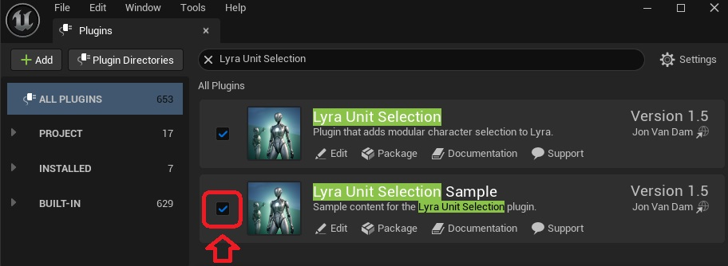

**The easiest way to get started with the plugin, is to enable the content examples, and modify these files to the needs of your project.**

To do this, enable the *LyraUnitSelectionSample* plugin.

The content folder of the plugin contains a Game Feature Data asset with the same name as the plugin.

Enable this game feature by setting its Current State to *Active*.

