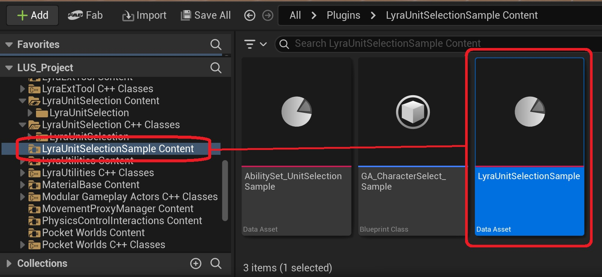
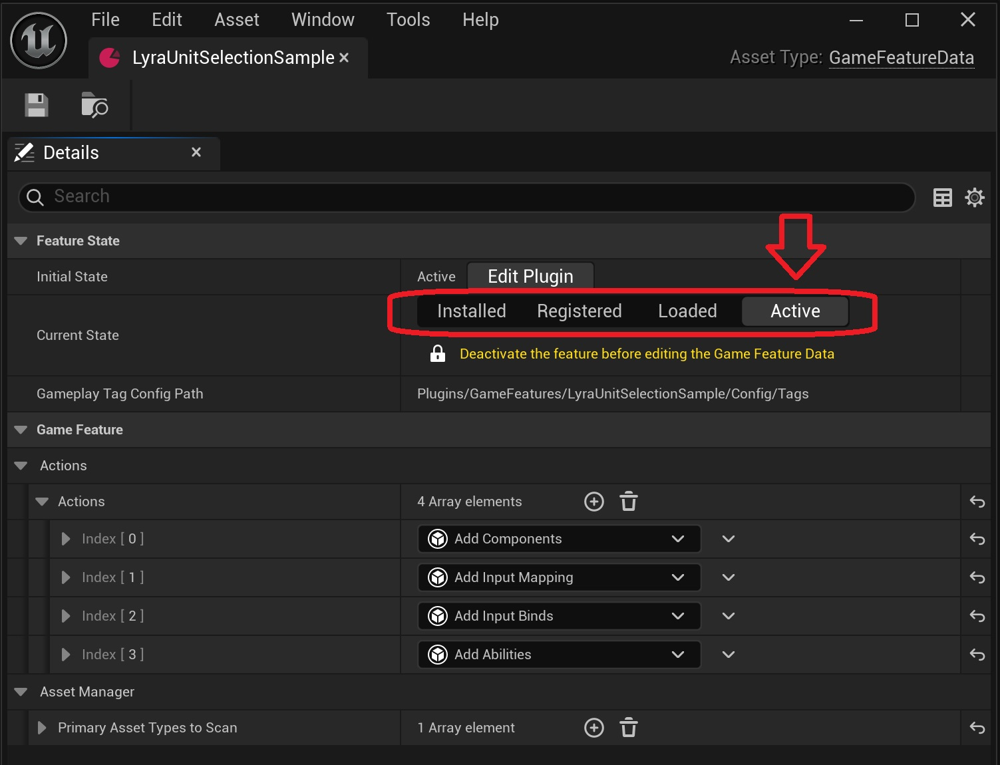
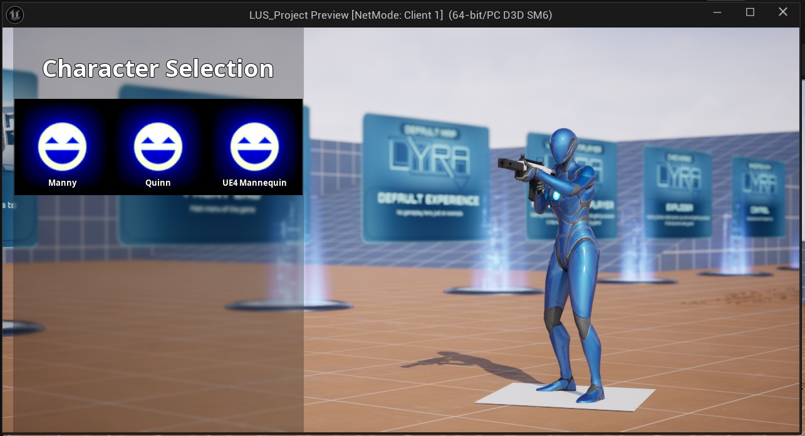
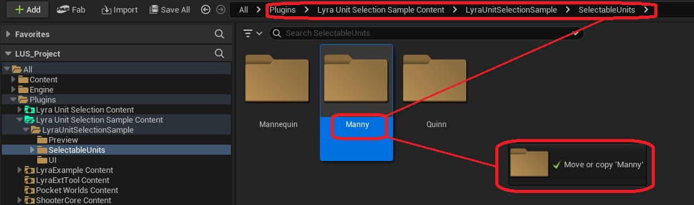
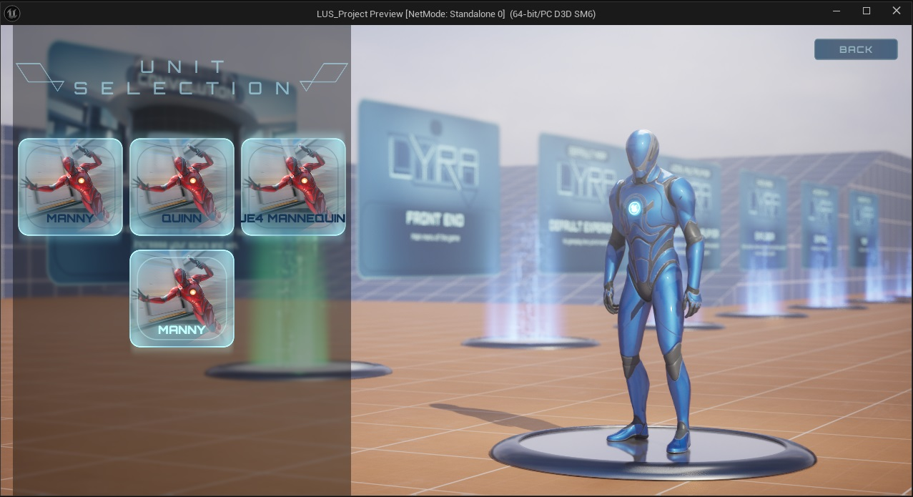

## Activating the sample content

**The easiest way to get started with the plugin, is to enable the content examples, and modify these files to the needs of your project.**

To do this, enable the *Lyra Unit Selection Sample* plugin.

The content folder of the plugin contains a Game Feature Data asset with the same name as the plugin.

Enable this game feature by setting its Current State to *Active*.

Open the Unit Selection Sample Level.

Start a new play-in-editor session, and press the [H] key. This will open the unit selection menu, allowing you to pick from a set of example characters. 

## Adding your own selectable unit

An easy way to create your own selectable character, is to start from a copy of the sample content. To do this, select one of the character folders, and drag it to an empty space in the content browser. 

After releasing the mouse button, select the *advanced copy here* option.

This operation will copy all necessary assets and their dependencies, allowing you to provide a new character name as a base.

Lastly, we need to add this unit as a selectable entry to our character select ability. This can be done by opening  GA_UnitSelection_LyraUnitSelectionSample, navigating to its *class details*, and adding our newly created item definition ID_MyUnit to the list of Selectable Units.

Start a new play-in-editor session, and press the [H] key. You will now see your newly created unit in the list of selectable entries.

Consult <a href="/lyra-unit-selection/02-reference-material/010-relevant-asset-types">this page</a> for more information on the classes we have just created, and how they fit into Lyra's modular game framework.
 

**Congratulations! You have now created your own selectable unit.**

## Customizing your selectable unit

From here, you can change the properties of your selectable unit you wish to customize:

| What? | Where? |
| ----------- | ----------- |
| [Add an animation set for your character](/lyra-unit-selection/002-cosmetic-elements/060-animation) | Equipment Definition *(EQD_MyUnit)* |
| [Assign a skeletal mesh and character parts](/lyra-unit-selection/002-cosmetic-elements/070-skeletal-mesh-character-parts) | Equipment Instance *(EQI_MyUnit)* |
| [Add starting inventory and equipment](/lyra-unit-selection/003-gameplay-elements/080-starting-inventory-equipment) | Equipment Instance *(EQI_MyUnit)* |
| [Add abilities](/lyra-unit-selection/003-gameplay-elements/115-abilities) | Equipment Definition *(EQD_MyUnit)* |
|[Set default attributes](/lyra-unit-selection/003-gameplay-elements/090-default-attributes) | Equipment Instance *(EQI_MyUnit)* |

For more customization possibilities, please refer to the [article on the different asset types and customization options](/lyra-unit-selection/001-getting-started/030-different-assets-and-customization-options) of the plugin.