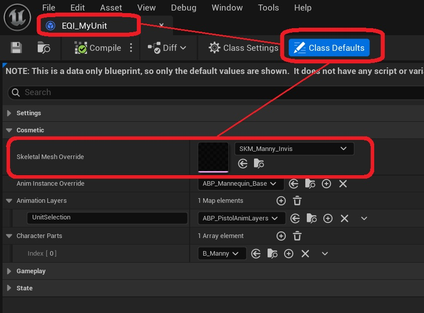
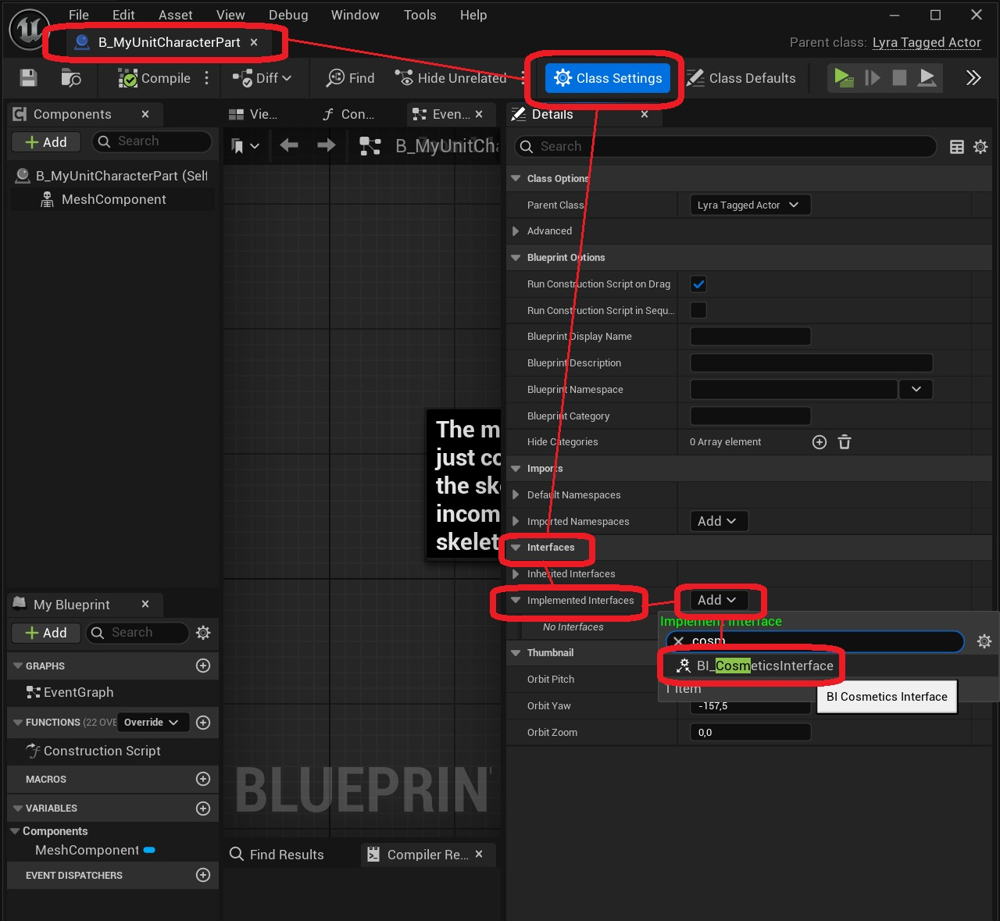
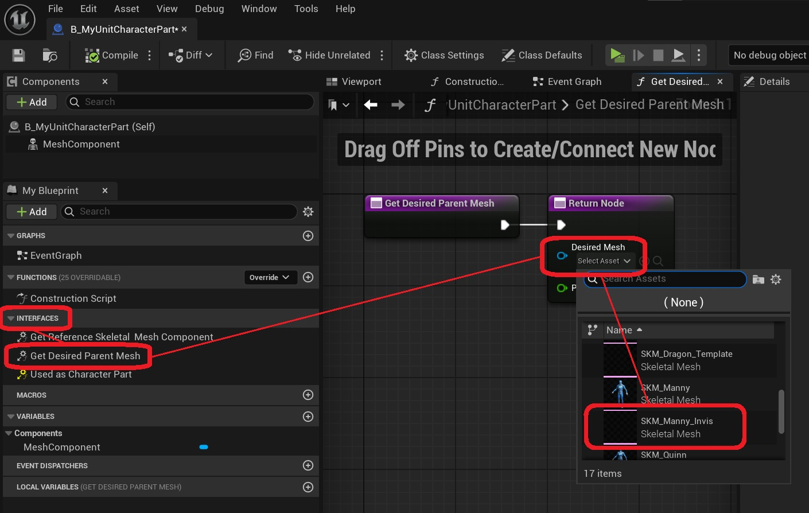
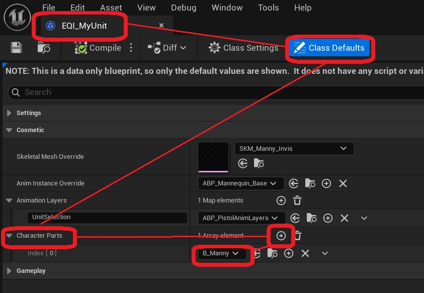

Units can each have their own appearance. In this regard, we should differentiate between two types of meshes.

## Main skeletal mesh on the pawn

Firstly, there is the actual Skeletal Mesh Component on the pawn. This is the mesh that is actually runs the main animation instance, and is used for gameplay (e.g. character proportions and collision). In many projects (including *Fortnite* and *ShooterGame*), this is actually an invisible mesh, and all cosmetics are derived aftwerwards from its pose.

When a unit is selected, you can change the main skeletal mesh of a pawn in two ways:

1.  Open the Equipment Instance *(EQI_MyUnit)*for your unit, and modify the Skeletal Mesh Override variable.

    

2. Open the character part you wish to use, and implement BI_CosmeticsInterface on it.

    

    Afterwards, implement the interface function Get Desired Parent Mesh. In this function, you can also return a priority. In case there are multiple character parts that want a different parent mesh, the one with the highest priority will be chosen.

    

## Character parts 

Secondly, it is possible to add cosmetic meshes without affecting the pawn itself or having an influence on gameplay. This is done using character parts. 

A common approach is to have a main skeletal mesh for each character or archetype in your game, and different character parts that represent outfits, skins, or customization items.

To add character parts while your unit is selected, open the Equipment Instance *(EQI_MyUnit)* for your unit, and modify the Character Parts variable.

You can use any actor type as a character part, but it is recommended to use one that inherits from B_UnitCosmetics. In any case, these actors must have their 'replication' propertry set to 'false', or they will not spawn in clients. To spawn replicated actors, use the ['spawn actors' functionality](/lyra-unit-selection/003-gameplay-elements/150-spawnable-actors) on the equipent definition instead.

