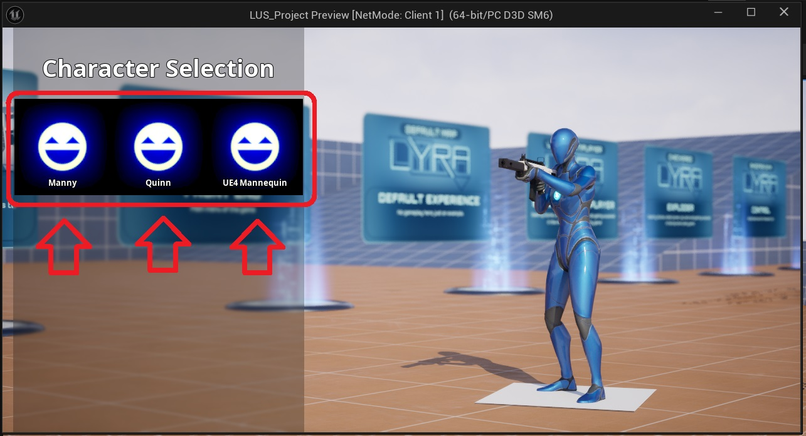
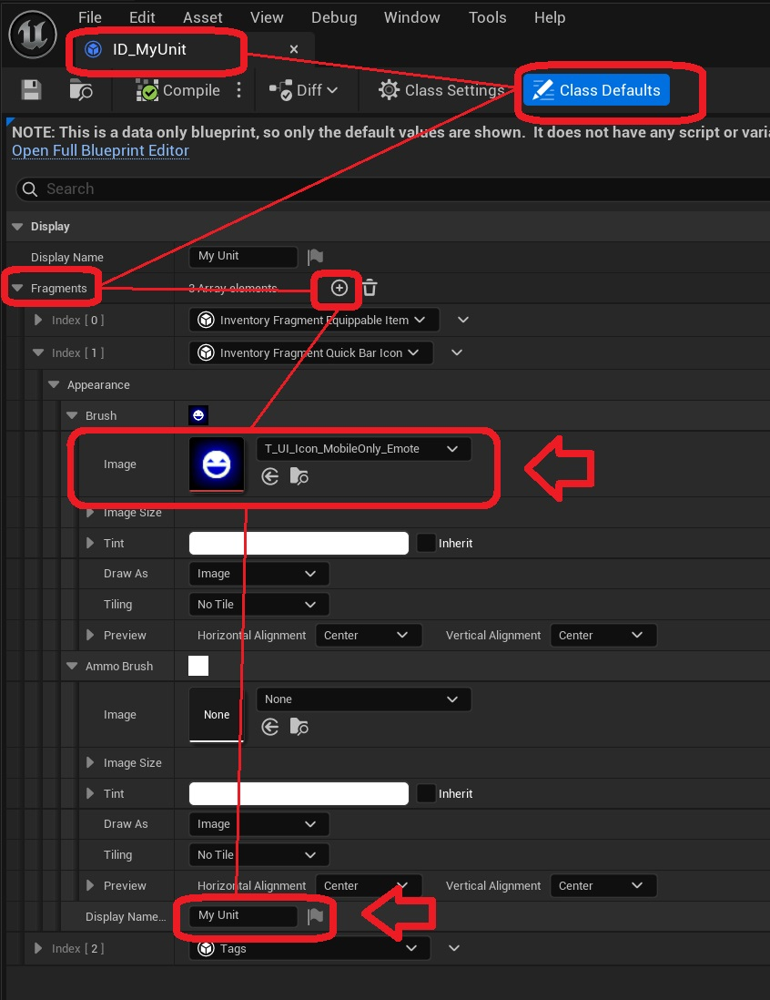

Units in the inventoy of a player can implement a UI icon to represent them in widgets. 

To add an icon, open the Inventory Item Definition for your unit *(ID_MyUnit)*, and navigate to the Fragments variable. In this array, add an  add an inventory fragment of type UInventoryFragment_QuickBarIcon. In this fragment, you can specify the icon to be used, as well as a display name for your unit.

