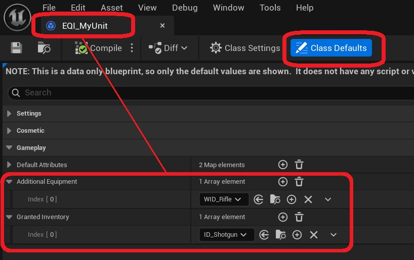
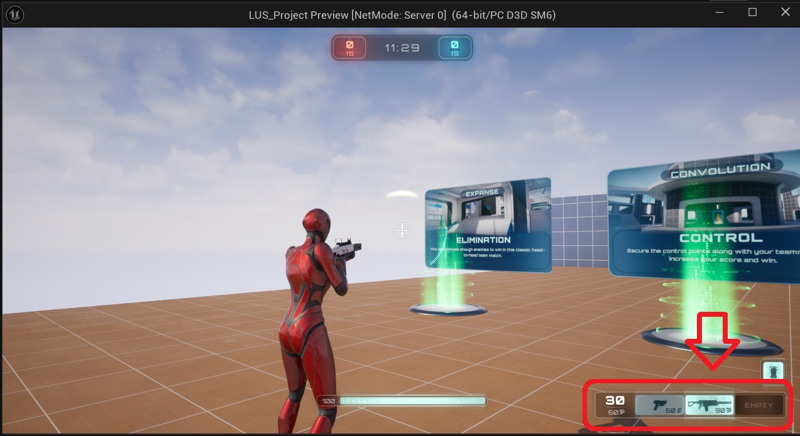

Units can have their own starting equipment and inventory. To add these, open the Equipment Instance *(EQI_MyUnit)*for your unit, and modify the following variables:

* Additional Equipment - This will equip items when the unit is selected, and unequip them when another unit is selected. Note that this variable has no effect on the controller's inventory.

* Granted Inventory - This will add items to the inventory when the unit is selected, and remove them when another unit is selected. Note that this has no direct effect on the item that the pawn has equipped. Items in the inventory must be equipped on the pawn manually. However, 

* Many Lyra projects (including *ShooterGame*) have a Lyra Quick Bar Component on each player controller. This component allows players to quickly cycle between weapons in their inventory. If Add Grantred Inventory To Quick Bar is set to true, the equipment instance will add all granted items to the quick bar as well, and attemt to equip them. 

