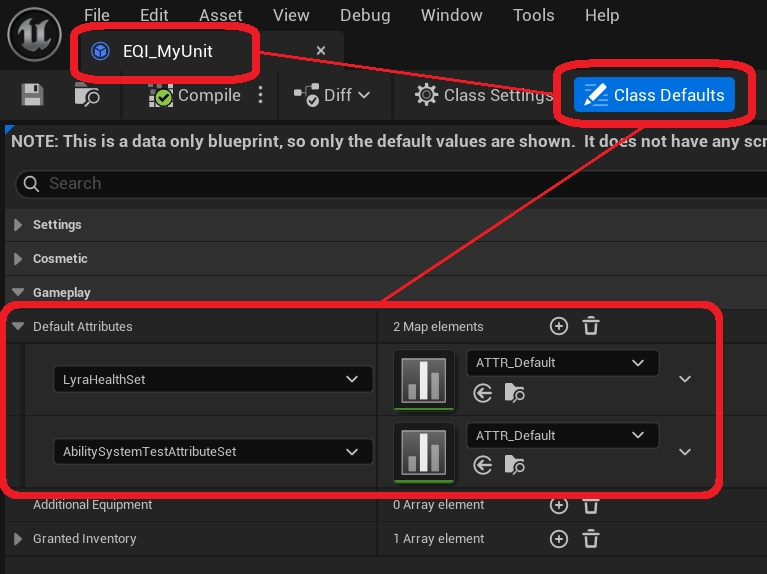
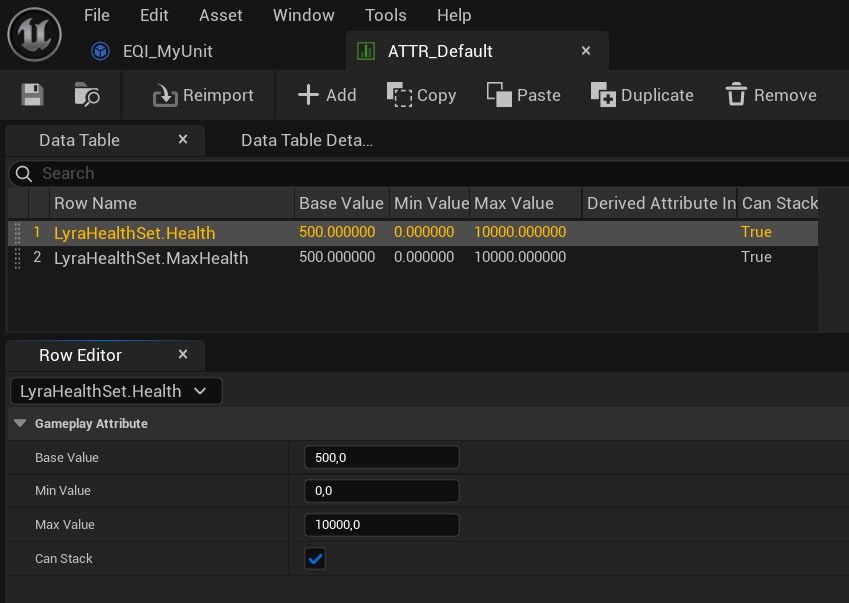

It is possible to set a defferent set of default gameplay attributes for each selectable unit. This is done in the equipment instance of your unit (e.g. (EQD_MyUnit)). 

To initialize an attribute set, add it as a key in the (Default Attributes) map. Then, select the desired data table to use for initialization. 

This data table should have a row type of UAttributeMetaData. It is possible to use one data table to initialize attributes on multiple attribute sets. 

The data table ATTR_Default contains an example of how to use this system to set the maximum health of a unit.

For more information on initializing attribute sets using data tables, please consult the [Unreal Engine documentation on the topic](https://dev.epicgames.com/documentation/en-us/unreal-engine/gameplay-attributes-and-attribute-sets-for-the-gameplay-ability-system-in-unreal-engine#importingdatatables). 